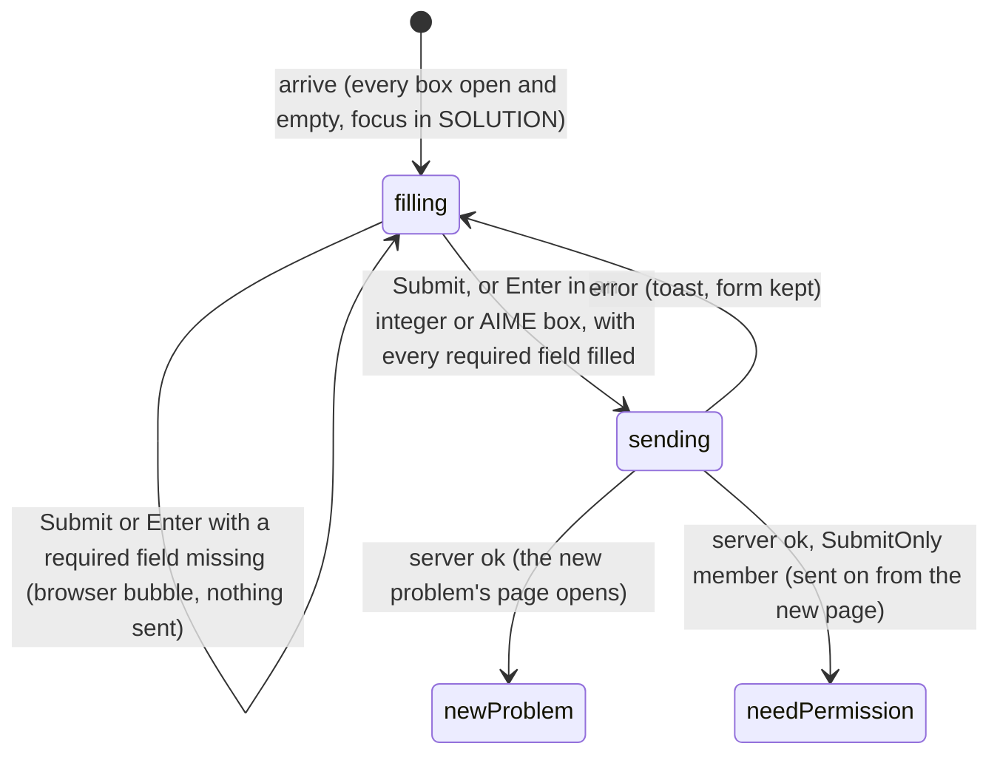

# The add-problem form

## Summary

The add-problem form is the only way to create a problem through the interface. It lives on the [add-problem page](../glossary.md#the-site) at `/c/{cid}/add-problem`, reached from the "Add Problem" button on the collection page or by typing the address. It asks for a title, a subject, a difficulty, a statement, an answer (in the shape the collection's answer format calls for) and a solution, and sends them all at once with "Submit". The text fields are [click-to-edit](../foundations/click-to-edit.md) fields that start open; closing one only keeps its text in the form, and nothing reaches the server until the whole form is submitted. On success the new problem gets the next [problem ID](../foundations/data-model.md#the-problem-id) in its subject and its page opens. Admins, TeamMembers and SubmitOnly members may use the form; SubmitOnly members, who cannot view the collection, are sent to "You need permission" right after their problem is stored.

## The simple case

A TeamMember clicks "Add Problem" on the collection page. The page shows "‹ Back to {collection name}" and, in a centered column, six labeled fields and a violet "Submit" button. Every text box is empty and open, and the cursor is already in the last one, "SOLUTION".

They click into "TITLE", type a title and press Tab: the title box closes and shows the title in large bold type, and focus moves to "SUBJECT". They pick a subject and a difficulty from the two menus, click into "PROBLEM STATEMENT", type the statement with some `$...$` math, and move on; the statement closes and shows the math typeset. They type the answer and the solution the same way and click "Submit".

The button shows its spinner and stays disabled while the server works. When it answers, the new problem's page opens (for example `/c/demo/p/A4`) with the problem already liked by its submitter. If something goes wrong instead, a red [toast](../glossary.md#interface) says why and the form stays filled in.

## The interaction, event by event

### Arrive

The page is built on the server after its own checks, in this order ([navigation](../foundations/navigation.md#what-each-page-checks-in-order)): the user is signed in (else the login page, which returns them to the form), the collection exists (else "Page not found"), and the user's role may add problems, that is Admin, TeamMember or SubmitOnly (else "You need permission"). There is no testsolver-type check. If the user has no [author](../glossary.md#people-and-access) in the collection yet, one is created now, named after their Google name; a user who is turned away gets none. On a production build this usually happened earlier, when the collection page prefetched the "Add Problem" link ([saving and feedback](../foundations/saving-and-feedback.md#edge-cases)).

There is no page heading. From the top:

1. **Back link.** "‹ Back to {collection name}", to the bare collection page.
2. **"TITLE"**, a single-line box in large bold type with the placeholder "Short and catchy title". Required.
3. **"SUBJECT"**, a menu with a blank first entry, then "Algebra", "Combinatorics", "Geometry", "Number Theory". Required.
4. **"DIFFICULTY"**, a menu with a blank first entry, then "Very easy", "Easy", "Medium", "Hard", "Very hard" (difficulty 1 to 5). In `otis-mock-aime` the entries are "AIME 1-3", "AIME 4-6", "AIME 7-9", "AIME 10-12", "AIME 13-15". Required unless the collection says otherwise.
5. **"PROBLEM STATEMENT"**, a multi-line box with the placeholder "Given a triangle $ABC$ with circumcenter $O$ and circumcircle $\Gamma$ ...". Required.
6. **"ANSWER"**, depending on the collection's answer format: a single-line click-to-edit box with the placeholder "$42$" (ShortAnswer, the default); a plain box saying "Enter an integer" (Integer); a plain box saying "Enter a number (0-999)" (AIME); nothing at all, only a blank gap (Proof). Required unless the collection says otherwise.
7. **"SOLUTION"**, a multi-line box with the placeholder "Since $O$ is the circumcenter, it lies on the perpendicular bisector of $BC$ ...". Required unless the collection says otherwise.
8. **"Submit"**, a violet button.

The labels are small gray capitals. Nothing is prefilled: there are no drafts ([saved](../glossary.md#interaction)). Every click-to-edit field starts open because its text is empty, and each one takes focus as it appears, so the last, "SOLUTION", ends up with the cursor. At 1280 × 720 the page is not scrolled on arrival; on a shorter window focusing the solution box may scroll it into view. The integer and AIME boxes do not take focus.

### Leave untouched

Leaving without typing records nothing beyond the author created on arrival. The back link, the browser's back button, a reload and closing the tab all leave no other trace.

### Begin editing

The first change is a keystroke in a box or a choice in a menu. Because focus starts in "SOLUTION", typing before clicking anywhere goes into the solution. Nothing else on the page reacts: there is no validation message, no counter, no preview of the whole problem, and "Submit" was enabled before the first change and stays enabled.

### While editing

The click-to-edit fields behave as [click-to-edit](../foundations/click-to-edit.md#while-editing) describes for the add-problem form:

- **Closing a box.** Tab, a click elsewhere, or the window losing focus closes a box that holds text; so do Enter in "TITLE" or a ShortAnswer "ANSWER", and Shift/Ctrl/Cmd+Enter in "PROBLEM STATEMENT" or "SOLUTION". The box is replaced by its label and the text as it will read, with math typeset and line breaks kept. Nothing is sent. An empty box never closes.
- **Reopening.** Clicking anywhere on a closed field opens it again with the text as typed and the cursor at the end.
- **Escape** in a reopened box drops what was typed since it was reopened and shows the text it had. In a box that has never closed, Escape does nothing.
- **Emptying a reopened box** and leaving it keeps it open and empty. Whatever an open box holds is what the form will send, so an emptied optional answer or solution is sent empty, and an emptied required field is caught by the browser on Submit. Escape brings the earlier text back.
- **Enter in an integer or AIME box submits the form.** These are plain boxes, so Enter in them starts the browser's own form submission ([implicit submission](../glossary.md#input)), as if "Submit" had been clicked: with a required field still empty the browser shows its bubble on the first one, and with everything filled in the problem is submitted. Enter in "TITLE" or a ShortAnswer "ANSWER" only closes that box; it does not submit, because the box is gone before the browser would act. Enter in "PROBLEM STATEMENT" or "SOLUTION" starts a new line.

The **answer boxes** for Integer and AIME filter as the user types, like the timed attempt's box ([the timed attempt](../testsolving/timed-attempt.md)): anything that would not leave a valid partial number is not entered, and leading zeros are removed at once. The integer box accepts an optional leading minus sign and any number of digits, and keeps a lone `-`; the AIME box accepts at most three digits, so `007` becomes `7`. Pasted text that is not valid as a whole is ignored.

The **menus** can be changed any number of times, but their blank first entry cannot be picked again once something else is chosen, so a difficulty chosen in a collection where it is optional cannot be taken back without reloading.

### Submit

Clicking "Submit" first closes the box that has focus, if it holds text. The browser then checks the required fields in page order and stops at the first that is missing, focusing it and showing its own bubble ("Please fill out this field" for a box, "Please select an item in the list" for a menu, in Chrome's wording). Nothing is sent until every required field passes. A title, statement, answer or solution of only spaces passes.

The form then sends the title, subject, difficulty (or none), statement, answer (when the format has an answer field), solution and the user's author. "Submit" shows its spinner and is disabled until the server answers, so a second click or Enter meanwhile does nothing. The fields stay editable while the request is [pending](../glossary.md#interaction), but what is typed then was not sent.

The server checks, in this order: the user is signed in; the values are well formed (title and statement not empty, subject one of the four, difficulty 1 to 5 or none); the collection exists; the user's role may add problems; the author on the form is one of the user's own. It does not check the collection's required-field settings. It then gives the problem the next number in its subject ([data model](../foundations/data-model.md#the-problem-id)) and stores it: not archived, the submitter's author as its only author, an [empty answer](../foundations/data-model.md#the-answers-three-states) when none was given, no difficulty when none was chosen, a solution by the same author when the solution was filled in, and a like from the submitter.

- **Ok.** The collection page is marked stale and the browser goes to the new problem's page, `/c/{cid}/p/{pid}`, as a new history entry. There is no success message. The page shows the problem unlocked (its submitter [can edit](../glossary.md#people-and-access) it), the heart liked with a count of 1, the lightbulbs for the chosen difficulty, and, when no solution was given, "Add Solution" in the [spoilers](../problem-page/spoilers.md). A SubmitOnly member is sent on from that page to "You need permission" and never sees their problem. A member of a collection that requires testsolving who has not chosen a testsolver type is sent on to the [chooser](../testsolving/choosing-a-testsolver-type.md).
- **Error.** A toast, the spinner stops, "Submit" is enabled again, and the text in every field is kept:

| Situation                                                                                       | Toast                                               |
| ----------------------------------------------------------------------------------------------- | --------------------------------------------------- |
| The session has ended                                                                           | "Not signed in"                                     |
| The collection was deleted since the form loaded                                                | "Collection not found"                              |
| The user's role no longer allows adding problems                                                | "You do not have permission to add a problem"       |
| The browser is now signed in as a different user who may add problems in the collection         | "Invalid input (authorId): not one of your authors" |
| Another problem took the same ID at the same moment, the network failed, or anything unexpected | "Something went wrong. Please try again."           |

After an error the "SUBJECT" and "DIFFICULTY" menus may no longer show what was chosen; see [open questions](#open-questions-and-verification).

> Technical note: React resets a form once its action has run. Text boxes survive the reset, but the two menus are controlled by React and fall back to the browser's default choice (the blank entry, or the first real entry when the page was opened by an in-app link) until the form next re-renders.

## Modifiers

| Modifier            | At arrival                                                                                                                                                                                                                                                                                                                                        | During editing                                                                                                                                                                                                                                                                                   |
| ------------------- | ------------------------------------------------------------------------------------------------------------------------------------------------------------------------------------------------------------------------------------------------------------------------------------------------------------------------------------------------- | ------------------------------------------------------------------------------------------------------------------------------------------------------------------------------------------------------------------------------------------------------------------------------------------------ |
| Role                | Admin and TeamMember get the form and an "Add Problem" button on the collection page. SubmitOnly members get the form only by typing its address. ViewOnly members and users with no permission are sent to "You need permission" and get no author. Signed-out visitors go to the login page, even before the collection's existence is checked. | Checked again on Submit: a role that can no longer add problems gets "You do not have permission to add a problem". A change between SubmitOnly and a full role still submits; where the user lands depends on the new role.                                                                     |
| Authorship          | The problem does not exist yet. The user's author is fixed when the page loads; a user with several authors in the collection submits as the first.                                                                                                                                                                                               | The author is re-checked on Submit and must still belong to the signed-in user.                                                                                                                                                                                                                  |
| Testsolver type     | No effect on the form, and no chooser check: a member who has not chosen can use the form by address. The submitter can edit their own problem, so it is never locked for them.                                                                                                                                                                   | No effect. After success, a member who has not chosen in a collection that requires testsolving lands on the chooser instead of the problem.                                                                                                                                                     |
| Record state        | No record yet. The collection's existing problems decide the ID the new one will get.                                                                                                                                                                                                                                                             | Problems added by others in the same subject before Submit push the new one to a later number; one added at the same moment makes this one fail with the generic toast.                                                                                                                          |
| Collection settings | The answer format decides the answer field; the required settings decide which of difficulty, answer and solution the browser insists on (title, subject and statement always); `otis-mock-aime` has its own difficulty labels. Showing authors and requiring testsolving change nothing on the form.                                             | Settings changed in the database do not change the open form, and the server does not enforce them, so a form loaded before a field became required can still be submitted without it.                                                                                                           |
| Keys                | Focus is already in "SOLUTION", so typing goes there.                                                                                                                                                                                                                                                                                             | Enter: closes "TITLE" or a ShortAnswer "ANSWER" without submitting; submits the form from an integer or AIME box; new line in the statement and solution. Shift/Ctrl/Cmd+Enter: closes the statement or solution. Escape: abandons a reopened box. Tab: moves on, closing a box that holds text. |

The form never changes because of something that happens elsewhere; changes show up only as an error on Submit or in where the user lands.

## Cancel and interrupt

| Event                               | Before editing                                                 | While editing                                                                                                                                                                                                                                                                                          |
| ----------------------------------- | -------------------------------------------------------------- | ------------------------------------------------------------------------------------------------------------------------------------------------------------------------------------------------------------------------------------------------------------------------------------------------------ |
| Escape or Discard                   | No effect: every box is empty, and there is no Discard button. | Abandons changes to a reopened box; does nothing in a box that has never closed. Nothing clears the whole form except a reload. A submission already sent cannot be cancelled.                                                                                                                         |
| Browser back or forward             | Leaves; nothing recorded beyond the author.                    | Leaves; everything typed is lost without warning. A submission already sent still completes on the server; whether the browser then jumps to the new problem was not confirmed. An error toast appears on whatever page is showing.                                                                    |
| Reload                              | A fresh, empty form.                                           | Everything typed is lost without warning and the form comes back empty. A pending submission may or may not have been stored; the collection page shows which.                                                                                                                                         |
| Tab or window closed                | Nothing recorded.                                              | Everything typed is lost without warning. A pending submission that reached the server is stored.                                                                                                                                                                                                      |
| A link inside the app followed      | The back link opens the collection page; nothing recorded.     | The click closes the focused box first, then the page is left and everything typed is lost. A pending submission behaves as with browser back.                                                                                                                                                         |
| Network lost mid-request            | No effect: nothing is sent before Submit.                      | "Something went wrong. Please try again."; the form stays filled. The problem may have been stored anyway, in which case submitting again adds a second problem with the next ID.                                                                                                                      |
| Request fails or returns an error   | No effect.                                                     | A toast with the reason (see [Submit](#submit)); the form stays filled and "Submit" is enabled again.                                                                                                                                                                                                  |
| Session ends                        | No effect on the open form.                                    | Submit fails with "Not signed in". Reloading to recover goes to the login page, which returns to an empty form.                                                                                                                                                                                        |
| Access changes                      | No effect on the open form.                                    | Submit is checked against the new role (see [Modifiers](#modifiers)). A new testsolver type changes only where a successful submit lands.                                                                                                                                                              |
| Same record changed in another tab  | Not applicable: the problem does not exist yet.                | A problem submitted from another tab in the same subject takes the next number first; this one gets the one after, or fails with the generic toast if both were stored at the same moment.                                                                                                             |
| Same record changed by another user | Not applicable: the problem does not exist yet.                | As another tab. Two members submitting in one subject at once can collide; the second gets the generic toast and must submit again.                                                                                                                                                                    |
| Autofill writes into the field      | No effect.                                                     | The single-line boxes may offer entries the browser remembers for fields named "title" and "answer" (the problem page's editors and the timed attempt's box share those names). Picking one is the same as typing it; the integer and AIME boxes ignore a remembered entry that is not a valid number. |
| The window loses focus              | No effect: the focused solution box is empty and stays open.   | The focused box closes if it holds text; nothing is sent.                                                                                                                                                                                                                                              |
| The testsolve time limit passes     | Not applicable: nothing on the form is timed.                  | Not applicable. An attempt running in another tab is unaffected by the form.                                                                                                                                                                                                                           |

After any interrupt that leaves the page, nothing typed survives; a submission that reached the server is stored whether or not the user saw its page open.

## Interactions with other systems

**Permissions.** Adding is allowed to Admin, TeamMember and SubmitOnly, checked when the page loads and again on Submit. The page deliberately does not require being able to view the collection, which is what lets SubmitOnly members use it; the same fact sends them to "You need permission" after a successful submit. See [accounts and roles](../foundations/accounts-and-roles.md).

**Testsolving locks.** The form is never locked, and it does not send members who have not chosen a testsolver type to the chooser. The submitter can edit the new problem and so never has to testsolve it; for Serious testsolvers other than its authors and Admins it is locked from the moment it is stored ([the locked problem](../testsolving/locked-problem.md)).

**Per-collection settings.** The answer format picks the answer field, the three required settings pick which fields the browser insists on, and `otis-mock-aime` relabels the difficulties. The settings also shape the stored problem: a Proof collection always stores an empty answer; a collection that requires testsolving but not a difficulty can end up with problems its Serious testsolvers cannot open ([the problem page](../problem-page/problem-page.md#edge-cases)); and the ShortAnswer placeholder "$42$" invites answers in math delimiters that the timed attempt's integer box cannot type ([the timed attempt](../testsolving/timed-attempt.md)). See [per-collection settings](../cross-cutting/per-collection-settings.md).

**Validation and errors.** Two layers. The browser's required-field checks, one bubble at a time on the first missing field, are the only messages before sending; the integer and AIME boxes also refuse invalid characters silently. The server re-checks the shape of the values but not the collection's required settings, and accepts text that is only spaces. Its refusals arrive as [toasts](../glossary.md#interface).

**Unsaved changes.** The whole form lives only in the page. Closing a box keeps its text in the form, not anywhere else. Nothing warns before leaving and nothing is restored afterwards.

**Optimistic updates.** None. The form waits for the server, with "Submit" disabled, and changes page only on success.

**Freshness and other users.** The form carries nothing from the server but the collection's settings and the user's author, as of arrival. Other members' submissions matter only through the ID the new problem gets, and a simultaneous one in the same subject makes this submission fail. See [freshness](../cross-cutting/freshness.md).

**URL state.** The page's address is `/c/{cid}/add-problem` with no query string. Neither the "Add Problem" button nor the back link carries the collection page's search and filters. A successful submit adds the new problem's address to the history, so the browser's back button returns to the form.

**Math rendering.** A closed field shows its text with math typeset, which is the only preview before submitting; an open box shows the source. Malformed math shows in red rather than being refused. The title is rendered here, but readers of the problem see it as typed, dollar signs included ([the problem page](../problem-page/problem-page.md)). See [math rendering](../cross-cutting/math-rendering.md).

**Offline.** Filling in the form works offline. Submitting fails with the generic toast and keeps the form; nothing is queued.

**Keyboard and accessibility.** The labels are plain text not tied to their fields, so a screen reader announces the boxes and menus without names (the placeholders, where there are any, stand in). A closed field cannot be reached or reopened with the keyboard, only by clicking. Enter in a single-line box submits the whole form, which a keyboard user may not expect. While pending, "Submit" is disabled and marked busy. The browser's bubbles are its own and are announced by it. See [keyboard and accessibility](../cross-cutting/keyboard-and-accessibility.md).

**Narrow screens.** The column is 28 rem wide (32 and 36 rem on wider windows) and shrinks to fit a narrow window, with smaller text; the boxes and menus take its full width and nothing is hidden. See [narrow screens](../cross-cutting/narrow-screens.md).

**Side effects.** Opening the page creates the user's author in the collection if they have none, which makes "Add Solution" appear for them on problems without a solution. A successful submit creates the problem, its like and its solution. No one is notified.

## Edge cases

- A user who starts typing without clicking first types into the solution, because it has focus.
- The first click on "Submit" while a text box above it is open is lost. Pressing the button takes focus from the box, the box closes and becomes shorter, the button moves up under the pointer, and the click does not land: nothing is sent and nothing says so. A second click submits. With the solution box open, the button moved up 35 px in the first local pass.
- Enter in an integer or AIME box with every other field filled submits the problem before the user has looked it over.
- A title or statement of only spaces is accepted and shows as a blank title or an empty statement.
- In an Integer collection a lone `-` passes the required check and is stored as the answer.
- The integer box turns very long numbers into approximations as it normalizes them: from 16 digits the last digits can change (`9007199254740993` becomes `9007199254740992`), and from 22 digits the box switches to a form like `1e+21`, after which every edit that leaves the `e` or `+` in place is refused.
- In an AIME collection, three-digit AIME answers such as `007` are stored as `7`.
- In a Proof collection the stored answer is empty, not absent, so the problem page offers its editors an open, empty answer editor ([data model](../foundations/data-model.md#the-answers-three-states)).
- The blank entry of a menu cannot be chosen again; an optional difficulty, once picked, can only be removed by reloading the form.
- There is no way to set several authors, a source or anonymity, or to change the subject or difficulty after submitting.
- A new problem's number follows the most recently created problem with the same letter, so a collection with hand-made IDs can produce surprising numbers ([data model](../foundations/data-model.md#the-problem-id)).
- A SubmitOnly member gets no confirmation that their problem was stored: the success path ends on "You need permission", the same page as a refusal.
- A member of a collection that requires testsolving who has not chosen a testsolver type can submit by typing the form's address, and then lands on the chooser instead of their problem.
- The browser tab's title is "Probase", as on every page.

## Open questions and verification

- A first local pass in headless Chromium, on a production build, found: Enter in "TITLE" closes the box and submits nothing, even with every other field filled; Enter in the integer box of an Integer collection submits the whole form; and the first click on "Submit" while the solution box is open sends nothing, the second submits. The lost first click looks like a bug. An earlier reading, that Enter in the title also submits, was wrong.
- Arrival focus: the first local pass confirmed focus in "SOLUTION" with no scroll at 1280 × 720. Whether a shorter window scrolls down to the solution box on arrival was not checked.
- The menus after a failed submit were read from React's code, not tried: the form reset is expected to show the blank entry (page loaded directly) or "Algebra" and the easiest difficulty (page opened from "Add Problem") while the form still holds the user's choice. Submitting again straight away would then be refused by the browser, silently drop an optional difficulty, or silently submit the wrong subject and difficulty. Confirm by forcing a failure (for example two simultaneous submissions in one subject). If confirmed, this is a bug.
- "Submit" disabling with its spinner until the server answers is taken from a probe of "Post comment" in the running app, which uses the same button and the same kind of form; confirm on this form with a slow connection.
- Whether the browser still goes to the new problem when the user has left the form while the submission was pending was not confirmed.
- The server does not enforce the collection's required settings; only the browser does. Whether it should is a product call.
- The integer box's handling of very long numbers was read from code. It is a bug, though an unlikely one to meet.
- The author being created by the collection page's prefetch was confirmed on a local production build.
- Whether SubmitOnly members should see a confirmation, or their own problem, after submitting is a product call.
- Two simultaneous submissions in one subject colliding on the ID is a known gap ([data model](../foundations/data-model.md#the-problem-id)); it may be worth treating as a bug.

Verified against Probase commit `c38ff56`
