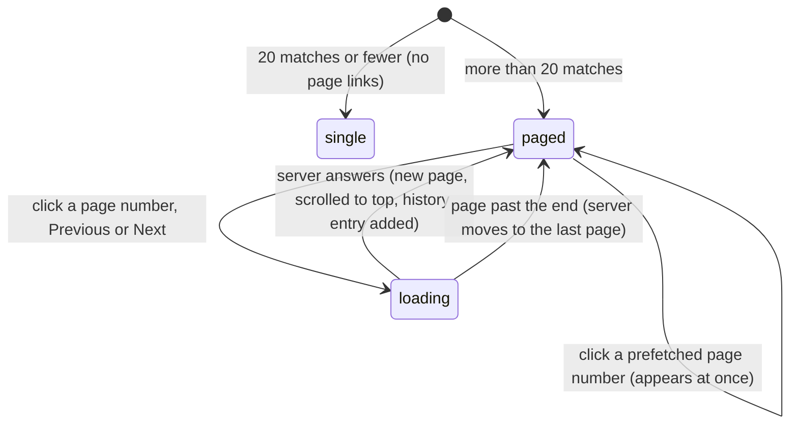

# Pagination

## Summary

The collection page shows its problem list 20 problems at a time. When the search and filters leave more than 20 matches, a row of page links appears below the list: "Previous", up to five page numbers around the current page, and "Next". The page number lives in the address as `page` (absent for page 1), so each page can be bookmarked and reloaded, and the page links keep the search and filters (see [navigation](../foundations/navigation.md#the-collection-pages-url)). Unlike a filter change, a page click adds a history entry and scrolls to the top. A page number past the end of the list takes the user to its last page. Every member who [can view](../glossary.md#people-and-access) the collection sees the same pagination.

## The simple case

A collection has 45 problems that are not archived. The collection page shows the 20 newest. Below the list, centered, is a row: a violet "1", then "2" and "3", then "Next" with a right chevron.

The member clicks "2". The page shows problems 21 to 40, scrolled to the top, and the address ends in `?page=2`. The row at the bottom now reads "Previous", "1", a violet "2", "3", "Next". Clicking "3" shows the last five problems; the row loses "Next". The browser's back button returns to page 2, then to page 1.

## The interaction, event by event

### Arrive

The server filters the collection's problems by the search and filters, puts them newest first (see [the problem list](problem-list.md)), and shows the 20 at the requested page: page _n_ holds matches 20(*n*−1)+1 to 20_n_. The number of pages is the number of matches divided by 20, rounded up, and never less than 1. The page size is 20 everywhere and cannot be changed.

The row of page links appears only when there are at least two pages. It sits below the list, centered, after a wide gap. It shows:

- **"Previous"**, with a left chevron, leading to the page before. Not shown on page 1.
- **Up to five page numbers.** The current page is in the middle when it can be; near either end the row shows the first five or the last five pages instead. With five pages or fewer, all of them are shown.
- **The current page's number** in a violet square. It is not a link and cannot be clicked.
- **"Next"**, with a right chevron, leading to the page after. Not shown on the last page.

| Pages | Current page | Row                       |
| ----- | ------------ | ------------------------- |
| 3     | 1            | [1] 2 3 Next              |
| 3     | 2            | Previous 1 [2] 3 Next     |
| 10    | 2            | Previous 1 [2] 3 4 5 Next |
| 10    | 5            | Previous 3 4 [5] 6 7 Next |
| 10    | 10           | Previous 6 7 8 9 [10]     |

Brackets mark the highlighted current page.

There is no link to the first or last page, no "…", no count of pages or problems, and no way to change the page size.

**A page past the end.** When the address asks for a page beyond the last one (an old bookmark, a filter change, problems archived since the link was made), the server sends the browser to the last page that exists, with the same search and filters. A list with no matches has one page, so any page number above 1 leads to page 1.

**Page numbers typed into the address.** Only a number above the last page is corrected. Other values are used as they are:

| `page=`                             | What the user sees                                                                                                                                                                                                                |
| ----------------------------------- | --------------------------------------------------------------------------------------------------------------------------------------------------------------------------------------------------------------------------------- |
| absent, `1`                         | Page 1.                                                                                                                                                                                                                           |
| `07`, `2abc`, `2.9`                 | The digits at the start are read: pages 7, 2 and 2.                                                                                                                                                                               |
| above the last page                 | The last page.                                                                                                                                                                                                                    |
| `0`                                 | An empty list. With more than one page of matches, the row shows the first page numbers (up to five) with none highlighted, no "Previous", and a "Next" that leads to page 1. With one page, nothing at all below the empty list. |
| negative                            | Some other slice of the list: `-1` shows the 20 matches before the last 20, `-2` the 20 before those, and so on, cut short or empty where that runs past the first match. The row is as for `0`, and "Next" goes up by one.       |
| `abc`, empty, anything not a number | An empty list, and an empty row: no numbers, no arrows.                                                                                                                                                                           |
| given twice (`page=2&page=3`)       | Ignored: page 1.                                                                                                                                                                                                                  |

For `0`, negative and non-numeric values the search and filters keep the odd value when they change (the address shows `page=0`, `page=-1` or `page=NaN`), so the list stays empty or odd until the address is edited or a page link is followed.

### Leave untouched

Looking at the row and leaving records nothing. On a production build, the page numbers (not the arrows) load their pages in the background as soon as the row scrolls into view; this runs the collection page on the server but changes nothing stored (see [navigation](../foundations/navigation.md#how-links-load)).

### Begin editing

Clicking a page number, "Previous" or "Next" (or pressing Enter on one that has focus) is the whole interaction. A page number that was loaded in the background appears at once. Otherwise nothing on the page changes until the server answers: the old list stays, the address still shows the old page, and nothing shows that the next page is loading.

### While editing

The old page stays usable while the new one loads. Clicking another page link abandons the first click in favor of the second. A change to the search or filters abandons the page click too, and is applied to the page number the user was on before the click.

### Submit

When the new page arrives, the list is replaced, the window scrolls to the top, and a new history entry is added with the new page number in the address. The row is rebuilt around the new current page. The browser's back button returns to the previous page number, shown as it was when the user left it.

If the requested page no longer exists by the time the server builds it, the user lands on the last page instead, with that page's number in the address.

A page click is not an [action](../glossary.md#interaction) and never shows a [toast](../glossary.md#interface); a failure behaves like any failed navigation ([navigation](../foundations/navigation.md#cancel-and-interrupt)).

## Modifiers

| Modifier            | At arrival                                                                                                                                                                                  | During editing                                                                                                                                                                      |
| ------------------- | ------------------------------------------------------------------------------------------------------------------------------------------------------------------------------------------- | ----------------------------------------------------------------------------------------------------------------------------------------------------------------------------------- |
| Role                | Admin, TeamMember and ViewOnly see the same pages. SubmitOnly members, users with no permission and signed-out visitors never reach the collection page.                                    | The new page runs the page's checks again: a user who lost view access is sent to "You need permission" by a page that is fetched, but not by one loaded in the background earlier. |
| Authorship          | No effect.                                                                                                                                                                                  | No effect.                                                                                                                                                                          |
| Testsolver type     | [Locked](../glossary.md#testsolving) problems take their place and count like any other. For a Serious testsolver, "Unsolved only" removes attempted problems, so there can be fewer pages. | With "Unsolved only" on, each attempt a Serious testsolver starts removes a problem, and the problems behind it move up by one place on every later page.                           |
| Record state        | Only the matches are paged. Archived problems are paged separately, when the Archived switch is on. Answers, solutions and difficulties make no difference.                                 | Problems added or archived by anyone since the last load shift the pages.                                                                                                           |
| Collection settings | No effect: every collection has 20 problems per page.                                                                                                                                       | No effect.                                                                                                                                                                          |
| Keys                | Nothing has focus. Tab reaches "Previous", each page number except the current one, and "Next", after the cards.                                                                            | Enter follows the focused link. Space scrolls the window, as on any link. Escape does nothing.                                                                                      |

## Cancel and interrupt

| Event                               | Before editing                                                                                                    | While editing                                                                                                                                                                    |
| ----------------------------------- | ----------------------------------------------------------------------------------------------------------------- | -------------------------------------------------------------------------------------------------------------------------------------------------------------------------------- |
| Escape or Discard                   | No effect.                                                                                                        | No effect: Escape does not stop a page from loading.                                                                                                                             |
| Browser back or forward             | Back goes to the previous page number, or to the page before the collection page.                                 | The page being loaded is abandoned in favor of the history entry.                                                                                                                |
| Reload                              | Rebuilds the page in the address, or the last page if that one no longer exists.                                  | Reloads the old page, which the address still shows until the new one arrives.                                                                                                   |
| Tab or window closed                | Nothing recorded.                                                                                                 | Nothing recorded.                                                                                                                                                                |
| A link inside the app followed      | Cards carry the page number to the problem page, whose back link returns to it.                                   | The newer navigation wins.                                                                                                                                                       |
| Network lost mid-request            | No effect until a link is clicked.                                                                                | The browser falls back to a full load of the new page's address, which shows its offline page. A page number loaded in the background before the connection dropped still opens. |
| Request fails or returns an error   | No effect.                                                                                                        | A failure while building the page shows "Something went wrong". No toast.                                                                                                        |
| Session ends                        | No effect on the open page.                                                                                       | A fetched page sends the user to the login page, which returns them to the bare collection page, on page 1 with no filters.                                                      |
| Access changes                      | No effect on the open page.                                                                                       | A fetched page uses the new access; a page loaded in the background earlier shows the old one.                                                                                   |
| Same record changed in another tab  | Not shown until the page is loaded again.                                                                         | "Previous" and "Next" fetch the page afresh. A page number loaded in the background can show the page as it was up to five minutes earlier.                                      |
| Same record changed by another user | Not shown until the page is loaded again.                                                                         | As another tab. Problems added in the meantime push the list down, so a problem can appear on two pages in a row, or one can be skipped when problems are archived.              |
| Autofill writes into the field      | Not applicable: there is no field.                                                                                | Not applicable.                                                                                                                                                                  |
| The window loses focus              | No effect.                                                                                                        | No effect.                                                                                                                                                                       |
| The testsolve time limit passes     | No effect. A card whose attempt is running is already unlocked, and stays on the same page when the attempt ends. | No effect.                                                                                                                                                                       |

After any interrupt the user is on whatever page the address bar shows; nothing else remembers the page number.

## Interactions with other systems

**Permissions.** Every page is built with the page's own checks ([navigation](../foundations/navigation.md#what-each-page-checks-in-order)); the row is the same for every role that can view the collection.

**Testsolving locks.** Locked problems are paged like any other, with "Testsolve to view" on their cards ([the locked problem](../testsolving/locked-problem.md#locked-cards)).

**Per-collection settings.** None. The page size is fixed at 20. See [per-collection settings](../cross-cutting/per-collection-settings.md).

**Validation and errors.** The page number is only checked for being past the end. Zero, negative and unreadable values are shown as described under [Arrive](#arrive) rather than corrected.

**Unsaved changes.** Nothing to lose.

**Optimistic updates.** None. A page number loaded in the background appears at once, which feels the same.

**Freshness and other users.** A page reached through its number can be up to five minutes old on a production build, because it was loaded in the background when the row came into view; the same page reached with "Previous" or "Next" is fetched when clicked and is current. A successful action anywhere clears the background copies. See [freshness](../cross-cutting/freshness.md).

**URL state.** The `page` parameter, absent for page 1. Filter changes keep it, cards carry it to the problem page and its back link returns to it, and the login redirect and the problem page's subject chip drop it. See [search and filters](search-and-filters.md) and [navigation](../foundations/navigation.md#the-collection-pages-url).

**Math rendering.** Not involved.

**Offline.** Clicking a page link fails with the browser's offline page, unless the page was loaded in the background before the connection dropped.

**Keyboard and accessibility.** The row is a navigation region named "pagination". Page numbers are announced as "Page {n}", the arrows as "Previous page" and "Next page", and the current page is marked as the current page. Links show a focus ring. See [keyboard and accessibility](../cross-cutting/keyboard-and-accessibility.md).

**Narrow screens.** The row never wraps. With both arrows and five numbers it is about 390 px wide, more than the 343 px a 375 px phone leaves for it, so it may spill past both edges of the window. See [narrow screens](../cross-cutting/narrow-screens.md).

**Side effects.** None. Loading pages in the background runs the collection page on the server without storing anything.

## Edge cases

- There is no way to jump to the last page from the row: from page 1 of 20 pages, each click moves the window at most a few pages. Typing a very large page number into the address is the quickest way, since the server turns it into the last page.
- A search or filter change keeps the page number, so it can land the user on page 3 of the new results, or on their last page ([search and filters](search-and-filters.md#submit)).
- Because the list is newest first, a problem added while the user pages forward pushes everything down one place, and the last problem of one page shows again at the top of the next.
- Archiving the last problem on the last page from its problem page and following the back link lands on the new last page.
- The problem page's "← Previous" and "Next →" are unrelated to these links: they step through problem IDs, not pages of the list ([navigation](../foundations/navigation.md#previous-and-next)).

## Open questions and verification

- A first local pass confirmed that `page=0` shows an empty list and is not corrected; negative and non-numeric values were read from code, not tried. It looks like a bug: such values should probably be treated as page 1, as a number past the end is treated as the last page.
- The lack of first and last page links is a product question; an unused "…" element exists alongside the page links.
- The width of the row on a phone is an estimate from the sizes in the styles, not a measurement. Confirm on a 375 px window with at least five pages and a middle page selected.
- That page numbers show pages up to five minutes old while the arrows show current ones follows from the framework's prefetch defaults and was not observed; confirm on a production build.
- Where keyboard focus goes after clicking a page number (the clicked link becomes the highlighted number and disappears) was not tried, nor whether Back restores the scroll position of the previous page.

Verified against Probase commit `c38ff56`
