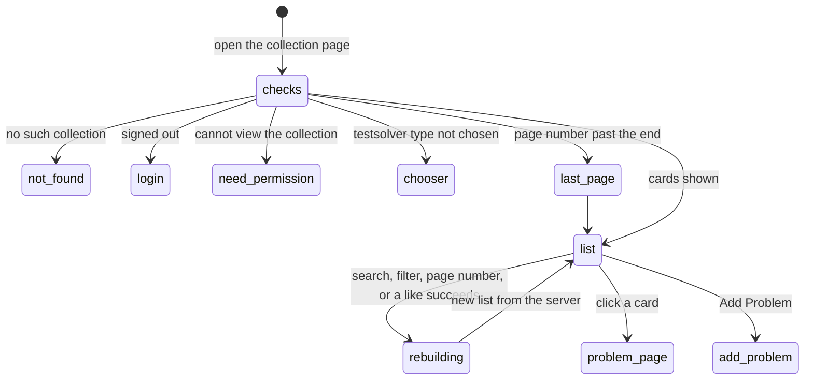

# The collection page

## Summary

The collection page, at `/c/{cid}`, is where a collection's problems are listed: one [card](../glossary.md#interface) per problem, newest first, twenty to a page, with an "Add Problem" button, a search box and filters in a column beside the list on a wide window and above it on a narrower one. Only members who [can view](../glossary.md#people-and-access) the collection reach it. A card shows the problem ID, title, statement (or a padlock when the problem is [locked](../glossary.md#testsolving)), the [lightbulbs](../glossary.md#interface) and the [heart](../problem-page/likes.md), and the whole card is a link to the problem page. This document owns the page's layout, the cards, which problems are listed by default and in what order, and where a card leads. The search box and filters belong to [search and filters](search-and-filters.md), the page numbers to [pagination](pagination.md), the heart to [the heart](../problem-page/likes.md), and "Add Problem" leads to [adding a problem](adding-a-problem.md).

## The simple case

A TeamMember opens their collection from the sidebar on the home page. On a wide window, a column at the right holds a violet "Add Problem" button, a search box, four subject checkboxes and an "Archived" switch; in the middle are the twenty most recently added problems that are not archived. Each card shows "A3." in the subject's color and the title on one line, then the whole statement with its math typeset, with the lightbulbs and the heart at the right of the title.

They scroll, then click a card. The problem page opens. Its back link, "‹ Back to {collection name}", returns them to the list with the same search, filters and page.

## The interaction, event by event

### Arrive

The page is built on the server after the checks in [navigation](../foundations/navigation.md#what-each-page-checks-in-order): an unknown collection shows "Page not found"; a signed-out visitor goes to the login page and comes back to `/c/{cid}` without the search and filters they asked for; a user who cannot view the collection goes to "You need permission"; a member of a collection that [requires testsolving](../glossary.md#testsolving) who has not chosen a testsolver type goes to the [chooser](../testsolving/choosing-a-testsolver-type.md). A page number past the end goes to the last page ([pagination](pagination.md)).

Users arrive by typing the address, from the home page's sidebar, after accepting an [invite](../entry/invites.md) or confirming the chooser, from a back link (the problem page's keeps the search and filters; the add-problem page's and the test page's do not), or from a problem page's subject chip, which opens the list filtered to that subject.

Each time, the server loads every problem in the collection, with its likes and who has started testsolving it, and the user's own attempts; it then filters, orders, and cuts out the requested page. A copy prefetched by a back link can be up to five minutes old ([navigation](../foundations/navigation.md#how-links-load)).

The page has no heading. The collection's name appears nowhere on it, the browser tab says "Probase", and there is no sidebar and no link to the home page or to any other collection ([navigation](../foundations/navigation.md#back-links)).

**Layout.** On a window 1280 px wide or wider, the list is a centered column up to 768 px wide, with an empty column of the same width as the controls on its left and the controls in a column up to 288 px wide on its right. The controls column stays in view, 6 rem from the top of the window, while the list scrolls. On a narrower window the controls sit above the list at full width: between 640 and 1279 px, "Add Problem" and the search box share a row with the filters below; under 640 px they stack. The page numbers, when there is more than one page, are centered under the list.

**The controls**, top to bottom: "Add Problem" (only for Admins and TeamMembers; see [Modifiers](#modifiers)), the search box with the placeholder "Search", the checkboxes "Algebra", "Combinatorics", "Geometry" and "Number Theory", the "Archived" switch, and, for a Serious testsolver in a collection that requires testsolving, the "Unsolved only" switch. [Search and filters](search-and-filters.md) owns what they do.

**A card** is a white box with rounded corners and a soft shadow. From the top:

1. **The title line.** "{problem ID}." in the subject's color (blue for Algebra, amber for Combinatorics, green for Geometry, red for Number Theory), then the title in bold near-black. The line never wraps: a long title is cut off with "…". The title is shown as typed; math in a title is not typeset. On a window 640 px or wider, the lightbulbs (when the difficulty is 1 to 5) and the heart sit at the right end of this line.
2. **The body.** For a problem the user may read, the whole statement, with line breaks kept and math typeset, never shortened. For a problem locked for the user, a padlock and "Testsolve to view", centered, in gray ([locked cards](../testsolving/locked-problem.md#locked-cards)).
3. **On a window narrower than 640 px**, a row with the heart at the left and the lightbulbs at the right.

A card shows nothing else: no subject name, author, answer, solution, tests, comment count, date or archived mark, and no sign of whether the user has solved the problem, given up on it, or is testsolving it now.

**Which problems, in what order.** By default the list holds the problems that are not [archived](../glossary.md#records); with the Archived switch on it holds only archived ones. The order is newest first by the moment each problem was created, across all subjects; problems created at the same moment are ordered most recently stored first. Each page holds 20.

Opened from a link, the page arrives scrolled to the top with nothing focused.

### Leave untouched

Viewing the list records nothing, with one exception. On a production build, the "Add Problem" link loads the add-problem page in the background as soon as it is on screen, and loading that page gives the member an [author](../glossary.md#people-and-access) in the collection if they have none ([saving and feedback](../foundations/saving-and-feedback.md#edge-cases)). So an Admin or TeamMember gets an author just by opening the collection page, and from then on sees "Add Solution" on problems without a solution. A first local pass on a production build confirmed it: a TeamMember with no author in the demo collection had one after viewing `/c/demo` for three seconds. The development server does not prefetch, so there it does not happen.

Cards load their problem pages in the background the same way; that starts no attempt and unlocks nothing. Leaving by a card, "Add Problem", the browser's back button or closing the tab records nothing.

### Begin editing

Nothing on the page is edited in place and the page has no form of its own. What the user can do from it:

- **Click a card** to open the problem ([Submit](#submit)).
- **Click a heart** to like or unlike without leaving ([the heart](../problem-page/likes.md)).
- **Type in the search box, tick a subject, flip a switch**: the URL changes and the list is rebuilt ([search and filters](search-and-filters.md)).
- **Click a page number** ([pagination](pagination.md)).
- **Click "Add Problem"** to open the [add-problem page](adding-a-problem.md).

### While editing

Every change of search, filters or page, and every successful like, rebuilds the page on the server from all of the collection's problems, and the list is replaced with the result. Nothing shows that a rebuild is under way: the old list stays, with no spinner, until the new one arrives. Search and filter changes keep the scroll position; page numbers go to the top ([pagination](pagination.md)).

A rebuild shows everything that has changed since the page was built: problems added by others appear at the top (and can push the last cards onto the next page), problems archived by others leave, edited titles and statements change, and a problem the user started testsolving in another tab loses its padlock. The user's access is checked again, so a rebuild can send them to "You need permission" or the chooser. The one thing a rebuild does not change is the heart of a card that stays on screen: it keeps its own color and count ([the heart](../problem-page/likes.md#interactions-with-other-systems)). Cards that newly enter the list are built entirely from the server's current data.

### Submit

The page has no submit. Its outcome is opening a problem: a click anywhere on a card except its heart opens `/c/{cid}/p/{pid}` with the current query string (search, subjects, Archived, Unsolved only, page) attached. The problem page opens at the top, and its back link, Previous and Next carry the query string on, so coming back lands on the same list ([navigation](../foundations/navigation.md#the-collection-pages-url)). Ctrl/Cmd+click and a middle click open the problem in a new tab, as on any link. On a production build the problem page was fetched in the background when the card came into view, so it can be up to five minutes old.

"Add Problem" opens the add-problem form; see [adding a problem](adding-a-problem.md).

## Modifiers

| Modifier            | At arrival                                                                                                                                                                                                                                                                                                                                                                                                                                                                           | During editing                                                                                                                         |
| ------------------- | ------------------------------------------------------------------------------------------------------------------------------------------------------------------------------------------------------------------------------------------------------------------------------------------------------------------------------------------------------------------------------------------------------------------------------------------------------------------------------------ | -------------------------------------------------------------------------------------------------------------------------------------- |
| Role                | Admin and TeamMember see the list and "Add Problem". ViewOnly sees the list without "Add Problem". SubmitOnly members, who may add problems but not view them, and users with no permission go to "You need permission"; signed-out visitors go to the login page.                                                                                                                                                                                                                   | A role changed elsewhere shows on the next rebuild: "Add Problem" appears or disappears, or the rebuild goes to "You need permission". |
| Authorship          | A problem the user wrote is never locked for them. Nothing on a card marks the user's own problems.                                                                                                                                                                                                                                                                                                                                                                                  | No effect.                                                                                                                             |
| Testsolver type     | Serious, in a collection that requires testsolving: each problem the user cannot edit, created after their [serious period](../glossary.md#testsolving) began, shows the padlock until they start an attempt, and shows its statement from that moment on, whether the attempt is running or finished. They also get "Unsolved only". Casual: every statement. Not chosen: the chooser. In a collection that does not require testsolving the type is ignored and nothing is locked. | A type changed elsewhere (by reopening the chooser in another tab) applies on the next rebuild.                                        |
| Record state        | Archived problems are left out unless the Archived switch is on, and then only they are listed; their cards look the same as any other. A locked problem shows the padlock. A problem with no difficulty, or difficulty 0, shows no lightbulbs. Answer, solutions, tests and comments are not on cards and make no difference.                                                                                                                                                       | Changes by others appear on the next rebuild, except in the hearts of cards that stay on screen.                                       |
| Collection settings | Requiring testsolving brings the padlocks and "Unsolved only". Showing authors, the answer format and the required fields change nothing here. Nothing in the code-level configuration changes this page, but members who join `topsoj` or `mgci` are Serious from the start, so every card they did not write shows a padlock ([per-collection settings](../cross-cutting/per-collection-settings.md)).                                                                             | No effect on an open page.                                                                                                             |
| Keys                | No shortcuts. Tab moves through "Add Problem", the search box, the checkboxes and switches, then each card as a single stop, then the page numbers. Enter on a focused card opens it. The heart cannot be focused.                                                                                                                                                                                                                                                                   | Keys typed in the search box belong to it ([search and filters](search-and-filters.md)).                                               |

## Cancel and interrupt

"Before editing" is the list at rest; "while editing" is the time a rebuild (after a search, filter or page change) or a like is on its way.

| Event                               | Before editing                                                                                                                                                                | While editing                                                                                                                                                                                                                      |
| ----------------------------------- | ----------------------------------------------------------------------------------------------------------------------------------------------------------------------------- | ---------------------------------------------------------------------------------------------------------------------------------------------------------------------------------------------------------------------------------- |
| Escape or Discard                   | No effect. There is no Discard. Escape in the search box belongs to it.                                                                                                       | No effect: a rebuild or a like cannot be cancelled.                                                                                                                                                                                |
| Browser back or forward             | Leaves for the previous history entry. Search and filter changes did not add entries; page numbers did ([navigation](../foundations/navigation.md#the-collection-pages-url)). | A pending rebuild is abandoned for the history entry. A pending like completes on the server; its error toast, if any, appears on the page the user went to.                                                                       |
| Reload                              | The page is rebuilt from the URL: the same search, filters and page, the current data, and every heart built anew.                                                            | Reloads the address the browser shows. The address bar changes only when a rebuild arrives, so a reload while one is pending loads the previous search and filters ([search and filters](search-and-filters.md)).                  |
| Tab or window closed                | Nothing recorded.                                                                                                                                                             | A like that reached the server is stored; a rebuild is simply dropped.                                                                                                                                                             |
| A link inside the app followed      | A card opens its problem page with the query string; "Add Problem" opens the add-problem page.                                                                                | The newer click wins over a pending rebuild. A pending like completes, and its error toast, if any, follows the user.                                                                                                              |
| Network lost mid-request            | No effect until something is clicked.                                                                                                                                         | A rebuild or a card's page does not arrive, and the browser falls back to a full page load that fails ([navigation](../foundations/navigation.md#cancel-and-interrupt)). A like shows the generic toast and its heart is put back. |
| Request fails or returns an error   | No effect.                                                                                                                                                                    | A failure while rebuilding the page shows "Something went wrong" in place of the whole page. A like's error shows as a toast.                                                                                                      |
| Session ends                        | No effect on the open page.                                                                                                                                                   | A rebuild or a card click goes to the login page, which returns to `/c/{cid}` without the search and filters. A like answers "Not signed in".                                                                                      |
| Access changes                      | No effect on the open page.                                                                                                                                                   | The rebuild or the problem page applies the new access: "You need permission", the chooser, "Add Problem" appearing or disappearing, cards locking or unlocking.                                                                   |
| Same record changed in another tab  | Not shown until a rebuild.                                                                                                                                                    | Shown by the rebuild, except in the hearts of cards that stay on screen.                                                                                                                                                           |
| Same record changed by another user | Not shown until a rebuild.                                                                                                                                                    | As another tab. New problems appear at the top and can push cards onto the next page.                                                                                                                                              |
| Autofill writes into the field      | Belongs to the search box ([search and filters](search-and-filters.md)); nothing else on the page is a field.                                                                 | As before editing.                                                                                                                                                                                                                 |
| The window loses focus              | No effect.                                                                                                                                                                    | No effect; the rebuild or like completes.                                                                                                                                                                                          |
| The testsolve time limit passes     | No effect. A card shows the statement from the moment an attempt starts, and nothing on the list counts down or changes when time runs out.                                   | No effect.                                                                                                                                                                                                                         |

## Interactions with other systems

**Permissions.** Only members who can view the collection reach the page. "Add Problem" is shown to roles that may add problems, which in practice means Admin and TeamMember, since SubmitOnly members cannot open the page. Locks are worked out per viewer. Every card is a link; the problem page runs its own checks. See [accounts and roles](../foundations/accounts-and-roles.md).

**Testsolving locks.** A locked card is built with its title, heart and lightbulbs, and without its statement: the statement is never sent to the browser ([locked cards](../testsolving/locked-problem.md#locked-cards)). A card unlocks as soon as the user starts an attempt. The search box still matches the text of locked statements, so a search can reveal that a locked problem contains a word; see [search and filters](search-and-filters.md).

**Per-collection settings.** Only requiring testsolving changes this page. See [per-collection settings](../cross-cutting/per-collection-settings.md).

**Validation and errors.** The page has no input the server validates. Reading the query string is forgiving ([navigation](../foundations/navigation.md#the-collection-pages-url)). A failure while building the page shows "Something went wrong" instead of the page.

**Unsaved changes.** None. The search text and filters live in the URL, not in the page.

**Optimistic updates.** Only the hearts. Everything else on the list waits for the server.

**Freshness and other users.** The list is as fresh as its last build: arrival, reload, a search, filter or page change, or a successful like. Nothing is pushed live. A card opens a problem page that may have been fetched up to five minutes earlier. See [freshness](../cross-cutting/freshness.md).

**URL state.** The search, subjects, Archived, Unsolved only and page live in the query string, and every card carries it to the problem page. The login redirect drops it. See [navigation](../foundations/navigation.md#the-collection-pages-url).

**Math rendering.** Statements on cards are rendered as on the problem page; display math wider than the card scrolls sideways inside it. Titles are shown as typed. See [math rendering](../cross-cutting/math-rendering.md).

**Offline.** The page stays as loaded. Clicking a card, changing a filter or turning a page fails to load; a like shows the generic toast and is put back.

**Keyboard and accessibility.** Every card is reachable with Tab and opens with Enter. A screen reader reads a card as one link made of all its text: the problem ID, the title, the statement (or "Testsolve to view") and the like count. The lightbulbs and the heart's icon are hidden from screen readers, so the difficulty is not announced. The page has no heading to navigate by, and on a wide window the controls on the right come before the list in the Tab order. See [keyboard and accessibility](../cross-cutting/keyboard-and-accessibility.md).

**Narrow screens.** Under 1280 px the controls move above the list, so the first cards start lower. Under 640 px the controls stack, the page's margins shrink, and each card's heart and lightbulbs move to a row under the statement. The statement and title use smaller text under 768 px. See [narrow screens](../cross-cutting/narrow-screens.md).

**Side effects.** On a production build, viewing the page creates the member's author in the collection if they may add problems and have none (see [Leave untouched](#leave-untouched)). Nothing else.

## Edge cases

- A collection with no problems, or a search or filter that matches nothing, shows the controls and an empty list with no message and no page numbers.
- Statements are never shortened, so a page of long problems is very long. There is no "show more".
- A long title is visible in full only on the problem page; there is no tooltip. A title containing `$...$` shows the dollar signs.
- The list is ordered by creation time across all subjects, while the problem page's Previous and Next step through problem IDs within one subject, so they do not follow this list ([navigation](../foundations/navigation.md#previous-and-next)).
- A Serious testsolver's card shows the statement from the moment they start an attempt, including while the attempt is running, and gives no sign of how the attempt ended.
- A problem with no difficulty shows a locked card to a Serious testsolver like any other, but opening it shows "Something went wrong" ([the problem page](../problem-page/problem-page.md#edge-cases)).
- A problem the user wrote is never locked for them, and an Admin sees no padlocks.
- Archived problems look like any other card; with the Archived switch on, nothing on the page says the list is of archived problems except the switch.
- Each card has two hearts, one per layout, that keep separate state ([the heart](../problem-page/likes.md#edge-cases)).
- A page number of 0, a negative number or text that is not a number is not sent to the last page; see [pagination](pagination.md).

## Open questions and verification

- The author created by prefetching "Add Problem" was confirmed by a first local pass on a production build (a TeamMember's author count went from 0 to 1 after viewing `/c/demo` for three seconds). Whether viewing a page should ever create a record is a product call; this may be worth treating as a bug.
- The search matching locked statements (`lib/filter.ts:102`) lets a Serious testsolver learn what a locked problem says by searching for words. This looks like a bug; [search and filters](search-and-filters.md) owns the details.
- Every view, including every keystroke in the search box and every like, loads all of the collection's problems with their likes and attempts from the database (`app/c/[cid]/page.tsx:20`). On a large collection this may make the list slow; not measured.
- The empty list with no message when nothing matches was read from code. Whether it should say "No problems" is a product call.
- The page has no heading and never names the collection. Whether that is intended is a product call.
- The order for problems created at the same moment (most recently stored first) was read from code; it matters only for problems created together in the database.
- Whether dragging across a card selects its text or drags the link was not tried; browsers usually drag the link, which would make statements hard to copy from the list.
- That nothing indicates a rebuild in progress was read from code (the page has no loading state); confirm on a throttled connection.

Verified against Probase commit `c38ff56`
