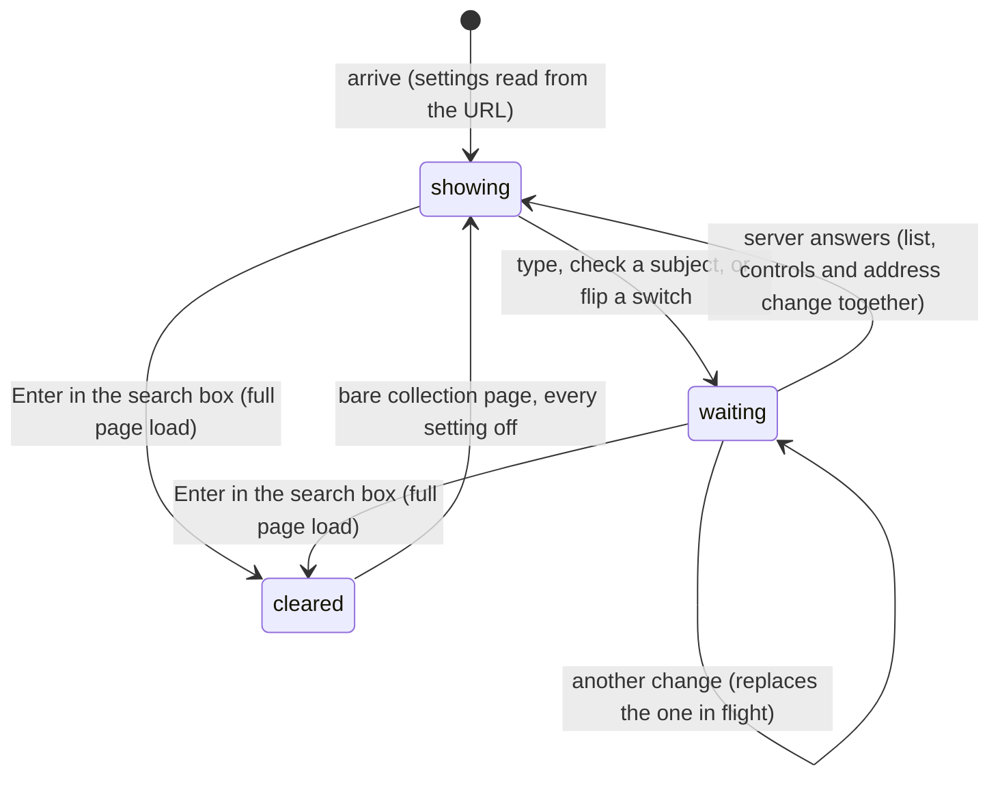

# Search and filters

## Summary

The search box and the filters narrow the problem list on the [collection page](../glossary.md#the-site). There is a text box with the placeholder "Search", four subject checkboxes ("Algebra", "Combinatorics", "Geometry", "Number Theory"), an "Archived" switch that swaps the list for the [archived](../glossary.md#records) problems, and, for Serious testsolvers in a collection that [requires testsolving](../glossary.md#testsolving), an "Unsolved only" switch. There is no Apply button and nothing is saved: every keystroke and every click changes the page's address, and the server rebuilds the list for the new address. The settings live only in the URL, which is what makes a filtered view bookmarkable and what the problem page's back link returns to (see [navigation](../foundations/navigation.md#the-collection-pages-url)). Every member who [can view](../glossary.md#people-and-access) the collection gets the search box, the subject checkboxes and the Archived switch.

## The simple case

A member opens the collection page and types "circle" into the "Search" box. After each letter the server answers, and the list shrinks to the problems whose title or statement contains what has been typed so far, in any mix of capitals, newest first as always (see [the problem list](problem-list.md)). The address becomes `/c/{cid}?search=circle`.

They check "Geometry". The tick, the shorter list and the new address (`?subject=g&search=circle`) all appear together when the server answers. They open a card, read the problem, and follow "‹ Back to {collection name}"; the collection page comes back with "circle" in the box and Geometry still checked.

On a fast connection this feels like ordinary typing. On a slow one, letters appear only once the server has answered, and letters typed faster than that are lost (see [While editing](#while-editing)).

## The interaction, event by event

### Arrive

The page is built on the server from its address. The search box shows the `search` text; a subject box is checked when its letter is in `subject`; each switch is on when its parameter is exactly `true` ([navigation](../foundations/navigation.md#the-collection-pages-url) has the reading rules). The list already reflects them. Nothing is focused.

On a window at least 1280 px wide the controls sit in a column to the right of the list and stay in view as the list scrolls. On narrower windows they come first, above the list. From top to bottom:

1. **"Add Problem"**, for Admins and TeamMembers (see [adding a problem](adding-a-problem.md)). Between 640 and 1279 px wide it shares a row with the search box.
2. **The search box**: a tall white box with rounded corners, the placeholder "Search", and a magnifier icon at its right end. The icon is decoration, not a button.
3. **Four checkboxes**, stacked: "Algebra", "Combinatorics", "Geometry", "Number Theory". A checked box is violet with a white tick.
4. **"Archived"**, a switch: violet when on, gray when off.
5. **"Unsolved only"**, a switch, only for a Serious testsolver in a collection that requires testsolving.

Clicking a label toggles its checkbox or switch. There is no count of matches, no "clear filters" control, and no filter for difficulty, author, test or likes.

What each control does, all combined (a problem must pass every one):

| Control         | Off or empty                | On                                                                                    |
| --------------- | --------------------------- | ------------------------------------------------------------------------------------- |
| Search          | No restriction              | Only problems whose title or statement contains the text, ignoring capitals           |
| Subject boxes   | None checked: every subject | Only the checked subjects; all four checked is the same as none                       |
| "Archived"      | Only problems not archived  | Only archived problems (not "archived as well")                                       |
| "Unsolved only" | No restriction              | Hides every problem the user has a [testsolve attempt](../glossary.md#testsolving) on |

The search is a plain substring match over the text as stored. It does not split words ("circle radius" matches only that phrase), is not trimmed (a trailing space must be matched too), and matches math by its source (`\pi`, not π). It does not look at the [problem ID](../glossary.md#records), the answer, solutions, authors, comments or test names. It does look at the statements of [locked](../glossary.md#testsolving) problems, whose cards then appear in the results showing only "Testsolve to view" (see [Open questions](#open-questions-and-verification)).

"Unsolved only" hides a problem as soon as the user has an attempt on it, whether the attempt was solved, given up, ran out of time, or is still running. It means "not yet attempted", which is not quite what its label says.

### Leave untouched

Looking at the controls and leaving records nothing. The settings are kept nowhere but the address: the problem page carries them for its back link, and every other way back to the collection page (the home page's sidebar, the chooser, an invite, signing in) arrives with none set.

### Begin editing

The first keystroke in the search box, or the first click on a checkbox or switch, changes nothing on screen. The typed letter does not appear, the box does not tick, the switch does not move. The new settings go to the server at once as a request for the page at the new address, which is the current address with that one change. The page number is kept.

No spinner or other sign shows that the list is loading.

> Technical note: the box, the checkboxes and the switches are controlled by the settings the server last rendered, and their handlers only start a client-side navigation (`router.replace`), which runs as a transition. React puts the box back to its last rendered value right after each keystroke, and the checkboxes and switches never change their own state, so nothing moves until the new page arrives.

### While editing

Until the server answers, the page shows the old list and the old settings, and everything on it stays usable: cards, hearts, "Add Problem", the page numbers.

- **Typing faster than the server answers loses letters.** Each keystroke is applied to what the box shows, which is still the last answered text, so letters typed since then are dropped. Typing "filler" quickly into an empty box leaves just "r". Pasting works, since it is one change. Holding Backspace removes one character per round trip.
- **Clicking a second control before the answer loses the first click**, for the same reason: checking Algebra and then Geometry quickly leaves only Geometry checked. Clicking the same box twice quickly leaves it checked rather than back where it was, since both clicks ask for the same change.
- **The text cursor jumps to the end** of the box whenever its text is put back or updated, so a letter typed in the middle of the search lands there, and the next one at the end.
- **Enter in the search box** does not search. The box sits in a form of its own with no destination, so Enter submits that form as a full page load of the bare collection address: the box empties, and every checkbox, switch and the page number are reset. The mobile keyboard's Search or Go key does the same.
- **Escape**, and the small × that Chrome and Safari draw at the end of a search box, clear the box in those browsers. That is an ordinary change: the search is removed when the server answers, and until then the old text stays in the box.

A newer change always replaces the one in flight; only the latest is ever shown.

### Submit

When the server answers, the list, the controls, the page numbers and the address bar change together. The current history entry is replaced rather than a new one added, so the browser's back button skips every intermediate setting. The window does not scroll, and the search box keeps focus.

- **The page number is kept.** A user on page 3 who checks Geometry sees page 3 of the Geometry problems if there are at least three pages of them, not the first page. If the new results do not reach that page, the server sends the browser to the last page that exists instead (see [pagination](pagination.md)).
- **Nothing matches.** The list is empty and there is no message; the controls stay, so the user can loosen the search.
- **The page's checks run again**, as on any load ([navigation](../foundations/navigation.md#what-each-page-checks-in-order)): a user whose session has ended is sent to the login page, and returns afterwards to the bare collection page; a user who can no longer view the collection is sent to "You need permission".

A filter change is not an [action](../glossary.md#interaction): it never shows a [toast](../glossary.md#interface). A failure behaves like any failed navigation.

## Modifiers

| Modifier            | At arrival                                                                                                                                                                                                                                                                                                                      | During editing                                                                                                                                                                                                                                                   |
| ------------------- | ------------------------------------------------------------------------------------------------------------------------------------------------------------------------------------------------------------------------------------------------------------------------------------------------------------------------------- | ---------------------------------------------------------------------------------------------------------------------------------------------------------------------------------------------------------------------------------------------------------------- |
| Role                | Admin, TeamMember and ViewOnly get the same controls; only "Add Problem" differs. SubmitOnly members, users with no permission and signed-out visitors never reach the page.                                                                                                                                                    | Every change reloads the page, so a role change applies at the next keystroke or click: losing view access sends the user to "You need permission".                                                                                                              |
| Authorship          | No effect on the controls. Problems the user can edit are never locked, so "Unsolved only" keeps them unless the user has an attempt on them.                                                                                                                                                                                   | No effect.                                                                                                                                                                                                                                                       |
| Testsolver type     | "Unsolved only" is shown only to Serious testsolvers in a collection that requires testsolving. A `unsolvedOnly=true` in the address still applies to anyone else, with no switch to turn it off (see [Edge cases](#edge-cases)). Locked problems are listed and searched like any other.                                       | A type changed in another tab applies at the next change: the "Unsolved only" switch appears or disappears and cards lock or unlock, while an `unsolvedOnly=true` already in the address stays in force.                                                         |
| Record state        | Archived problems appear only with "Archived" on, and then only they do. Whether a problem has an answer, a solution or a difficulty makes no difference.                                                                                                                                                                       | Each answer reflects problems added, edited or archived by anyone since the last one.                                                                                                                                                                            |
| Collection settings | "Requires testsolving" is the only setting involved, through "Unsolved only". New members of `topsoj` and `mgci` are made Serious, so there every new member sees the switch, provided the collection requires testsolving. Answer format, required fields and shown authors change nothing here; there is no filter by author. | No effect.                                                                                                                                                                                                                                                       |
| Keys                | Nothing has focus. Tab reaches "Add Problem" (if shown), the search box, the four checkboxes, "Archived" and "Unsolved only", in that order, then the cards.                                                                                                                                                                    | In the search box: Enter reloads the bare collection page, clearing everything; Escape clears the search in Chrome and Safari. On a checkbox, Space toggles and Enter does nothing. On a switch, Space or Enter toggles. Tab moves on without changing anything. |

## Cancel and interrupt

| Event                               | Before editing                                                                                           | While editing                                                                                                                                                                                                                                 |
| ----------------------------------- | -------------------------------------------------------------------------------------------------------- | --------------------------------------------------------------------------------------------------------------------------------------------------------------------------------------------------------------------------------------------- |
| Escape or Discard                   | No effect. There is no Discard and no "clear filters".                                                   | In the search box, Escape clears the search (Chrome, Safari), which is itself a change sent to the server. Nothing cancels a change already sent; the next change replaces it.                                                                |
| Browser back or forward             | Leaves for the previous history entry: the page before the collection page, or the previous page number. | The change in flight is abandoned and the browser goes to the previous entry. Because filter changes replace the entry, Back never steps through earlier settings.                                                                            |
| Reload                              | Rebuilds the page with the settings in the address.                                                      | Reloads the address bar's settings, which are the last ones the server answered; letters typed or a click made since then are lost.                                                                                                           |
| Tab or window closed                | Nothing recorded.                                                                                        | Nothing recorded. The settings survive only in the browser's history of the closed tab.                                                                                                                                                       |
| A link inside the app followed      | Cards and page numbers carry the settings; "Add Problem" does not.                                       | The newer navigation wins and the change in flight is abandoned. A card carries the settings as last answered, not the pending ones.                                                                                                          |
| Network lost mid-request            | No effect until a change is made.                                                                        | The new page cannot be fetched; the browser falls back to a full load of the new address, which shows its offline page ([navigation](../foundations/navigation.md#cancel-and-interrupt)). Reloading once back online shows the filtered list. |
| Request fails or returns an error   | No effect.                                                                                               | A failure while building the page falls back to a full load and shows "Something went wrong". No toast.                                                                                                                                       |
| Session ends                        | No effect on the open page.                                                                              | The next change sends the user to the login page; after signing in they land on the bare collection page, without their settings.                                                                                                             |
| Access changes                      | No effect on the open page.                                                                              | The next change uses the new access: "You need permission" if the user can no longer view, or a list with a new testsolver type applied.                                                                                                      |
| Same record changed in another tab  | Not shown until a change or reload.                                                                      | Each change fetches the list afresh, so problems added, archived or edited elsewhere show up with it. A problem started in another tab disappears under "Unsolved only" at the next change.                                                   |
| Same record changed by another user | Not shown until a change or reload.                                                                      | As another tab.                                                                                                                                                                                                                               |
| Autofill writes into the field      | No effect.                                                                                               | The search box has no name, so browsers have no saved entries to offer. Anything that does fill it counts as typing and changes the list.                                                                                                     |
| The window loses focus              | No effect.                                                                                               | No effect. A change in flight still completes; nothing is sent on blur.                                                                                                                                                                       |
| The testsolve time limit passes     | No effect. A problem with a running attempt is already unlocked on its card.                             | No effect. "Unsolved only" hides a problem from the moment its attempt starts, so the attempt ending changes nothing in the list.                                                                                                             |

After any interrupt the settings are whatever the address bar showed last; nothing else remembers them.

## Interactions with other systems

**Permissions.** The controls are the same for every role that can view the collection. Each change is a page load, so the collection page's checks run again every time. See [accounts and roles](../foundations/accounts-and-roles.md).

**Testsolving locks.** Locked problems are listed, counted and searched like any other; their cards show "Testsolve to view" ([the locked problem](../testsolving/locked-problem.md#locked-cards)). Because the search reads locked statements, a matching locked card reveals that its statement contains the searched text. "Unsolved only" is the one control built for testsolving.

**Per-collection settings.** Only "requires testsolving" matters, and only for "Unsolved only". See [per-collection settings](../cross-cutting/per-collection-settings.md).

**Validation and errors.** None. Any text is a valid search, and unreadable parameters in a hand-typed address are ignored. Nothing produces a toast.

**Unsaved changes.** Nothing to lose beyond the letters dropped while typing; the settings are in the address as soon as the server has answered.

**Optimistic updates.** None, and deliberately not even the control itself: the box, the checkboxes and the switches change only when the server answers. This is the opposite of the heart and the Archive switch ([saving and feedback](../foundations/saving-and-feedback.md#optimistic-updates-and-rollback)).

**Freshness and other users.** Every change fetches the list afresh, including other people's new, edited and archived problems. See [freshness](../cross-cutting/freshness.md).

**URL state.** The settings are the `search`, `subject`, `archived` and `unsolvedOnly` parameters, written and read as described in [navigation](../foundations/navigation.md#the-collection-pages-url). Changes replace the history entry without scrolling. The page number (`page`) is kept across changes.

**Math rendering.** The search matches the stored text, so math is matched by its source (`x^2`, `\frac`), not by what is displayed. See [math rendering](../cross-cutting/math-rendering.md).

**Offline.** The first change made offline replaces the page with the browser's offline page for the new address.

**Keyboard and accessibility.** Everything can be reached with Tab and used from the keyboard. The checkboxes and switches are announced with their labels and state. The search box has no label; its placeholder "Search" is all a screen reader has to name it. When focused, the search box shows no focus ring; the checkboxes and switches show one. On wide windows the controls come before the list in Tab order although they are drawn to its right. See [keyboard and accessibility](../cross-cutting/keyboard-and-accessibility.md).

**Narrow screens.** Below 1280 px the controls move above the list and stop following the scroll; below 640 px "Add Problem" and the search box stack. On a phone, the list starts below all of them. See [narrow screens](../cross-cutting/narrow-screens.md).

**Side effects.** None. Searching and filtering change nothing stored.

## Edge cases

- A member who is not a Serious testsolver but opens an address with `unsolvedOnly=true` (a link shared by a Serious testsolver, or a back link from before switching to Casual) sees only problems they have not attempted, with no switch to show that this is happening. Their own filter changes keep the setting.
- With "Archived" on, the cards look the same as unarchived ones; only the switch says the list is of archived problems.
- A search of one space matches almost everything; a search with a trailing space matches only where a space follows.
- Typing a problem ID finds nothing unless the ID's text happens to appear in a title or statement.
- Checking all four subjects gives the same list as checking none, with the address saying `subject=acgn`.
- Pressing Enter to "run" the search, the natural thing to do, throws the search away.
- The subject chip on a problem page links back to the collection page with only that subject checked and nothing else, not with the settings the user came with.
- A server redirect to the last page happens silently; the list simply shows a different page from the one in the address a moment earlier.

## Open questions and verification

- Dropped letters are confirmed by a first local pass (headless Chromium, production build): typing "filler" at 20 ms per key into the search box of `/c/demo` left only "r" in the box and `?search=r` in the address. This looks like a bug: the box should keep its own text and send it to the server, instead of taking its value back from the server.
- Enter clearing everything is confirmed by the same pass: from `/c/demo?subject=c&search=w`, Enter in the search box made a full page load of `/c/demo` with an empty box. This looks like a bug.
- The same lost-click race on the checkboxes and switches, the text cursor jumping to the end, and a checkbox not ticking until the server answers were read from code; they follow from the same mechanism as the dropped letters but were not tried.
- Searching reads the statements of locked problems, and a first local pass confirmed it: a Serious testsolver searching `this problem has`, words found only in the statement of a problem locked for them, got that problem's padlocked card back, and a search for a word in no problem got nothing. So a testsolver can learn words in a statement they may not read yet. This looks like a bug: the search should look only at the title for locked problems.
- Keeping the page number when a filter changes, so that the user lands on page 3 of the new results or on its last page, looks like a bug; resetting to page 1 would be expected.
- "Unsolved only" hides given-up, timed-out and running attempts, not only solved ones. Whether to rename it ("Not attempted") or change the rule is a product question.
- `unsolvedOnly=true` in the address applies to users who are not shown the switch. It may be worth ignoring the parameter for them.
- Escape and the × clearing the box, and the mobile keyboard's Search key submitting the form, are browser behavior for search boxes and were not tried; Firefox may differ. Shift/Ctrl/Cmd+Enter in the box was not tried.
- That a change whose address exactly matches a page number prefetched in the last five minutes can show that prefetched copy follows from the framework's prefetch cache and was not observed.

Verified against Probase commit `c38ff56`
