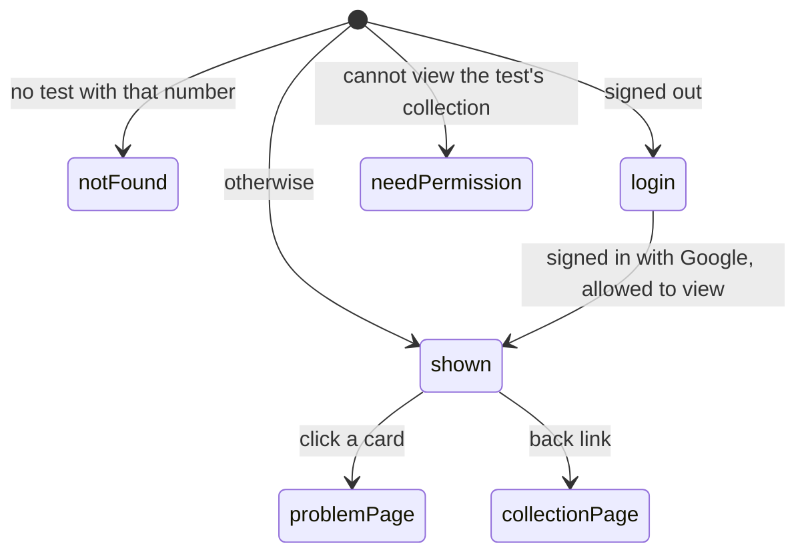

# The test page

## Summary

The test page lists the problems of one [test](../glossary.md#records), a named, ordered selection of a collection's problems such as a mock contest, as a column of cards headed "PROBLEM 1", "PROBLEM 2" and so on, each showing the problem's statement or, when the problem is [locked](../glossary.md#testsolving) for the viewer, a padlock and "Testsolve to view". It lives at `/c/{cid}/t/{name-slug}-{testId}` and is reached from the gray test chips under a problem's title on the [problem page](../problem-page/problem-page.md); nothing else links to it, because tests are created in the database and have no management page. Admins, TeamMembers and ViewOnly members of the test's collection can open it. It is read-only: the only things to do on it are follow a card to its problem or go back to the collection.

## The simple case

A TeamMember reading problem `A3` sees a gray chip "Mock AIME 1" under its title and clicks it. The test page opens with "‹ Back to {collection name}" at the top left and "Mock AIME 1" as a large bold heading. Below it, one card per problem, in the test's order, each labeled "PROBLEM 1", "PROBLEM 2", ... and showing the statement with its math typeset. The cards are the same color as the page, so they show no edge until the pointer is over one, when it turns into a white rounded box with a shadow; clicking anywhere on it opens that problem's page.

A Serious testsolver sees the same page, except that the cards of problems they have not started show a gray padlock and "Testsolve to view" instead of the statement.

## The interaction, event by event

The test page has no interaction of its own. It is built on the server each time it is loaded.

### Arrive

**The address.** Only the end of the last segment is read: whatever follows its last hyphen (or the whole segment, if it has none), taken as the number its leading digits spell. So `/c/demo/t/mock-aime-1-7` shows test 7, and so do `/c/demo/t/anything-7`, `/c/demo/t/7` and `/c/demo/t/mock-7abc`. The name part is ignored, so a test renamed in the database keeps working at its old addresses. The collection part is ignored too: the test is found by its number alone and shown in its own collection, whatever collection the address names, including one that does not exist. The chips build the address from the test's name in lower case, with spaces turned into hyphens and every other character that is not a letter a to z or a digit dropped, then a hyphen and the number.

**The checks**, in this order ([navigation](../foundations/navigation.md#what-each-page-checks-in-order)):

1. **The test exists**, or "Page not found". This is checked before sign-in, so anyone can tell which test numbers exist.
2. **The user is signed in**, or the login page, which returns them to the address exactly as typed.
3. **The user can view the test's collection** (Admin, TeamMember or ViewOnly there), or "You need permission".

There is no testsolver-type check. A member of a collection that requires testsolving who has not chosen a type, and whom every other page of the collection sends to the [chooser](../testsolving/choosing-a-testsolver-type.md), gets the test page, with every statement shown (confirmed on a first local pass).

**What is shown**, from the top:

1. **Back link.** "‹ Back to {collection name}", to the test's collection page with no search or filters.
2. **Heading.** The test's name as stored, in large bold type.
3. **Cards**, one per problem in the test, ordered by position. Each is labeled "PROBLEM {position}" in small gray capitals, using the position stored with the test, and shows either the statement, with math typeset and line breaks kept, or, when the problem is locked for the viewer, a gray padlock and "Testsolve to view". A card shows no problem ID, title, subject color, heart, lightbulbs or author. Archived problems are included and look like the rest.

The whole card is a link to the problem's page in the test's collection, `/c/{cid}/p/{pid}`, with no query string.

**Which cards are locked.** Exactly the rule of the collection page's cards and the problem page ([the locked problem](../testsolving/locked-problem.md#locked-cards)): the collection requires testsolving, the viewer is a Serious testsolver whose serious period covers the problem, they cannot edit it, and they have not started an attempt on it. A problem whose attempt is running shows its statement, as the testsolving view does. A locked problem's statement is left out of the page, not hidden in the browser.

A test with no problems shows the back link and the heading and nothing else; there is no "no problems" message and no count. The page arrives scrolled to the top with nothing focused.

### Leave untouched

Opening and leaving the test page records nothing. It never starts an attempt, even on locked problems, and leaves no trace of the visit.

### Begin editing

Not applicable: nothing on the test page can be changed. Following a card leaves for the problem page, which opens in whichever [view](../glossary.md#testsolving) applies (locked, testsolving or unlocked); starting an attempt happens there.

### While editing

Not applicable. The page shows the test as of its last load; statements edited, problems added to the test, or attempts started elsewhere appear on the next load.

### Submit

Not applicable.

## Modifiers

| Modifier            | At arrival                                                                                                                                                                                                                                                                      | During editing                                                                                                              |
| ------------------- | ------------------------------------------------------------------------------------------------------------------------------------------------------------------------------------------------------------------------------------------------------------------------------- | --------------------------------------------------------------------------------------------------------------------------- |
| Role                | Admin, TeamMember and ViewOnly members of the test's collection see the page. SubmitOnly members and users with no permission get "You need permission"; signed-out visitors go to the login page (after the test's existence is checked). Admins see every statement.          | A role changed elsewhere does not change the open page; the next load, or the problem page a card opens, uses the new role. |
| Authorship          | Problems the viewer can edit (their own, as a TeamMember; all of them, as an Admin) are never locked.                                                                                                                                                                           | No effect.                                                                                                                  |
| Testsolver type     | Serious: locked cards for problems not yet started. Casual, not chosen, or a collection that does not require testsolving: every statement shown. Not chosen does not send the member to the chooser.                                                                           | A type chosen or changed elsewhere applies on the next load.                                                                |
| Record state        | Archived problems are listed like any other. A problem with an attempt, running or finished, shows its statement. A problem with no difficulty locks like any other here, although its page fails for a viewer who needs to testsolve it. An empty test shows only its heading. | Changes to the problems, their statements or the test itself appear on the next load.                                       |
| Collection settings | Only requiring testsolving matters, since without it nothing locks. Answer format, required fields and showing authors change nothing. In `topsoj` and `mgci` new members are Serious from joining, so they see padlocks at once.                                               | No effect on the open page.                                                                                                 |
| Keys                | No page shortcuts. Tab moves through the back link and the cards; Enter follows the focused one.                                                                                                                                                                                | Not applicable: nothing to edit.                                                                                            |

## Cancel and interrupt

The test page has nothing to edit, so every "While editing" cell is not applicable. The "Before editing" column records what each event does to the page while it is open.

| Event                               | Before editing                                                                                                                                                         | While editing                    |
| ----------------------------------- | ---------------------------------------------------------------------------------------------------------------------------------------------------------------------- | -------------------------------- |
| Escape or Discard                   | No effect. There is no Discard button.                                                                                                                                 | Not applicable: nothing to edit. |
| Browser back or forward             | Leaves; nothing recorded. Coming back may show the page as it was, from the browser's cache.                                                                           | Not applicable: nothing to edit. |
| Reload                              | The checks run again and the page is rebuilt with the current problems, statements and locks.                                                                          | Not applicable: nothing to edit. |
| Tab or window closed                | Nothing recorded.                                                                                                                                                      | Not applicable: nothing to edit. |
| A link inside the app followed      | The back link opens the bare collection page; a card opens the problem page. On a production build both were prefetched, so they can show data up to five minutes old. | Not applicable: nothing to edit. |
| Network lost mid-request            | The page sends no requests of its own; a link followed offline fails to load ([navigation](../foundations/navigation.md#how-links-load)).                              | Not applicable: nothing to edit. |
| Request fails or returns an error   | A failure while building the page shows "Something went wrong" with "Try again" in place of the page.                                                                  | Not applicable: nothing to edit. |
| Session ends                        | No effect on the open page. The next load goes to the login page, which returns to the test page.                                                                      | Not applicable: nothing to edit. |
| Access changes                      | No effect on the open page. A card then leads wherever the problem page's own checks send the user ("You need permission", the chooser, or a different view).          | Not applicable: nothing to edit. |
| Same record changed in another tab  | Not shown until a reload. A card stays locked after an attempt is started in another tab; the problem page it opens shows the true state.                              | Not applicable: nothing to edit. |
| Same record changed by another user | Not shown until a reload: edited statements, archived problems, and changes to the test in the database.                                                               | Not applicable: nothing to edit. |
| Autofill writes into the field      | Not applicable: the page has no fields.                                                                                                                                | Not applicable: nothing to edit. |
| The window loses focus              | No effect.                                                                                                                                                             | Not applicable: nothing to edit. |
| The testsolve time limit passes     | No effect. A card whose attempt is running already shows the statement and keeps showing it; the test page has no countdown.                                           | Not applicable: nothing to edit. |

## Interactions with other systems

**Permissions.** The page requires being able to view the test's own collection, not the collection named in the address. It is decided once, when the page is built; there are no actions to check again. See [accounts and roles](../foundations/accounts-and-roles.md).

**Testsolving locks.** Cards lock by the same rule as everywhere else, and a locked statement never reaches the browser. The test page cannot unlock anything; "Start testsolving" is on the problem page. Because the page skips the testsolver-type check, a member who has not chosen a type sees every statement here, including statements they would have to testsolve after choosing Serious. See [the locked problem](../testsolving/locked-problem.md).

**Per-collection settings.** Requiring testsolving decides whether any card can lock. No other setting, and nothing in the code-level configuration, changes the page. See [per-collection settings](../cross-cutting/per-collection-settings.md).

**Validation and errors.** None on the page. An unknown test number shows "Page not found". An address whose last part does not start with a digit is expected to show "Something went wrong" instead; see [open questions](#open-questions-and-verification).

**Unsaved changes.** None: there is nothing to type.

**Optimistic updates.** None.

**Freshness and other users.** As fresh as the page's last load. A test chip on a problem page prefetches the test page on a production build, so the test page can open showing statements and locks up to five minutes old. See [freshness](../cross-cutting/freshness.md).

**URL state.** The address carries the test's number and an ignored name part, and no query string. The chip that leads here drops the search and filters the problem page was carrying, and the cards carry none onward, so the problem page opened from a card has a back link to the bare collection page, not to the test. The browser's back button is the only way back to the test page.

**Math rendering.** Statements are rendered as on the collection page's cards: math typeset, line breaks kept, malformed math in red. The test's name is plain text. See [math rendering](../cross-cutting/math-rendering.md).

**Offline.** The page keeps showing what was loaded; its links fail to load.

**Keyboard and accessibility.** Each card is a single link whose text is its label and its whole statement (or "Testsolve to view"), so a screen reader reads the entire statement as the link's name; the padlock icon is not announced. The test's name is styled as a heading but is not marked up as one. The cards are in a numbered list with its numbers hidden; the "PROBLEM {n}" labels carry the numbering. See [keyboard and accessibility](../cross-cutting/keyboard-and-accessibility.md).

**Narrow screens.** The column is 32 rem wide (36 and 40 rem on wider windows) and shrinks to fit a narrow window, with smaller text; the cards take its full width and nothing is hidden. See [narrow screens](../cross-cutting/narrow-screens.md).

**Side effects.** None. On a production build each card prefetches its problem page as it scrolls into view, which records nothing.

## Edge cases

- `/c/{any cid}/t/{anything}-{n}` shows test _n_ to anyone who can view its collection. The back link and the cards point to the test's own collection, so an address naming another collection shows that collection nowhere.
- The labels show the positions as stored in the database. A test whose positions skip (1, 2, 4) or start at 0 shows exactly those numbers.
- The test page is the only place a problem's statement is shown without its title or ID, so two problems with similar statements can only be told apart by opening them.
- A card for a problem the viewer is testsolving right now shows the statement; clicking it opens the testsolving view with the countdown already running.
- A card for a locked problem with no difficulty shows the padlock, but clicking it shows "Something went wrong" instead of the locked view ([the problem page](../problem-page/problem-page.md#edge-cases)).
- Previous and Next on a problem page opened from a card step through problem IDs, not through the test's order.
- A test chip is shown on each of the test's problems, so a test is reachable only through one of its problems; a test with no problems has no chip anywhere and can only be opened by typing its address.
- The browser tab's title is "Probase", not the test's name.

## Open questions and verification

- Ignoring the name part was confirmed on a first local pass (`/c/ts/t/anything-1` opened test 1). Not checking the collection in the address against the test's own was read from code. Whether it should be checked is a product call; nothing leaks, since the viewer's permission is checked on the test's own collection.
- The missing testsolver-type check was confirmed on a first local pass: a member of a collection that requires testsolving, sent to the chooser from the collection page, saw every statement of a test with no padlocks. This looks like a bug: a member can read problems before choosing Serious and then testsolve them with the statements already seen.
- An address whose last part does not start with a digit (`/t/mock`, `/t/mock-`) turns into a lookup with no valid number, which is expected to fail and show "Something went wrong" rather than "Page not found"; a number too large for the database likewise. Read from code, not tried. If confirmed, this is a bug: it should be "Page not found".
- Checking whether the test exists before checking sign-in lets signed-out visitors tell which test numbers exist, as with collections.
- No automated test covers the test page; everything else here was read from code.
- Whether the cards should carry the test back to the problem page (a back link to the test, or Previous and Next in the test's order) is a product call.

Verified against Probase commit `c38ff56`
