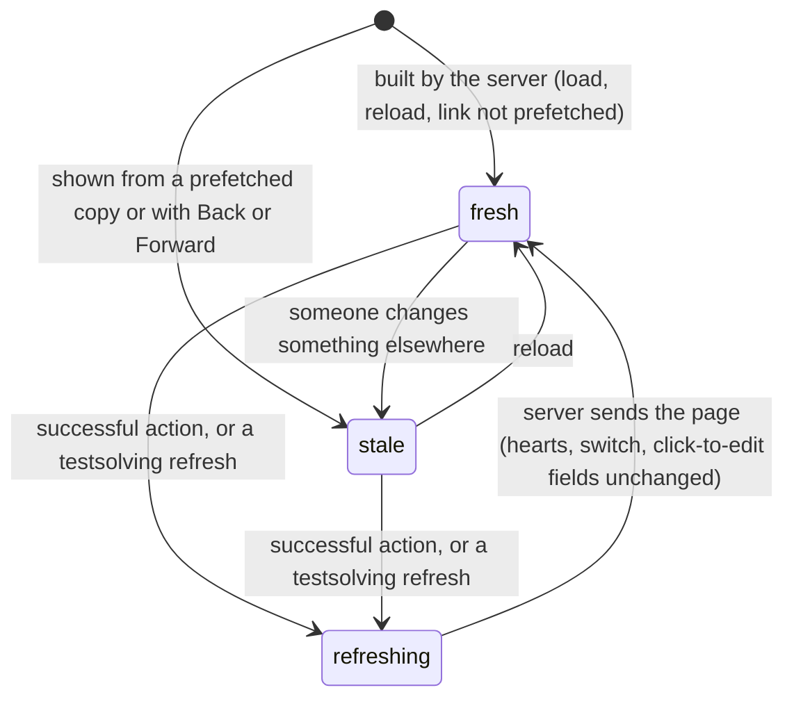

# Freshness

## Summary

[Freshness](../glossary.md#other-users-and-other-tabs) is whether what a page shows matches what the server holds. Probase never pushes changes to an open page: what other users and other tabs change appears only when a page is loaded or [refreshed](../glossary.md#interaction), and the one thing on any page that changes by itself is the countdown of a [timed attempt](../testsolving/timed-attempt.md). A page is fresh when the server builds it, on a load, on a refresh after a successful [action](../glossary.md#interaction), or when a testsolving control asks for one, and it grows stale from then on. Two things show a page that may already be stale when it appears: eager prefetching on a production build, which can reuse a copy up to five minutes old, and the browser's back and forward buttons. And a refresh does not reach every part of a page: the heart, the Archive switch and click-to-edit fields keep the state they started with. This document owns those rules, page by page, and what happens when two tabs or two users change the same thing.

## The simple case

Ana and Ben, two members, have the same problem page open. Ben posts a comment. Nothing happens on Ana's screen: no notice, no new comment. A minute later Ana likes the problem. Her heart turns rose at once; when the server answers, her page refreshes in place, without scrolling, and Ben's comment appears in the discussion along with anything else that changed since she opened the page.

Had Ben changed the problem's title instead, and had Ana been able to edit the problem, her refresh would have shown the comment but kept the old title, because her title is a [click-to-edit](../foundations/click-to-edit.md) field that keeps its own text. If Ana then edited that title, her save would replace Ben's without warning.

## How a page gets its data

### Loading

Every page is built on the server when it is loaded: from the address bar, by a reload, or through a link whose destination was not prefetched. It shows everything as it stood at that moment, including which problems are locked for the user. Nothing on it changes afterwards except through a refresh, and nothing checks for changes when the window or tab regains focus.

### Refreshing in place

A refresh asks the server for a fresh copy of the page the user is on and puts it in place without a full reload: the scroll position is kept, focus stays where it was, and text typed into a component that stays on the page is kept. On the problem page a refresh also decides the [view](../glossary.md#testsolving) again. These are the only things that refresh a page:

| Event                                                                        | What happens                                                                         |
| ---------------------------------------------------------------------------- | ------------------------------------------------------------------------------------ |
| A like or unlike succeeds, on a card or on the problem page                  | The page the heart is on refreshes: the collection page or the problem page.         |
| A title, statement, answer or solution save, or the Archive switch, succeeds | The problem page refreshes.                                                          |
| A comment is posted, or a solution added                                     | The problem page refreshes.                                                          |
| "Start testsolving" succeeds                                                 | The problem page refreshes into the testsolving view.                                |
| A correct answer, or "Give Up", succeeds                                     | The problem page refreshes into the unlocked view.                                   |
| A wrong answer                                                               | No refresh; only the wrong-answer line changes.                                      |
| The countdown reaches zero                                                   | The problem page refreshes, once a second, until the server sends the unlocked view. |
| A problem is added                                                           | The new problem's page opens, built fresh.                                           |
| An invite is accepted, or a testsolver type chosen                           | The collection page opens, built fresh.                                              |
| Any action is refused or fails                                               | No refresh; the [toast](../glossary.md#interface) is the only change.                |

Each refresh in this table, and adding a problem, also empties the browser's cache of other pages, so the next page visited is fetched from the server. A wrong answer, which does not refresh, does not empty it.

> Technical note: any server action that marks a path stale makes the server rebuild the page the action was sent from and return it with the answer, whichever path was named. That is why a like on a collection-page card refreshes the collection page although the like action names only the problem's page. The testsolving actions mark nothing stale; the page calls for a refresh itself when they succeed.

> Technical note: actions and refreshes from one tab go through a single queue and are sent one after another, so a second click waits for the first request's answer. Following a link or pressing Back while an action is pending drops that action's refresh; the page arrived at is refreshed once more right after it appears.

### Pages shown from a cached copy

**Prefetched pages.** On a production build, most links fetch their destination in the background as soon as they come into view, and a click within five minutes shows that copy instead of asking the server again ([navigation](../foundations/navigation.md#how-links-load)). The prefetched copy is as old as the moment it was fetched. Problem cards and test cards, the back links, the subject and test chips, the sidebar, the collection page's page numbers and "Add Problem" are prefetched this way; Previous and Next, and the pagination's "Previous" and "Next", are not, and always fetch. A refresh (including the one after a successful action) empties the cache, and links on screen are then fetched again when hovered, touched or scrolled back into view. The development server never prefetches, so there every link fetches.

**Back and forward.** The browser's back and forward buttons show a page visited earlier in the same tab as it was when the user left it, as long as the tab has not refreshed since. After a refresh, a successful action that opens a new page, or a reload, the page is fetched from the server.

Either way, the page's components start over from the cached copy: a heart shows the count in the copy, not the count the user saw last.

## What a refresh updates

**Updated.** Everything the server draws: on the problem page, the title for users who cannot edit it, the chips, the lightbulbs, the statement and the answer and solution as read (for users who cannot edit them), "Written by", whether the spoilers hold a solution or offer "Add Solution", the [leaderboard](../testsolving/leaderboard.md), the comments, the locked notice's "You could be the first!", and the view itself; on the collection page, which problems are listed, their titles, statements, padlocks and lightbulbs, and the number of pages.

**Not updated.** Components that keep their own state in the browser keep it:

- The **heart**, on cards and on the problem page: its color and count stay as the user last set them, or as they were when the page (or that problem) was opened.
- The **Archive switch** keeps its position.
- Every **click-to-edit field** (title, statement, answer and solution, for users who can edit) keeps the text it was opened with, or the text the user last saved in it.
- The **spoilers** stay open or closed. What is inside them is not part of the page while they are closed, so closing and reopening them rebuilds the answer and solution from the latest refresh, editors included.
- **Typed text** stays: the comment box, open editors, the Add Solution box, the timed attempt's answer box and its wrong-answer line.

A component that the refreshed page no longer contains is removed, with whatever was typed in it. When the view changes, or when "Add Solution" gives way to a solution another member added, the text in the old component is lost without warning.

These components start over only when the page is loaded, when the spoilers holding them are closed and reopened, or when the user moves to a different page: another problem (by Previous, Next or a card), or another page and back. Changing the collection page's search, filters or page number does not start the page over, so the heart on a card that stays on screen keeps its state.

> Technical note: the page is identified by its path without the query string, so a query-string change re-renders the collection page in place instead of replacing it; the cards are identified by problem ID.

## Page by page

| Page                          | Refreshes in place when                                                                                                                          | Updates on refresh                                                                       | Does not update                                                                          |
| ----------------------------- | ------------------------------------------------------------------------------------------------------------------------------------------------ | ---------------------------------------------------------------------------------------- | ---------------------------------------------------------------------------------------- |
| Collection page               | A heart on a card succeeds. A search or filter change fetches the list again, unless that exact address was prefetched in the last five minutes. | Which cards are shown, their titles, statements, padlocks and lightbulbs; the page count | Hearts on cards that stay on screen                                                      |
| Problem page, unlocked        | Any successful action on it                                                                                                                      | Everything the server draws (see above)                                                  | Heart, Archive switch, click-to-edit fields, spoilers' state, typed text                 |
| Problem page, locked          | A successful like; a successful "Start testsolving"                                                                                              | The title, chips, lightbulbs, the notice, the view                                       | Heart                                                                                    |
| Problem page, testsolving     | A successful like, a correct answer, "Give Up", the countdown at zero                                                                            | The title, chips, lightbulbs, statement, the view                                        | Heart, typed answer, wrong-answer line                                                   |
| Test page                     | Never; it has no actions                                                                                                                         | Nothing                                                                                  | Everything, until reloaded                                                               |
| Add-problem page              | Never; a successful Submit opens the new problem                                                                                                 | Nothing                                                                                  | The form, which lives only in the page                                                   |
| Chooser, invite page          | Never; success opens the collection page                                                                                                         | Nothing                                                                                  | The invite's state as loaded; "Accept Invite" is checked against the invite as it now is |
| Home page, login, error pages | Never                                                                                                                                            | Nothing to update: nothing on them is changed by users                                   | Not applicable                                                                           |

## Other tabs and other users

Probase has no conflict detection. Each change is stored as sent, and the last one wins, field by field:

| What changes             | Two changes at once, or one made from a stale page                                                                                                                                                                                                                                                                      |
| ------------------------ | ----------------------------------------------------------------------------------------------------------------------------------------------------------------------------------------------------------------------------------------------------------------------------------------------------------------------- |
| Title, statement, answer | Each save replaces only its own field; the later save wins. An editor whose field still shows old text starts from that text, so their save undoes the other change without either of them being told.                                                                                                                  |
| Solution                 | The same, for the solution's text. Two members adding the first solution before either page has refreshed both succeed, and the page shows only one of the two; the other is stored but never shown.                                                                                                                    |
| Archive switch           | Sends the position the user moved it to, not "toggle"; the later click wins.                                                                                                                                                                                                                                            |
| Like                     | Sends "like" or "unlike" according to what this tab shows, not "toggle", so repeating in one tab what another tab already did changes nothing on the server. The count shown is the count when the page was opened plus this tab's own clicks; other people's likes are missing from it until the page is opened again. |
| Comments                 | Both are stored; each person sees the other's on their next refresh.                                                                                                                                                                                                                                                    |
| Testsolve attempt        | One per user per problem; two tabs on one attempt are covered in [the timed attempt](../testsolving/timed-attempt.md).                                                                                                                                                                                                  |
| One-time invite          | Checked again as it is used; the second person to accept sees "Invite has expired". See [invites](../entry/invites.md).                                                                                                                                                                                                 |
| Role or testsolver type  | Applies to the next action and the next page built; see [accounts and roles](../foundations/accounts-and-roles.md#access-that-changes-while-a-page-is-open).                                                                                                                                                            |

## Cancel and interrupt

"Before editing" is a page on screen with nothing pending; "while editing" is a page with an action or a refresh pending, or with text being typed when a refresh arrives.

| Event                               | Before editing                                                                                                                                                                                                                                             | While editing                                                                                                                                                                       |
| ----------------------------------- | ---------------------------------------------------------------------------------------------------------------------------------------------------------------------------------------------------------------------------------------------------------- | ----------------------------------------------------------------------------------------------------------------------------------------------------------------------------------- |
| Escape or Discard                   | No effect.                                                                                                                                                                                                                                                 | Abandoning an editor shows the field's own saved text, which may be older than the server's.                                                                                        |
| Browser back or forward             | Shows the page as it was when the user left it, or fetches it if the tab has refreshed since.                                                                                                                                                              | The pending action completes on the server and its toast, if any, appears; its refresh is dropped, and the page arrived at refreshes once more right after it appears.              |
| Reload                              | The page is rebuilt from the server, hearts, switch and click-to-edit fields included, and the cache of other pages is emptied.                                                                                                                            | Typed text is lost. A pending action may or may not have been stored; the reloaded page shows which.                                                                                |
| Tab or window closed                | Nothing.                                                                                                                                                                                                                                                   | A request that reached the server is stored.                                                                                                                                        |
| A link inside the app followed      | The destination is fetched, or shown from a prefetched copy up to five minutes old on a production build.                                                                                                                                                  | As browser back.                                                                                                                                                                    |
| Network lost mid-request            | Nothing changes; the page stays as stale as it was.                                                                                                                                                                                                        | The action fails with "Something went wrong. Please try again." and nothing refreshes. A refresh the page asked for itself fails silently; the countdown asks again a second later. |
| Request fails or returns an error   | No effect.                                                                                                                                                                                                                                                 | No refresh; the toast is the only change.                                                                                                                                           |
| Session ends                        | The page keeps showing what it showed.                                                                                                                                                                                                                     | Actions answer "Not signed in" and do not refresh. A refresh the page asks for itself (the countdown's) sends the user to the login page.                                           |
| Access changes                      | The page keeps showing the old access.                                                                                                                                                                                                                     | The next refresh builds the page with the new access; see Permissions below.                                                                                                        |
| Same record changed in another tab  | Not shown until this page refreshes or reloads; then shown, except in hearts, the Archive switch and click-to-edit fields.                                                                                                                                 | A save here replaces the other tab's change without warning.                                                                                                                        |
| Same record changed by another user | As another tab.                                                                                                                                                                                                                                            | As another tab; see [other tabs and other users](#other-tabs-and-other-users).                                                                                                      |
| Autofill writes into the field      | Not applicable: freshness involves no field.                                                                                                                                                                                                               | Not applicable.                                                                                                                                                                     |
| The window loses focus              | No effect. Returning to the window does not refresh anything.                                                                                                                                                                                              | No effect, except that a single-line editor saves on blur, and a successful save refreshes the page.                                                                                |
| The testsolve time limit passes     | On the user's own problem page in the testsolving view, the countdown shows "Finished!" and the page refreshes into the unlocked view. Nothing else changes anywhere: cards and leaderboards show a running attempt and one that has run out the same way. | The refresh replaces the testsolving view, so an answer being typed is lost.                                                                                                        |

After any interrupt, the page is as fresh as its last load or refresh; the only way to be sure it matches the server is to reload.

## Interactions with other systems

**Permissions.** A page shows the access the user had when it was built. The next refresh builds it with the access they have now: a member switched to Casual in another tab sees a locked problem open up on the next refresh, and a refresh that finds the user signed out or without access sends them to the login page or "You need permission", as a load would. Actions, which cause most refreshes, check access first and do not refresh when they refuse. See [accounts and roles](../foundations/accounts-and-roles.md#access-that-changes-while-a-page-is-open).

**Testsolving locks.** Whether a problem is locked is decided when a page or card is built. A padlock on a collection-page or test-page card stays until that page is loaded again or refreshed, and the problem page changes view only by refreshing ([the problem page](../problem-page/problem-page.md)).

**Per-collection settings.** Settings changed in the database apply to pages built afterwards. See [per-collection settings](per-collection-settings.md).

**Validation and errors.** A refused or failed action never refreshes the page; the page stays exactly as stale as it was.

**Unsaved changes.** A refresh keeps text typed in components that stay on the page and loses it in components the refresh removes.

**Optimistic updates.** The optimistic controls ignore refreshes and show the state the user last set, whatever the server holds ([saving and feedback](../foundations/saving-and-feedback.md#optimistic-updates-and-rollback)).

**Freshness and other users.** This document.

**URL state.** Changing the collection page's search or filters asks the server for the list again without starting the page over, unless that exact address was prefetched in the last five minutes (a page-number link, or a subject chip seen on a problem page). See [navigation](../foundations/navigation.md#the-collection-pages-url).

**Math rendering.** Rendered text updates with a refresh, except in click-to-edit fields. See [math rendering](math-rendering.md).

**Offline.** Nothing refreshes. Actions fail with the generic toast and change nothing on the page; a countdown at zero keeps asking every second and shows the unlocked view once the connection returns.

**Keyboard and accessibility.** A refresh does not move focus and is not announced. Nothing on any page says how old it is, or that it has just refreshed.

**Narrow screens.** No difference.

**Side effects.** Prefetching and refreshing build pages on the server exactly as a load does. That has no effect anyone could notice, except that prefetching the add-problem page creates the member's author ([saving and feedback](../foundations/saving-and-feedback.md#edge-cases)).

## Edge cases

- A like on a collection-page card refreshes the whole collection page, so problems others added since the page loaded appear, and cards can move under the pointer.
- The problem page's back link is prefetched when the problem opens. Returning with it within five minutes, with no action in between, shows the collection page as it was when the problem was opened.
- A card seen on the collection page opens its problem as it was when the card came into view, possibly up to five minutes earlier: its comments, leaderboard, heart and lock all date from then.
- A heart shows the count from when its card or page was opened. Paging away from a card and back, or opening the problem, can show a different count from the one on the card a moment ago.
- A test page left open shows its padlocks and statements as they were when it loaded, however many problems the user has testsolved since in another tab.
- A member switched from Casual to Serious in another tab who likes a problem while typing a comment sees the page refresh into the locked view; the comment text is gone.
- A member typing in the Add Solution box loses the text if a refresh (from their own like or comment) brings in a solution someone else added meanwhile.
- A production build and the development server differ: only the production build serves prefetched copies, so staleness from links cannot be reproduced on the development server.

## Open questions and verification

- Confirmed in a first local pass on a production build (headless Chromium, two browser contexts): after tab B changed a problem's title and posted a comment, a like in tab A refreshed A, which then showed B's comment but still the old title, until a reload. A viewer who had loaded `/c/demo` and waited four seconds, then clicked the card of a problem whose statement an Admin had just changed, saw the old statement; a reload showed the new one. After that reload, Back to the collection page showed the card's new statement.
- The pass did not record whether tab A's user could edit the problem. For a user who can edit it the title is a click-to-edit field and keeping the old title is expected; for one who cannot, the title is drawn by the server and should update on refresh. Confirm the second case.
- That the heart and the Archive switch ignore refreshes was read from code, not observed.
- A click-to-edit field keeping old text through refreshes lets an editor silently undo someone else's change by saving. This looks like a bug.
- Two members adding the first solution at once both succeed, and the second solution is never shown (`app/c/[cid]/p/[pid]/actions.ts`, `addSolution` does not check for an existing solution). This looks like a bug.
- That a like on a card refreshes the whole collection page, that actions from one tab are queued, and that navigating during a pending action refreshes the destination were read from Next.js 15.5's source, not observed.
- Whether a refresh that finds the user without access really lands on "You need permission" (rather than showing an error) was read from the framework's redirect handling and not observed.
- Whether pages should update without a reload (polling, or refreshing when the window regains focus) is a product question.

Verified against Probase commit `c38ff56`
