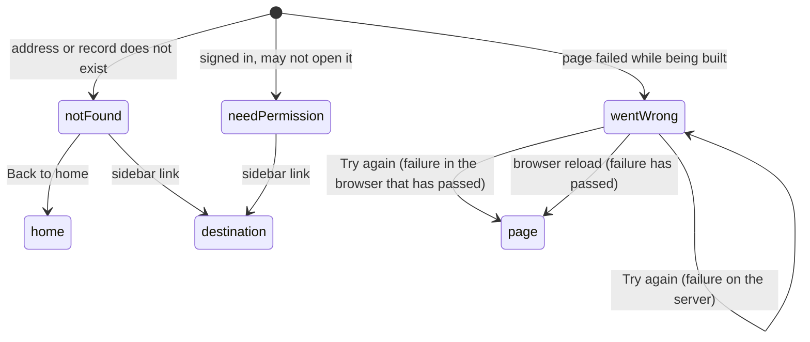

# The error pages

## Summary

The [error pages](../glossary.md#the-site) are the three pages a user lands on when the page they asked for cannot be shown: "Page not found" when the address, or the collection, problem, test or invite in it, does not exist; "You need permission" when a signed-in user may not open what they asked for; and "Something went wrong" when a page fails while it is being built. Each explains itself in one sentence and has at most one control of its own: "Back to home" on the first, none at all on the second, and "Try again" on the third, which does not recover from a failure on the server. The first two show the [sidebar](../glossary.md#interface); the third does not. Which checks send a user to which page, and in what order, belongs to [navigation](../foundations/navigation.md#what-each-page-checks-in-order); this document owns the pages themselves.

## The simple case

A member on the last algebra problem clicks "Next →" and sees "Page not found": "This page does not exist, or the problem or collection was removed." They click "Back to home" and are on the [home page](home-page.md).

A signed-in user who is not a member of CMIMC clicks "CMIMC" in the home page's sidebar. The address changes to `/need-permission` and the page says "You need permission" and "Ask for access, or switch to an account with permission." There is nothing to click but the sidebar.

When a page fails on the server, the user sees "Something went wrong" and "An unexpected error occurred while loading this page." with a "Try again" button. Clicking it shows the same page again. Reloading the browser, once whatever failed has recovered, shows the page they wanted.

## The interaction, event by event

The pages have nothing to edit. Their controls are one link ("Back to home"), the sidebar's links, and one button ("Try again"), so _begin editing_ is a click on one of them, _while editing_ is the moment until the result shows, and _submit_ is the result.

### Arrive

| Page                   | The user lands here when                                                                                                                                                                                                                                                                                                                                                                                                                                                                     | The address bar shows                                  |
| ---------------------- | -------------------------------------------------------------------------------------------------------------------------------------------------------------------------------------------------------------------------------------------------------------------------------------------------------------------------------------------------------------------------------------------------------------------------------------------------------------------------------------------- | ------------------------------------------------------ |
| "Page not found"       | The address matches no page (`/c/demo/p`, `/anything`); or the collection, problem, test or invite named in it does not exist, including a problem ID typed in the wrong case and "Next →" past a subject's last problem ([Previous and Next](../foundations/navigation.md#previous-and-next)). A missing collection, test or invite is reported without asking for sign-in (except at an add-problem address, which asks first); a missing problem only after the collection's checks pass. | The address asked for.                                 |
| "You need permission"  | A signed-in user opens a collection page, problem page, test page or chooser of a collection they cannot view (no permission there, or SubmitOnly); or the add-problem page of a collection where they may not add problems (no permission, or ViewOnly). Anyone who types `/need-permission` also sees it.                                                                                                                                                                                  | `/need-permission`; the address asked for is replaced. |
| "Something went wrong" | A page fails while being built on the server (the database is unreachable; a problem with no difficulty opened by someone who needs to testsolve it, see [the problem page](../problem-page/problem-page.md#edge-cases)), or while being drawn in the browser. This includes the refresh that follows an action or a countdown reaching zero.                                                                                                                                                | The address asked for.                                 |

**"Page not found"** shows the sidebar and, beside it, a column up to 32rem wide: "Page not found" in large type, "This page does not exist, or the problem or collection was removed.", and "Back to home", a violet link styled as a button. The wording is the same whatever was missing, and nothing says which part of the address was wrong. If the address starts with `/c/{cid}` for a collection in the sidebar, that collection is highlighted ([the home page](home-page.md#arrive)).

**"You need permission"** shows the sidebar and "You need permission" in large type over "Ask for access, or switch to an account with permission." There is no link or button of its own: no back link, no "Log in", no sign-out, no home link. The page does not name the collection that refused the user, or the account they are signed in as, and it checks nothing itself; it looks the same to a signed-out visitor who types its address.

**"Something went wrong"** has no sidebar. A centered column says "Something went wrong" in large type, "An unexpected error occurred while loading this page.", and has a violet "Try again" button. It replaces the whole page, including any back link the failed page would have had. Nothing says what failed; the details go to the server's log, and the error is also written to the browser's console. On the development server the framework's own error overlay appears on top.

On all three the browser tab says "Probase", nothing is focused, and [toasts](../glossary.md#interface) from actions still in flight appear as usual.

> Technical note: "Page not found" answers with HTTP status 404. An address that leads to "You need permission" answers with a temporary redirect (307) on a full page load, and `/need-permission` itself with 200. "Something went wrong" answers with 500 on a full page load. On a navigation inside Probase none of this is visible; the page is swapped in like any other.

### Leave untouched

Nothing is recorded on any of the three. The ways out:

- **"Page not found"**: "Back to home", the sidebar, or the browser's back button.
- **"You need permission"**: the sidebar or the back button. Back returns to the page before the refused address, which never entered the history.
- **"Something went wrong"**: "Try again", the back button, a reload, or typing an address. There are no links.

### Begin editing

- **"Back to home"**, clicked or activated with Enter, loads the home page. On a production build it has been loaded in the background as soon as the page appeared, so it shows at once.
- **A sidebar link** starts loading that collection; see [the home page](home-page.md#begin-editing).
- **"Try again"**, clicked or activated with Enter or Space, asks the page to draw itself again. Nothing is sent to the server.
- **"You need permission"** has no control of its own.

### While editing

"Back to home" and the sidebar links behave like any link ([how links load](../foundations/navigation.md#how-links-load)): nothing changes until the destination arrives, and a newer click wins. "Try again" has no in-between: the redraw happens at once.

### Submit

"Back to home" ends on the home page. A sidebar link ends wherever that collection's checks send the user ([the home page](home-page.md#submit)); from "You need permission", clicking the collection that just refused the user ends on "You need permission" again.

"Try again" redraws the failed page from what the browser already holds; it does not ask the server again. A failure that happened on the server, which is nearly every failure in Probase because its pages are built there, is part of what the browser holds, so "Something went wrong" comes straight back. A first local pass on a production build confirmed this for a Serious testsolver opening a problem with no difficulty: the page answered 500, and "Try again" showed "Something went wrong" again. Only a failure that happened while drawing in the browser, and does not happen again, clears. The retry that works for a server failure is the browser's reload.

> Technical note: the button calls the `reset()` that Next.js passes to `app/error.tsx`. It only clears the error boundary's state and re-renders the same server payload; it does not call `router.refresh()`, so no new copy of the page is requested.

## Modifiers

| Modifier            | At arrival                                                                                                                                                                                                                                                                                                                                                                                                                                                                       | During editing                                                                                             |
| ------------------- | -------------------------------------------------------------------------------------------------------------------------------------------------------------------------------------------------------------------------------------------------------------------------------------------------------------------------------------------------------------------------------------------------------------------------------------------------------------------------------- | ---------------------------------------------------------------------------------------------------------- |
| Role                | "Page not found" looks the same to everyone. A signed-out visitor gets it for a missing collection, test or invite, but the login page for a real collection or test. "You need permission" is reached through its redirects only by signed-in users with no permission or SubmitOnly (collection, problem, test pages and chooser) or with no permission or ViewOnly (add-problem page), and looks the same to all of them. "Something went wrong" does not depend on the role. | The destinations of "Back to home" and the sidebar links run their own checks. "Try again" checks nothing. |
| Authorship          | No effect.                                                                                                                                                                                                                                                                                                                                                                                                                                                                       | No effect.                                                                                                 |
| Testsolver type     | No effect on the pages. A member without a type goes to the chooser rather than any error page; a Serious testsolver opening a problem with no difficulty that they need to testsolve gets "Something went wrong".                                                                                                                                                                                                                                                               | No effect.                                                                                                 |
| Record state        | A collection, problem, test or invite that does not exist gives "Page not found". An archived problem is not missing, and an [expired](../glossary.md#records) invite shows its own state on the invite page, not "Page not found".                                                                                                                                                                                                                                              | "Try again" does not look at any record again.                                                             |
| Collection settings | The sidebar on the first two pages lists the [code-level configuration](../cross-cutting/per-collection-settings.md)'s collections. No database setting changes the pages.                                                                                                                                                                                                                                                                                                       | No effect.                                                                                                 |
| Keys                | Tab moves through the sidebar links, then "Back to home" or "Try again". Enter follows a link or presses the button; Space presses "Try again" but does not follow "Back to home", which is a link. Escape does nothing.                                                                                                                                                                                                                                                         | No key stops a navigation.                                                                                 |

## Cancel and interrupt

"While editing" is the time after clicking "Back to home", a sidebar link or "Try again", until the result shows.

| Event                               | Before editing                                                                                                                                                                        | While editing                                                                                                                                                                          |
| ----------------------------------- | ------------------------------------------------------------------------------------------------------------------------------------------------------------------------------------- | -------------------------------------------------------------------------------------------------------------------------------------------------------------------------------------- |
| Escape or Discard                   | No effect. There is nothing to discard.                                                                                                                                               | No effect: Escape does not stop a navigation.                                                                                                                                          |
| Browser back or forward             | Leaves; nothing recorded. From "You need permission", Back skips the refused address.                                                                                                 | The pending navigation is abandoned in favor of the history entry.                                                                                                                     |
| Reload                              | "Page not found" and "You need permission" show again. "Something went wrong" is rebuilt from the server: the wanted page appears if the failure has passed, or the error page again. | Reloads whichever address the browser shows.                                                                                                                                           |
| Tab or window closed                | Nothing recorded.                                                                                                                                                                     | Nothing recorded.                                                                                                                                                                      |
| A link inside the app followed      | Loads the destination.                                                                                                                                                                | The newer click wins.                                                                                                                                                                  |
| Network lost mid-request            | No effect: the pages send nothing. Losing the connection while following a link elsewhere shows the browser's own offline page, not "Something went wrong".                           | "Back to home" or a sidebar link ends on the browser's offline page ([navigation](../foundations/navigation.md#cancel-and-interrupt)). "Try again" sends nothing, so it is unaffected. |
| Request fails or returns an error   | No effect.                                                                                                                                                                            | A failure while building the destination shows "Something went wrong". "Try again" after a server failure shows it again.                                                              |
| Session ends                        | No effect: none of the pages depends on the session.                                                                                                                                  | A sidebar link leads to the login page, which returns to the collection.                                                                                                               |
| Access changes                      | No effect on the open page. "You need permission" stays after the user is given access; they have to open the collection's address again themselves.                                  | The destination's checks use the new access.                                                                                                                                           |
| Same record changed in another tab  | No effect: the pages show no records. Accepting an invite in another tab does not change "You need permission" here.                                                                  | The destination shows what the server holds when it is fetched.                                                                                                                        |
| Same record changed by another user | No effect: a problem or collection created at the missing address meanwhile appears only on reload.                                                                                   | As another tab.                                                                                                                                                                        |
| Autofill writes into the field      | Not applicable: the pages have no fields.                                                                                                                                             | Not applicable.                                                                                                                                                                        |
| The window loses focus              | No effect.                                                                                                                                                                            | No effect.                                                                                                                                                                             |
| The testsolve time limit passes     | Not applicable: no attempt is shown. An attempt left running keeps counting on the server ([the timed attempt](../testsolving/timed-attempt.md)).                                     | Not applicable.                                                                                                                                                                        |

## Interactions with other systems

**Permissions.** "Page not found" for a missing collection or test is decided before sign-in, so signed-out visitors see it too, and can tell real addresses from mistyped ones ([accounts and roles](../foundations/accounts-and-roles.md#how-access-is-checked)). "You need permission" checks nothing: its advice is the same whoever reads it. "Something went wrong" does not depend on who the user is.

**Testsolving locks.** A problem with no difficulty cannot be shown locked, so a user who needs to testsolve it gets "Something went wrong" instead of the locked view ([the problem page](../problem-page/problem-page.md#edge-cases)). Otherwise none.

**Per-collection settings.** The sidebar on "Page not found" and "You need permission" lists the collections in the code-level configuration; see [the home page](home-page.md). No collection setting changes the pages.

**Validation and errors.** These pages are where page-level failures land. An action's failure never leads here; it appears as a toast on the page the user is on ([saving and feedback](../foundations/saving-and-feedback.md#toasts)). None of the three says what exactly was missing, refused or broken.

**Unsaved changes.** None of the pages holds input.

**Optimistic updates.** None.

**Freshness and other users.** The pages show no data. "Try again" does not fetch anything, so it cannot pick up a fix made meanwhile; a reload does.

**URL state.** "Page not found" and "Something went wrong" keep the address the user asked for, so a reload retries it. "You need permission" replaces it with `/need-permission`, so the refused address, and any search or filters in it, are gone; a user who is then given access has to find the link again.

**Math rendering.** None.

**Offline.** A link followed offline never produces "Something went wrong": the browser falls back to a full page load and shows its own offline page ([navigation](../foundations/navigation.md#how-links-load)).

**Keyboard and accessibility.** Each page has one top-level heading; on the two with the sidebar, its "Probase" heading comes first in reading order. "Back to home" is a link that looks like a button, so Space does not activate it. Nothing is focused on arrival, and nothing announces the page as an error beyond its heading. See [keyboard and accessibility](../cross-cutting/keyboard-and-accessibility.md).

**Narrow screens.** "Page not found" and "Something went wrong" shrink to the window with a 2rem margin on each side. "You need permission" does not: its box keeps a fixed width of 32rem with no side margin, so on any window narrower than about 768px (the box plus the sidebar) it is wider than the space beside the sidebar, and the page scrolls sideways, with the text passing under the fixed sidebar. The sidebar is 10rem wide below 640px. See [narrow screens](../cross-cutting/narrow-screens.md).

**Side effects.** None. "Something went wrong" writes the error to the browser's console; the server logs its own side.

## Edge cases

- "Page not found" says the problem or collection "was removed", but nothing can be removed through the interface; in practice it means the address is wrong.
- "You need permission" advises switching accounts, but Probase has no sign-out control and signing in again from the invite page does not switch accounts ([signing in](sign-in.md#edge-cases)); the only way is the authentication library's unlinked `/api/auth/signout` page, or clearing the site's cookies.
- A SubmitOnly member who opens the collection they submit to sees "You need permission", although they can still use its add-problem form by typing its address ([adding a problem](../collection/adding-a-problem.md)).
- From "You need permission", clicking the collection that refused the user runs the checks again and lands on the same page, which looks as if nothing happened.
- "Something went wrong" leaves the user with no link anywhere. Reached by a link inside Probase, Back returns to the previous page; reached by typing or reloading, Back leaves wherever the browser was before.
- On a local instance, every sidebar link on the first two pages leads to "Page not found" ([the home page](home-page.md#edge-cases)).

## Open questions and verification

- "Try again" does not retry a failure on the server; confirmed by a first local pass on a production build. This looks like a bug: the button should ask the server for a fresh page, or be replaced by a reload.
- The box on "You need permission" lacks the width limit and side margin the other two pages have, which should make it overflow on windows narrower than about 768px. Read from the page's layout; not confirmed on a phone. This looks like a bug.
- "You need permission" gives advice the interface cannot carry out (switching accounts) and names neither the collection nor the account. Whether it should offer sign-out, a link home, or the collection's name is a product call.
- The status codes were read from the framework's code; the 500 for "Something went wrong" was confirmed in the first local pass, the others were not checked.
- A test page address whose trailing part is not a number, or is too large for an ID, may fail with "Something went wrong" rather than "Page not found"; read from code, not tried ([tests](../collection/tests.md)).
- That a failure during the refresh after an action, or at a countdown's zero, shows "Something went wrong" was read from the framework's behavior, not tried.
- Whether "Page not found" and "Something went wrong" are drawn in the page's HTML or only once the page's scripts run, on a full page load, was not checked.

Verified against Probase commit `c38ff56`
