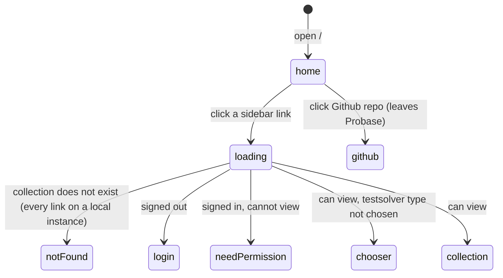

# The home page and sidebar

## Summary

The home page, at `/`, is Probase's front door: a short welcome beside the [sidebar](../glossary.md#interface), a fixed column headed "Probase" that links to three collections named in the [code-level configuration](../glossary.md#collection-settings). It is the same for everyone. It needs no sign-in, shows no account, offers no "Log in" link, and lists the same three collections to every visitor whatever their access. Apart from the sidebar it links only to Probase's source code on GitHub. The sidebar also appears on "Page not found" and "You need permission" ([the error pages](error-pages.md)); this document owns it there too.

## The simple case

A visitor opens `/`. On the left, a white column headed "Probase" lists "CMIMC", "OTIS Mock AIME" and "TopsOJ". On the right the page says "Welcome to Probase!", then "There's not much here yet, but you can check out the Github repo." and "There are links to private collections on the left, if you have access to them."

They click a collection. Where they land depends on who they are: a signed-out visitor goes to the [login page](sign-in.md) and comes back to the collection after signing in; a member who can view the collection sees its [collection page](../collection/problem-list.md) (or the [chooser](../testsolving/choosing-a-testsolver-type.md) first); anyone else sees "You need permission".

## The interaction, event by event

The page has nothing to edit. Its one interaction is following a link, so here _begin editing_ is the click on a sidebar link, _while editing_ is the destination loading, and _submit_ is its arrival.

### Arrive

The page runs no checks and reads no session: signed in or out, member or not, every visitor gets the same page. The browser tab says "Probase". Nothing is focused.

**The sidebar** is fixed to the left edge of the window at full height, a white column on the page's very light gray background, 16rem wide on windows 640px and wider and 10rem wide on narrower ones. Its heading, "Probase", is plain text, not a link; it is centered on wide windows and left-aligned on narrow ones. Below it are three links, in this order: "CMIMC" (to `/c/cmimc`), "OTIS Mock AIME" (to `/c/otis-mock-aime`) and "TopsOJ" (to `/c/topsoj`). Each is a rounded row of gray text whose background turns light gray on hover. The labels come from the configuration, not from the collections' names in the database. The list is not filtered: it does not depend on who is signed in, what they may open, or whether the collections exist. The column scrolls on its own if the list is taller than the window.

A link is shown highlighted (light gray background, darker text) when the current address starts with its `/c/{cid}`. The sidebar never appears on a collection's own pages, so the highlight is seen only on "Page not found" under such an address: `/c/cmimc/p/A999`, or `/c/cmimc` itself on an instance where that collection does not exist. The match is on the start of the address, so `/c/topsoj-2` or `/c/cmimcx` (both "Page not found") highlight "TopsOJ" or "CMIMC" too.

**The welcome** is a heading, "Welcome to Probase!", and two sentences. "Github repo" is a violet link, underlined on hover, to `https://github.com/howard36/probase`; it opens in the same tab.

Nothing on the page says whether the visitor is signed in or who they are, and there is no way to sign in from it except following a sidebar link into a collection (which sends a signed-out visitor to the login page), opening an [invite](invites.md), or typing `/login`.

### Leave untouched

Leaving records nothing. On a production build the three sidebar links start loading their collection pages in the background as soon as the home page appears, so a click shows the collection at once; this changes nothing on the server (see [how links load](../foundations/navigation.md#how-links-load)).

### Begin editing

Clicking a sidebar link, or pressing Enter on it, starts loading that collection's page. The home page stays as it is until the destination arrives: no loading indicator, and the clicked link is not highlighted, because the address has not changed yet.

"Github repo" is an ordinary link out of Probase; the browser leaves for GitHub.

### While editing

The collection page is being fetched. On a production build it has usually been prefetched and appears at once, possibly up to five minutes old; on the development server it is fetched on the click. Clicking another link meanwhile makes the newer click win.

### Submit

The destination runs its checks in order ([navigation](../foundations/navigation.md#what-each-page-checks-in-order)), and the first that fails decides where the user lands:

| Who clicks                                                                                                           | Lands on                                                                    |
| -------------------------------------------------------------------------------------------------------------------- | --------------------------------------------------------------------------- |
| Anyone, when the collection does not exist (every sidebar link on a local instance, whose only collection is `demo`) | "Page not found", with the clicked collection highlighted in its sidebar    |
| A signed-out visitor                                                                                                 | The login page, which returns them to `/c/{cid}` after signing in           |
| A signed-in user with no permission in the collection, or a SubmitOnly member                                        | "You need permission"                                                       |
| A member who can view, in a collection that requires testsolving, before choosing a testsolver type                  | The chooser                                                                 |
| A member who can view                                                                                                | The collection page, which has no sidebar and no link back to the home page |

## Modifiers

| Modifier            | At arrival                                                                                                                                                                                                                                                            | During editing                                                                                                                                                                           |
| ------------------- | --------------------------------------------------------------------------------------------------------------------------------------------------------------------------------------------------------------------------------------------------------------------- | ---------------------------------------------------------------------------------------------------------------------------------------------------------------------------------------- |
| Role                | No effect. Signed-out visitors, users with no permission, and SubmitOnly, ViewOnly, TeamMember and Admin members all see the same page and the same three links, including links to collections they cannot open.                                                     | Decides the destination: signed out, the login page; no permission or SubmitOnly, "You need permission"; ViewOnly, TeamMember or Admin, the collection page (or the chooser).            |
| Authorship          | No effect.                                                                                                                                                                                                                                                            | No effect.                                                                                                                                                                               |
| Testsolver type     | No effect.                                                                                                                                                                                                                                                            | A member of a collection that requires testsolving who has not chosen a type goes to the chooser. New members who join TopsOJ through an invite are made Serious, so they are not asked. |
| Record state        | No effect: the page shows no records, and the sidebar does not check whether its collections exist.                                                                                                                                                                   | A collection that does not exist gives "Page not found". On a local instance every sidebar link does; the demo collection has no link and is reached only by typing `/c/demo`.           |
| Collection settings | The list and its labels are the [code-level configuration](../cross-cutting/per-collection-settings.md): "CMIMC", "OTIS Mock AIME", "TopsOJ", in that order. Collections outside it (such as `demo` and `mgci`) are not listed. No database setting changes the page. | No effect beyond the destination's own settings.                                                                                                                                         |
| Keys                | Tab moves through the three sidebar links, then "Github repo"; Enter follows the focused link. Escape does nothing.                                                                                                                                                   | No key stops the navigation.                                                                                                                                                             |

## Cancel and interrupt

"While editing" is the time between clicking a sidebar link and the destination arriving.

| Event                               | Before editing                                                                                                                                         | While editing                                                                                                                                                                                            |
| ----------------------------------- | ------------------------------------------------------------------------------------------------------------------------------------------------------ | -------------------------------------------------------------------------------------------------------------------------------------------------------------------------------------------------------- |
| Escape or Discard                   | No effect. There is nothing to discard.                                                                                                                | No effect: Escape does not stop the navigation.                                                                                                                                                          |
| Browser back or forward             | Leaves the home page; nothing recorded.                                                                                                                | The pending navigation is abandoned in favor of the history entry.                                                                                                                                       |
| Reload                              | The same page again.                                                                                                                                   | Reloads the home page, whose address the browser still shows; the click is forgotten.                                                                                                                    |
| Tab or window closed                | Nothing recorded.                                                                                                                                      | Nothing recorded.                                                                                                                                                                                        |
| A link inside the app followed      | Loads the destination, as under [Submit](#submit).                                                                                                     | The newer click wins.                                                                                                                                                                                    |
| Network lost mid-request            | No effect: the page sends nothing.                                                                                                                     | The collection page does not arrive; the browser falls back to a full load of its address, which shows the browser's own offline page ([navigation](../foundations/navigation.md#cancel-and-interrupt)). |
| Request fails or returns an error   | No effect.                                                                                                                                             | A failure while building the collection page shows "Something went wrong" ([the error pages](error-pages.md)).                                                                                           |
| Session ends                        | No effect: the page does not use the session.                                                                                                          | The destination sends the user to the login page, which returns them to the collection.                                                                                                                  |
| Access changes                      | No effect: the page is the same for everyone.                                                                                                          | The destination's checks use the access the user has when it is built.                                                                                                                                   |
| Same record changed in another tab  | Not applicable: the page shows no records.                                                                                                             | The collection page shows what the server holds when it is fetched, or what it held up to five minutes earlier if it was prefetched.                                                                     |
| Same record changed by another user | Not applicable: the page shows no records.                                                                                                             | As another tab.                                                                                                                                                                                          |
| Autofill writes into the field      | Not applicable: the page has no fields.                                                                                                                | Not applicable.                                                                                                                                                                                          |
| The window loses focus              | No effect.                                                                                                                                             | No effect; the navigation completes in the background.                                                                                                                                                   |
| The testsolve time limit passes     | Not applicable: no attempt is shown here. An attempt left running keeps counting on the server ([the timed attempt](../testsolving/timed-attempt.md)). | No effect on the navigation.                                                                                                                                                                             |

## Interactions with other systems

**Permissions.** None on the home page. The sidebar lists collections the visitor may not open, and shows their names to signed-out visitors; each link runs into its destination's checks ([accounts and roles](../foundations/accounts-and-roles.md#how-access-is-checked)).

**Testsolving locks.** None.

**Per-collection settings.** The sidebar's list, order and labels are the code-level configuration; see [per-collection settings](../cross-cutting/per-collection-settings.md). Nothing in a collection's database settings affects the page.

**Validation and errors.** None on the page. Everything that can go wrong happens at the destination: the login page, "You need permission", "Page not found" or "Something went wrong".

**Unsaved changes.** The page holds no input.

**Optimistic updates.** None.

**Freshness and other users.** The page has no data and never changes. A collection page opened from the sidebar on a production build may be up to five minutes old ([how links load](../foundations/navigation.md#how-links-load)).

**URL state.** None. A query string on `/` is ignored.

**Math rendering.** None.

**Offline.** The page itself needs nothing once loaded. Following a sidebar link offline ends on the browser's own offline page; "Github repo" likewise.

**Keyboard and accessibility.** Every link is reachable with Tab, sidebar first, and shows the browser's own focus ring. The sidebar's "Probase" is a second-level heading read before the page's "Welcome to Probase!", its links sit in an unnamed navigation landmark, and the highlighted link is not marked as the current one for screen readers. There is no skip link. See [keyboard and accessibility](../cross-cutting/keyboard-and-accessibility.md).

**Narrow screens.** Below 640px the sidebar narrows to 10rem but stays on screen, taking a large share of a phone's width; it cannot be hidden. "OTIS Mock AIME" may wrap onto two lines. The welcome text gets smaller padding and type. See [narrow screens](../cross-cutting/narrow-screens.md).

**Side effects.** None. On a production build, showing the sidebar makes the server build the three collection pages in the background for the visitor; that records nothing.

## Edge cases

- Nothing links to the home page except "Back to home" on "Page not found". The sidebar's "Probase" heading is not a link, and collection pages have no sidebar, so from inside a collection the home page is reached only by typing `/` or with the browser's back button.
- A user who signs in from `/login` with no return address lands on this page, which looks exactly as it did signed out; nothing confirms the sign-in.
- On a local instance the sidebar is no use: all three collections are missing, so every link shows "Page not found", and the seeded `demo` collection has no link.
- From "You need permission", clicking the collection just refused sends the user through the same checks and back to the same page, which looks as if the click did nothing.
- "Github repo" is spelled that way on the page, not "GitHub".

## Open questions and verification

- The sidebar is not filtered by permission; a comment in the code marks filtering by permission as still to do. Whether signed-out visitors should see the three collections' names at all is a product call.
- The highlight can only ever appear on "Page not found", where it points at a collection the user could not reach. It may be worth removing or treating as a bug rather than documenting.
- The eager loading of the three collection pages whenever the sidebar is shown was read from code and the framework's defaults, not observed on a production build.
- The sidebar's `aria-label` ("Sidenav") sits on an element that has no role, which screen readers generally ignore; the navigation landmark inside it is unnamed. Not checked with a screen reader.
- Whether "OTIS Mock AIME" wraps at 10rem depends on font rendering; not checked on a phone.
- The code notes that long collection names are not cut off; with the current three labels this is not visible.

Verified against Probase commit `c38ff56`
