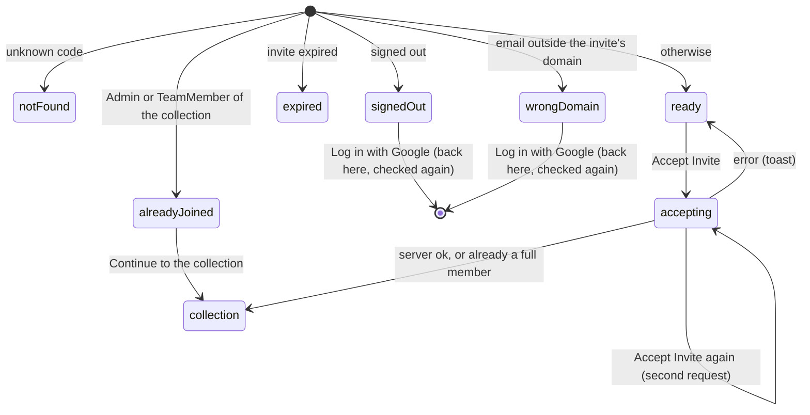

# Invites

## Summary

An [invite](../glossary.md#records) is a link, `/invite/{code}`, that lets a person join one collection with the [role](../glossary.md#people-and-access) the invite grants. Opening it shows the [invite page](../glossary.md#the-site), which names who sent the invite and which collection it is for, and then, depending on who is looking and on the invite's state, offers a Google sign-in button, an "Accept Invite" button, a note that the user already has access, or a note that the invite has expired. Accepting records the user's [permission](../glossary.md#people-and-access) and opens the collection. Invites are the only way to join a collection through the interface. They are created in the database or by an operator script, and nothing in Probase links to one, so an invite page is always reached from a link shared outside Probase. This document owns the invite page's states, the accept action, and what joining does to the new member's role and [testsolver type](../glossary.md#testsolving).

## The simple case

Someone is sent a link such as `/invite/Xy7...` and opens it while signed out. The page says "{inviter} invited you!" and "Log in to Probase to join **{collection}**", with a "Log in with Google" button. They sign in with Google and come back to the same page, which now says "You've been invited to join **{collection}**." above a violet "Accept Invite" button. They click it. Nothing on the page changes until the server answers; then the collection page opens, and they are a member.

In a collection that [requires testsolving](../glossary.md#testsolving) the new member usually lands on the [chooser](../testsolving/choosing-a-testsolver-type.md) instead. If that collection is `topsoj` or `mgci`, they are made Serious on joining and land on the collection page with every problem locked.

## The interaction, event by event

`collection` is wherever the collection's own checks send the user; see [Submit](#submit).

### Arrive

The page is built on the server each time it is opened, and it shows the first of these that applies:

| Order | Condition                                                                 | What the page shows                                                                                                                              |
| ----- | ------------------------------------------------------------------------- | ------------------------------------------------------------------------------------------------------------------------------------------------ |
| 1     | No invite has this code                                                   | ["Page not found"](error-pages.md)                                                                                                               |
| 2     | Signed out                                                                | "{inviter} invited you!", "Log in to Probase to join {collection}", and "Log in with Google"                                                     |
| 3     | Signed in, but the session holds no email address                         | ["Something went wrong"](error-pages.md)                                                                                                         |
| 4     | Signed in as an Admin or TeamMember of the collection                     | "Already Joined", "You already have access to {collection}.", and a violet "Continue to {collection}" link                                       |
| 5     | The invite has [expired](../glossary.md#records)                          | "Invite Expired" and "This invite link has expired. If you think this is a mistake, contact {inviter} for access to {collection}." Nothing else. |
| 6     | The invite is limited to a domain and the user's email does not end in it | "{inviter} invited you!", "Log in with an @{domain} email to join {collection}", "Currently logged in as {email}", and "Log in with Google"      |
| 7     | Otherwise: a signed-in user who may join right now                        | "{inviter} invited you!", "You've been invited to join {collection}.", and "Accept Invite"                                                       |

{inviter} is the Google name of the user recorded as the invite's creator, in bold. {collection} is the collection's display name, in bold everywhere except the expired message. {email} is the Google address the user signed in with. The code is matched exactly, so a code typed with different capitals is "Page not found".

The page is a single centered column: a large bold heading, one or two lines of text, and at most one control. The Google button is a wide outlined button with Google's "G" and "Log in with Google"; "Accept Invite" and "Continue to {collection}" are violet. There is no sidebar, no back link and no link to the home page, and the browser tab says "Probase". Nothing is focused.

The page never says which role the invite grants, whether it is one-time, when it expires, or which domain it is limited to (except in the wrong-domain state). Only Admins and TeamMembers count as having joined in step 4; a ViewOnly or SubmitOnly member sees steps 5 to 7 exactly like someone new.

The order has consequences a user can notice:

- A signed-out visitor always sees the invitation, even for an invite that has expired or that their account's domain cannot accept. They find out after signing in.
- An Admin or TeamMember sees "Already Joined" even for an expired invite or one limited to another domain.
- A signed-in user outside the domain of an expired invite sees "Invite Expired", not the domain message.

> Technical note: step 3 cannot happen with Google sign-in as configured, because Google always reports an email address. The page throws rather than rendering, so the user would see the generic error page.

### Leave untouched

Opening the page records nothing, in any state: no permission is created, no one-time invite is used up, and no [author](../glossary.md#people-and-access) is created. A one-time invite can be opened any number of times, by anyone, until someone accepts it.

The "Invite Expired" state is a dead end: it has no button or link, so the only ways on are the browser's back button or typing an address.

### Begin editing

The page has no fields. Depending on the state, one thing can be clicked:

- **"Log in with Google"** (signed out, wrong domain) sends the browser to Google (see [sign-in](sign-in.md)). Google then returns the browser to this invite page, which runs its checks again for whichever account is now signed in. In the wrong-domain state this is a fresh sign-in, not an addition: if the user picks a different Google account, they are signed in to all of Probase as that account from then on (see [accounts and roles](../foundations/accounts-and-roles.md#the-session)).
- **"Continue to {collection}"** (Already Joined) opens the collection page. Nothing is recorded.
- **"Accept Invite"** sends the accept action. Nothing on the page changes.

### While editing

"Accept Invite" has no pending state: it does not disable itself, shows no spinner, and the page does not change while the request is [pending](../glossary.md#interaction) (see [saving and feedback](../foundations/saving-and-feedback.md#while-editing)). Clicking it again sends a second request:

- Once the first request has made the user an Admin or TeamMember, the second finds a full member, changes nothing, and also opens the collection page.
- For a reusable ViewOnly or SubmitOnly invite, the second sets the same role again and opens the collection page.
- For a one-time invite, the second can be refused with "Invite has expired", because the first used the invite up. The user is a member all the same; the toast appears on whatever page the first request opened.

### Submit

The server checks, in order, and stops at the first failure:

1. The user is signed in, else "Not signed in".
2. The session holds an email address, else "session.email is null or undefined".
3. The invite still exists, else "Invalid invite code".
4. If the user is already an Admin or TeamMember of the collection, nothing changes: the invite is not used up and the collection page opens.
5. The invite has not expired, else "Invite has expired".
6. If the invite is limited to a domain, the user's email ends with "@" and that domain, else "Invalid email domain". The match is exact: an invite for `mit.edu` accepts `student@mit.edu` but not `student@alum.mit.edu` or `student@notmit.edu`.
7. A one-time invite is used up now, by stamping the current time as its expiry, but only if it has no expiry yet. If it already has one, because someone else has just accepted it (even at the same instant), the answer is "Invite has expired". Of two people accepting the same one-time invite at once, exactly one gets in.
8. The permission is written. A user with no permission in the collection gets one with the invite's role. A ViewOnly or SubmitOnly member has their role replaced by the invite's, whether that raises or lowers it; their testsolver type is kept. A new member of `topsoj` or `mgci` is made Serious, with their [serious period](../glossary.md#testsolving) dated from the collection's creation; a new member of any other collection has no testsolver type.
9. The browser is sent to the collection page.

Steps 7 and 8 happen together: if the permission cannot be written, a one-time invite is not used up.

On success there is no toast. The browser goes to `/c/{cid}`, whose own checks ([navigation](../foundations/navigation.md#what-each-page-checks-in-order)) decide where the user actually lands:

| The user's role now           | The collection                                                                   | Lands on                                                         |
| ----------------------------- | -------------------------------------------------------------------------------- | ---------------------------------------------------------------- |
| Admin, TeamMember or ViewOnly | Does not require testsolving                                                     | The collection page                                              |
| Admin, TeamMember or ViewOnly | Requires testsolving, `topsoj` or `mgci`, joined just now                        | The collection page, every problem locked (nothing for an Admin) |
| Admin, TeamMember or ViewOnly | Requires testsolving, and the user has no testsolver type (any other new member) | The chooser                                                      |
| Admin, TeamMember or ViewOnly | Requires testsolving, and the user already had a type from before                | The collection page                                              |
| SubmitOnly                    | Any                                                                              | ["You need permission"](error-pages.md)                          |

A SubmitOnly member cannot open the collection, so accepting a SubmitOnly invite ends on "You need permission", with nothing pointing to the add-problem page they are meant to use (see [adding a problem](../collection/adding-a-problem.md)).

On failure the page stays exactly as it was, "Accept Invite" included, and a [toast](../glossary.md#interface) says why:

| Situation                                                                                     | Toast                                     |
| --------------------------------------------------------------------------------------------- | ----------------------------------------- |
| The session has ended                                                                         | "Not signed in"                           |
| The session holds no email address                                                            | "session.email is null or undefined"      |
| The invite was deleted after the page loaded                                                  | "Invalid invite code"                     |
| The invite expired after the page loaded, or a one-time invite was used by someone else first | "Invite has expired"                      |
| A one-time invite that also has an expiry time in the future                                  | "Invite has expired"                      |
| The account signed in (for example from another tab) is outside the invite's domain           | "Invalid email domain"                    |
| The network, or anything unexpected                                                           | "Something went wrong. Please try again." |

The fifth row is always the outcome for such an invite. Step 7 uses up a one-time invite only if its expiry is empty, so a one-time invite that was also given an expiry time can never be accepted by anyone: until the expiry passes its page shows "{inviter} invited you!", "You've been invited to join {collection}." and "Accept Invite", and pressing the button leaves the user on the invite page with "Invite has expired" and no permission. After the expiry passes the page shows "Invite Expired". See [open questions](#open-questions-and-verification).

## Modifiers

| Modifier            | At arrival                                                                                                                                                                                                                                                                                                             | During editing                                                                                                                                                                                                                      |
| ------------------- | ---------------------------------------------------------------------------------------------------------------------------------------------------------------------------------------------------------------------------------------------------------------------------------------------------------------------- | ----------------------------------------------------------------------------------------------------------------------------------------------------------------------------------------------------------------------------------- |
| Role                | Signed out: the sign-in state. No permission, ViewOnly or SubmitOnly: the expired, wrong-domain or ready state, as for a newcomer. TeamMember or Admin: "Already Joined", whatever the invite's state.                                                                                                                 | A user made Admin or TeamMember elsewhere while the page is open: accepting changes nothing and opens the collection. A ViewOnly or SubmitOnly role, or a removed permission, is replaced by (or recreated with) the invite's role. |
| Authorship          | No effect. Joining does not create an author; the add-problem page does, the first time it loads.                                                                                                                                                                                                                      | No effect.                                                                                                                                                                                                                          |
| Testsolver type     | No effect on the page.                                                                                                                                                                                                                                                                                                 | On accepting, an existing permission keeps its type. A new permission has none, except in `topsoj` and `mgci`, where it is Serious.                                                                                                 |
| Record state        | Reusable: any number of people can accept. One-time: the first accept stamps its expiry, and everyone after sees "Invite Expired". Expired: "Invite Expired" for anyone but a full member. Domain-limited: the wrong-domain state for other emails. One-time with a future expiry: "Accept Invite" shown, never works. | An invite that expires, is used up or is deleted while the page is open still shows "Accept Invite"; accepting is refused with the matching toast. The role granted is whatever the invite says when the button is clicked.         |
| Collection settings | Whether the collection requires testsolving decides whether a new member is sent to the chooser; `topsoj` and `mgci` make new members Serious ([per-collection settings](../cross-cutting/per-collection-settings.md)). No other setting affects invites.                                                              | Settings changed meanwhile apply when the collection page opens.                                                                                                                                                                    |
| Keys                | No shortcuts. Tab reaches the page's one button or link; Enter activates it (Space too, for the buttons).                                                                                                                                                                                                              | No effect. Escape does nothing.                                                                                                                                                                                                     |

## Cancel and interrupt

| Event                               | Before editing                                                                                           | While editing                                                                                                                                                                                                                      |
| ----------------------------------- | -------------------------------------------------------------------------------------------------------- | ---------------------------------------------------------------------------------------------------------------------------------------------------------------------------------------------------------------------------------- |
| Escape or Discard                   | No effect. There is no Discard.                                                                          | No effect. Nothing cancels a sent accept.                                                                                                                                                                                          |
| Browser back or forward             | Leaves; nothing recorded.                                                                                | Leaves. A sent accept completes on the server, so the user may already be a member; an error toast, if any, appears on the page they went to.                                                                                      |
| Reload                              | The page is rebuilt and its state decided again.                                                         | A sent accept may or may not have been recorded. The reloaded page shows "Already Joined" if the user became a full member, "Invite Expired" for a one-time invite they used up with a lesser role, and the ready state otherwise. |
| Tab or window closed                | Nothing recorded.                                                                                        | An accept that reached the server is recorded, and a one-time invite is used up.                                                                                                                                                   |
| A link inside the app followed      | Only the "Already Joined" state has a link, "Continue to {collection}", which opens the collection page. | Not applicable: the ready state has no links.                                                                                                                                                                                      |
| Network lost mid-request            | No effect until something is clicked. "Log in with Google" does nothing visible when offline.            | "Something went wrong. Please try again." The page stays. The permission may still have been granted if the request arrived; a reload shows which.                                                                                 |
| Request fails or returns an error   | No effect.                                                                                               | A toast (see [Submit](#submit)); the page stays in the ready state and can be tried again.                                                                                                                                         |
| Session ends                        | No effect on the open page.                                                                              | "Not signed in". A reload shows the signed-out state, whose Google button returns here.                                                                                                                                            |
| Access changes                      | No effect on the open page.                                                                              | The accept is checked against the access at that moment; see the Role row of [Modifiers](#modifiers).                                                                                                                              |
| Same record changed in another tab  | Not shown. Accepting in another tab does not change this tab until it reloads.                           | Accepting here again after accepting in another tab is harmless for a full-member role, sets the same role again otherwise, and for a one-time invite is refused with "Invite has expired".                                        |
| Same record changed by another user | Not shown. Someone else using a one-time invite leaves this page showing "Accept Invite".                | Someone else used the one-time invite first: "Invite has expired". An invite deleted or re-dated in the database: checked as it is now.                                                                                            |
| Autofill writes into the field      | Not applicable: the page has no fields.                                                                  | Not applicable.                                                                                                                                                                                                                    |
| The window loses focus              | No effect.                                                                                               | No effect.                                                                                                                                                                                                                         |
| The testsolve time limit passes     | Not applicable: nothing on the invite page is timed.                                                     | Not applicable.                                                                                                                                                                                                                    |

A permission granted by a request whose answer the user never saw is kept: the next visit to the invite page shows the resulting state, and the collection opens for them.

## Interactions with other systems

**Permissions.** Accepting is the only way the interface creates or changes a permission. Only Admins and TeamMembers are protected from it: a ViewOnly or SubmitOnly member who accepts an invite gets the invite's role, even a lower one, so a ViewOnly member accepting a SubmitOnly invite loses the ability to open the collection. An invite can also grant Admin to anyone who holds the link. See [accounts and roles](../foundations/accounts-and-roles.md#roles).

**Testsolving locks.** New members of `topsoj` and `mgci` are Serious from the collection's creation, so, if the collection requires testsolving, every problem they cannot edit is locked for them from their first visit and they never see the chooser. New members of other collections that require testsolving are sent to the chooser on their first visit. See [the locked problem](../testsolving/locked-problem.md).

**Per-collection settings.** "Requires testsolving" and the code-level list of collections that force Serious testsolving; see [per-collection settings](../cross-cutting/per-collection-settings.md). No other setting changes the invite page.

**Validation and errors.** The only input is the code in the address. Every condition the page checked is checked again when "Accept Invite" is clicked, and failures arrive as toasts; the page itself never changes state in response to an error.

**Unsaved changes.** None: there is nothing to type.

**Optimistic updates.** None. The page waits for the server and then leaves.

**Freshness and other users.** The page's state is decided when it loads and does not change by itself. An invite that expires, is used up, or is deleted while the page is open still offers "Accept Invite" until reloaded. See [freshness](../cross-cutting/freshness.md).

**URL state.** The code is the address. Both Google buttons return to `/invite/{code}`, so signing in brings the user back to the same invite. Accepting leads to the bare collection address, without any search or filters.

**Math rendering.** None. The inviter's name, the collection's name and the email are shown as plain text.

**Offline.** "Accept Invite" fails with the generic toast; nothing is queued.

**Keyboard and accessibility.** Each state has at most one control, a real button or link, reachable with Tab. Nothing is focused on arrival. Toasts are announced as alerts. See [keyboard and accessibility](../cross-cutting/keyboard-and-accessibility.md).

**Narrow screens.** The column takes the full width of the window, less padding, with a smaller gap above the heading; long names and email addresses wrap. See [narrow screens](../cross-cutting/narrow-screens.md).

**Side effects.** Accepting a one-time invite uses it up for everyone. The inviter is not notified, and no email is sent.

## Edge cases

- A ViewOnly or SubmitOnly member who opens an invite to their own collection sees "You've been invited to join {collection}." as though they were not a member.
- A ViewOnly or SubmitOnly member who used a one-time invite and opens the link again sees "Invite Expired" and is told to contact the inviter for access they already have. An Admin or TeamMember in the same position sees "Already Joined".
- An invite for a domain matches only that exact domain after the `@`, not its subdomains. The comparison is case-sensitive, so an invite whose domain was stored with capital letters, or with a leading `@`, can be accepted by no one; the wrong-domain message then shows the domain as stored.
- If the inviter's user has no name, the heading reads " invited you!" and the expired message reads "contact for access to {collection}." with the name missing.
- Deleting the inviter's user in the database deletes their invites; the links then show "Page not found".
- The wrong-domain state's Google button is the only place Probase offers to switch accounts. If Google signs the user straight back in with the same account, they return to the same wrong-domain page.
- Two clicks on "Accept Invite" for a one-time invite can leave the user a member and show "Invite has expired" on the collection page.
- The browser's Back button from the collection page after accepting can return to the invite page as it was before accepting, still offering "Accept Invite" (see [navigation](../foundations/navigation.md#how-links-load)).
- Accepting never creates an author, so "Add Solution" does not appear for a new Admin or TeamMember until they open the add-problem page (on a production build, as soon as they view the collection page; see [saving and feedback](../foundations/saving-and-feedback.md#edge-cases)).

## Open questions and verification

- A one-time invite that also has an expiry time is refused with "Invite has expired" for everyone, even before the expiry, because it is used up only if its expiry is empty (`app/invite/[code]/actions.ts`, the `updateMany` inside the transaction). No test covers the combination. This is a bug, confirmed by a first local pass on a production build: a one-time invite expiring 7 days later showed "Accept Invite", and pressing it left the user on the invite page with the toast "Invite has expired" and no permission, while a one-time invite with no expiry was accepted normally and opened the collection page. The operator script creates one-time invites without an expiry, so its invites are not affected.
- A ViewOnly or SubmitOnly member accepting an invite with a lower role is lowered, although the code's own comment says accepting "must never lower their access". This may be worth treating as a bug.
- Accepting a SubmitOnly invite ends on "You need permission" with no route to the add-problem form. Whether the invite should send SubmitOnly members to the form is a product call.
- The ready state treats ViewOnly and SubmitOnly members as not having joined, and the expired state tells a member who used the invite to ask for access. Both were read from code.
- The page never says which role an invite grants. The role, the expiry and the one-time flag are sent to the browser with the rest of the invite but not shown.
- "session.email is null or undefined" is worded for developers. It cannot occur with Google sign-in as configured.
- Whether two simultaneous accepts of the same reusable invite by the same user (a double click) can collide on creating the permission, and show the generic error, was not determined.
- Whether a pending accept's redirect takes the user to the collection page after they have already navigated elsewhere, and what Back shows after accepting, were not confirmed.
- Whether Google offers its account chooser from the wrong-domain state when only one Google account is signed in to the browser was not confirmed (Google's screens are out of scope for the local pass).
- The demo data's invite, `/invite/demo`, grants Admin in the demo collection to anyone who opens it on a local instance; see [per-collection settings](../cross-cutting/per-collection-settings.md#the-demo-collection).

Verified against Probase commit `c38ff56`
