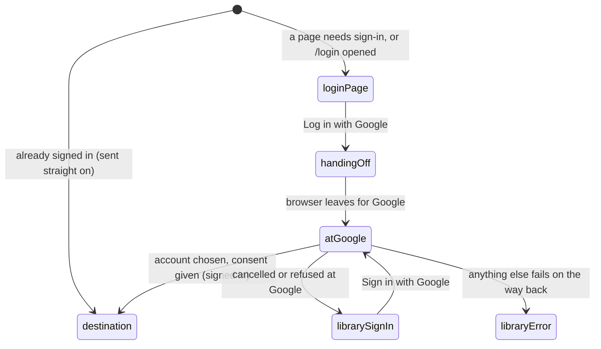

# Signing in

## Summary

Signing in is the round trip through Google that turns a signed-out visitor into a [signed-in](../glossary.md#people-and-access) user and puts them back where they were. It starts on the [login page](../glossary.md#the-site), at `/login`, which Probase sends a visitor to whenever a page needs a signed-in user: a heading "Log in to Probase", the line "Log in with your Google account to continue.", and one "Log in with Google" button. The button hands the browser to Google; when Google sends it back, Probase starts the [session](../glossary.md#people-and-access) and redirects to the page that asked for sign-in. The same button, and the same round trip, is on the signed-out and wrong-domain states of the [invite page](invites.md). What Probase keeps from Google, how long the session lasts, and the absence of any sign-out control belong to [accounts and roles](../foundations/accounts-and-roles.md); this document owns the login page, the button, and where the user lands, including when something goes wrong.

## The simple case

A signed-out visitor opens a collection, say `/c/demo`. Probase sends them to `/login?callbackUrl=%2Fc%2Fdemo`. They click "Log in with Google". Nothing on the page changes for a moment; then the browser goes to Google, which shows its account chooser and its consent screen. They pick their account and allow access. Google sends them back, and they arrive at `/c/demo`, signed in, where the collection's own checks decide what they see.

If they cancel at Google instead, they land on a plain page that is not styled like Probase, belonging to the authentication library, which says "Try signing in with a different account." above a "Sign in with Google" button.

## The interaction, event by event

The button is a one-click control: the click is _begin editing_, the hand-off and the time at Google are _while editing_, and the return to Probase is _submit_.

### Arrive

**How the user gets here.** A page that needs a signed-in user sends the browser to `/login?callbackUrl={path}`, with its own path encoded: the collection page, the problem page, the add-problem page and the test page return to themselves; the chooser returns to the collection page ([the login round trip](../foundations/navigation.md#the-login-round-trip)). The path carries no query string, so the collection page's search and filters are dropped. A visitor can also open `/login` directly; nothing in Probase links to it.

**The return address.** The page accepts `callbackUrl` only if it is a path on this site: it must start with a single `/`. Anything else, including a full address (`https://elsewhere.example/`), a protocol-relative one (`//elsewhere.example/`), a path starting `/\`, a path without the leading slash, or an empty value, is silently replaced by `/`, the [home page](home-page.md). With no `callbackUrl` the return address is also `/`. If the parameter is repeated, the first one is used. The page never shows the return address or says why the user was sent here.

**A visitor who is already signed in** never sees the page: they are sent straight to the return address.

**What is shown.** A single column, 36rem wide and centered on windows 640px and wider, full width with a 2rem margin on narrower ones: "Log in to Probase" in large bold type, "Log in with your Google account to continue.", and the button. The button spans the column: a rounded box with a gray 2px border, Google's colored "G", and "Log in with Google"; its background turns light gray on hover. There is no sidebar, no link to the home page, and no other link or control. The browser tab says "Probase". Nothing is focused.

### Leave untouched

Leaving records nothing. The page has no links, so the ways out are the browser's back button or typing an address. Back returns to wherever the user was before the address that needed sign-in; that address itself never entered the history, because it redirected at once.

### Begin editing

Clicking "Log in with Google", or pressing Enter or Space on it, starts the hand-off. Nothing on the page changes: the button shows no spinner, is not disabled, and says nothing. Behind it, the page asks Probase's authentication library for the address to send the user to at Google, which takes three quick requests; the library remembers the return address and a one-time check value in cookies that last 15 minutes. Then the browser leaves for Google.

> Technical note: the button calls `signIn("google", { callbackUrl })` from `next-auth/react`, which fetches `/api/auth/providers` and `/api/auth/csrf`, then posts to `/api/auth/signin/google` and sets `window.location.href` to the Google URL it gets back. Any failure along the way is caught and written to the browser console only.

### While editing

**Before the browser leaves.** The login page stays usable. A second click starts a second hand-off; normally the browser still ends up at Google once. If the login page was reached by a link inside Probase, the hand-off keeps running after the user presses Back, and the browser leaves for Google from whatever page they went back to.

**At Google.** Probase is not involved; Google's screens are out of scope. Probase asks Google for its consent screen on every sign-in, so it appears every time, not only the first ([accounts and roles](../foundations/accounts-and-roles.md#signing-in)). The one-time check expires 15 minutes after the click, so a user who stays on Google's screens longer than that cannot finish this sign-in.

A [timed attempt](../testsolving/timed-attempt.md) whose user was signed out mid-attempt keeps counting down on the server during the whole round trip.

### Submit

Google sends the browser back to Probase's authentication address (`/api/auth/callback/google`), a full page load. The library checks Google's answer, creates the user on first sign-in or recognizes them by their Google account or email ([accounts and roles](../foundations/accounts-and-roles.md#signing-in)), starts the 30-day session, and redirects to the return address. That page is built fresh with the user now signed in and runs its own checks, so the round trip can end on the page itself, the chooser, "You need permission" or "Page not found" ([the error pages](error-pages.md)). The address bar shows the bare return path.

Where the user lands:

| What happened                                                                                                                      | Where the user lands                                                                                                                                                                                                                                                                       |
| ---------------------------------------------------------------------------------------------------------------------------------- | ------------------------------------------------------------------------------------------------------------------------------------------------------------------------------------------------------------------------------------------------------------------------------------------ |
| An account was chosen and consent given                                                                                            | The return address, signed in.                                                                                                                                                                                                                                                             |
| The user cancelled or refused at Google                                                                                            | The library's own sign-in page, `/api/auth/signin?error=OAuthCallbackError`, titled "Sign In": "Try signing in with a different account." and a "Sign in with Google" button. That button repeats the Google step and still returns to the original return address. Not signed in.         |
| Another Probase session was already active and the chosen Google account belongs to a different Probase user                       | The same library page with "To confirm your identity, sign in with the same account you used originally." The user stays signed in as before.                                                                                                                                              |
| Another Probase session was already active and the chosen Google account is new to Probase                                         | The return address, still signed in as the earlier user. The new Google account is attached to that user from now on (see [edge cases](#edge-cases)).                                                                                                                                      |
| Anything else fails on the way back (the 15 minutes ran out, a later sign-in was started in another tab meanwhile, a server fault) | The library's error page, `/api/auth/error?error=Configuration`, titled "Error": "Server error", "There is a problem with the server configuration.", "Check the server logs for more information." It has no button and no link; the user must go back or type an address. Not signed in. |

The library's pages are plain white cards (dark in a browser set to a dark theme), unlike the rest of Probase, and none of them links back into Probase except through its own sign-in button. No part of signing in ever shows a [toast](../glossary.md#interface).

## Modifiers

| Modifier            | At arrival                                                                                                                                                                                                                                | During editing                                                                                                                                                                                                                                                   |
| ------------------- | ----------------------------------------------------------------------------------------------------------------------------------------------------------------------------------------------------------------------------------------- | ---------------------------------------------------------------------------------------------------------------------------------------------------------------------------------------------------------------------------------------------------------------- |
| Role                | Only signed-out visitors see the page. Anyone signed in, whatever their role in any collection, is sent straight to the return address. Roles play no part in signing in.                                                                 | No effect on the round trip. On arrival the return address's checks apply: a user with no permission, or a SubmitOnly member returning to a collection page, lands on "You need permission".                                                                     |
| Authorship          | No effect.                                                                                                                                                                                                                                | No effect.                                                                                                                                                                                                                                                       |
| Testsolver type     | No effect.                                                                                                                                                                                                                                | No effect on the round trip. A member returning to a collection that requires testsolving, without a type, goes on to the chooser.                                                                                                                               |
| Record state        | The return address is any same-site path; it is not checked for existence, so a path to something missing ends on "Page not found" after sign-in. Whether the Google account is already known to Probase makes no difference to the page. | A first sign-in creates the user; a Google account whose email matches an existing user takes that user over ([accounts and roles](../foundations/accounts-and-roles.md#signing-in)). The invite's own state is checked only after returning to the invite page. |
| Collection settings | No effect.                                                                                                                                                                                                                                | No effect. An invite's email domain is checked on the invite page after the return, not by sign-in.                                                                                                                                                              |
| Keys                | Tab reaches the button, the only focusable element; Enter or Space presses it. Escape does nothing.                                                                                                                                       | No key stops the hand-off. At Google, Google's own keys apply.                                                                                                                                                                                                   |

## Cancel and interrupt

"While editing" runs from the click on "Log in with Google" until the user is back on Probase.

| Event                               | Before editing                                                                                                                                                | While editing                                                                                                                                                                                                                                                                                                            |
| ----------------------------------- | ------------------------------------------------------------------------------------------------------------------------------------------------------------- | ------------------------------------------------------------------------------------------------------------------------------------------------------------------------------------------------------------------------------------------------------------------------------------------------------------------------ |
| Escape or Discard                   | No effect. There is no cancel control.                                                                                                                        | No effect on the hand-off. At Google, cancelling on Google's own screens lands on the library's sign-in page (see [Submit](#submit)).                                                                                                                                                                                    |
| Browser back or forward             | Leaves; nothing recorded. Back returns to the page before the address that needed sign-in.                                                                    | Before the browser has left: if the login page was reached by a link inside Probase, the previous page shows but the hand-off carries on and the browser still leaves for Google; otherwise the hand-off is abandoned. At Google: Back returns to the login page, still signed out.                                      |
| Reload                              | The login page again, with the same return address.                                                                                                           | Before the browser has left: the hand-off is abandoned and the login page shows again. At Google: Google's page reloads.                                                                                                                                                                                                 |
| Tab or window closed                | Nothing recorded.                                                                                                                                             | Nothing recorded; the user is not signed in. The remembered return address and check value expire on their own.                                                                                                                                                                                                          |
| A link inside the app followed      | Not applicable: the login page has no links.                                                                                                                  | Not applicable: the login page has no links.                                                                                                                                                                                                                                                                             |
| Network lost mid-request            | No effect until the button is clicked.                                                                                                                        | If the first request fails, the browser is sent to the library's error address, which offline shows the browser's own offline page. If a later request fails, nothing happens at all: the button seems not to work. On the way back from Google, the browser shows its offline page at Probase's authentication address. |
| Request fails or returns an error   | No effect.                                                                                                                                                    | Nothing is shown on the login page. Errors after Google land on the library's sign-in or error page (see [Submit](#submit)).                                                                                                                                                                                             |
| Session ends                        | Not applicable: the page is shown only to signed-out visitors.                                                                                                | Not applicable: a completed round trip starts a new session.                                                                                                                                                                                                                                                             |
| Access changes                      | No effect: the page does not depend on access.                                                                                                                | No effect on the round trip; the return address's checks use whatever access the user has on arrival.                                                                                                                                                                                                                    |
| Same record changed in another tab  | Signing in in another tab is not noticed here. Reloading then sends the user straight on; clicking the button signs in again (see [edge cases](#edge-cases)). | A second sign-in started in another tab replaces the first one's check value, so the sign-in started first ends on the library's error page when it comes back from Google.                                                                                                                                              |
| Same record changed by another user | No effect: nothing on the page is shared.                                                                                                                     | No effect.                                                                                                                                                                                                                                                                                                               |
| Autofill writes into the field      | Not applicable: the page has no fields.                                                                                                                       | Not applicable.                                                                                                                                                                                                                                                                                                          |
| The window loses focus              | No effect.                                                                                                                                                    | No effect; the hand-off completes in the background.                                                                                                                                                                                                                                                                     |
| The testsolve time limit passes     | Not applicable: no attempt is shown. A running attempt keeps counting on the server.                                                                          | Not applicable on the login page. A running attempt keeps counting through the whole round trip and can run out before the user is back on its problem page.                                                                                                                                                             |

## Interactions with other systems

**Permissions.** Signing in grants nothing. Anyone with a Google account can sign in; what they can do is decided by their [permissions](../foundations/accounts-and-roles.md#roles), which the return address checks as soon as they arrive.

**Testsolving locks.** None on the login page. The clock of a running [timed attempt](../testsolving/timed-attempt.md) does not stop while its user signs in again.

**Per-collection settings.** None.

**Validation and errors.** The return address is checked silently: an unacceptable one becomes the home page, with no message. Nothing else is validated, and nothing is ever shown on the login page itself: failures before Google go to the browser's console, and failures after Google land on the library's own pages rather than as toasts.

**Unsaved changes.** The page holds nothing to lose. Text left typed on another page when its session ended is not carried through sign-in.

**Optimistic updates.** None.

**Freshness and other users.** The page decides whether the visitor is signed in when it loads. A sign-in completed in another tab is noticed only on reload (which sends the user straight on) or by clicking the button again.

**URL state.** `callbackUrl` carries the return address, and the page never changes the URL itself. After the round trip the address is the bare return path; the query string of the page that sent the user here is lost ([the login round trip](../foundations/navigation.md#the-login-round-trip)).

**Math rendering.** None.

**Offline.** Clicking the button offline either leaves for the browser's offline page or does nothing visible, depending on which request fails first (see the table above). Nothing is retried.

**Keyboard and accessibility.** One heading and one button, named "Log in with Google" by its text; the Google logo beside it has no text of its own. Nothing is focused on arrival; Tab reaches the button, which shows the browser's own focus ring. See [keyboard and accessibility](../cross-cutting/keyboard-and-accessibility.md).

**Narrow screens.** Below 640px the column takes the full width with a 2rem margin and the button spans it; nothing is hidden. See [narrow screens](../cross-cutting/narrow-screens.md).

**Side effects.** The first sign-in creates the user. A sign-in while another Probase session is active can attach the new Google account to the already signed-in user (see [edge cases](#edge-cases)). Probase sends no email or notification.

## Edge cases

- Opening `/login` while signed in goes straight on, so there is no way to reach the login page to change accounts. The only sign-out is the library's unlinked `/api/auth/signout` page ([the session](../foundations/accounts-and-roles.md#the-session)).
- **Signing in while already signed in** is possible from the invite page's wrong-domain state ("Currently logged in as {email}") or from a login page left open in a tab that has since signed in elsewhere. It does not switch accounts. With the same Google account, nothing changes. With a Google account that already belongs to another Probase user, the library refuses ("To confirm your identity, sign in with the same account you used originally.") and the user stays who they were. With a Google account Probase has never seen, the library attaches it to the user already signed in: the user stays the same Probase user, with the same name, roles and authors, but Probase now sees the new account's email address, and that Google account signs in as this user from then on.
- Any same-site path is honored as a return address, including `/login` itself (which then sends the signed-in user on to the home page) and the library's own pages, such as `/api/auth/signout` ("Are you sure you want to sign out?").
- A return address to something that does not exist, or that the user may not open, is followed anyway; the user signs in and then sees "Page not found" or "You need permission".
- Signing in from `/login` with no return address ends on the home page, which looks the same signed in as signed out.

## Open questions and verification

- The landing pages for a cancel at Google, a refused second account, and the 15-minute expiry were read from the authentication library's code (no custom `pages` are configured), not tried. Confirm each by hand; the "Server error" wording for an expired sign-in is misleading and may be worth treating as a bug.
- Signing in with a new Google account while already signed in attaches that account to the signed-in user instead of switching to it. This looks like a bug: on the invite page's wrong-domain state it lets the signed-in user pass the email-domain check with an account that is not theirs in Probase's records, and it permanently merges two Google accounts. Read from the library's code; not tried.
- [Invites](invites.md) describes the wrong-domain button as signing the user in to all of Probase as the other account; if the behavior above is confirmed, that description needs to change.
- Where Back goes from the page the round trip ended on (Google's screens, or the login page, which would send a now signed-in user straight on) was not tried.
- The login page accepts a path starting `/` followed by a tab character. Browsers drop tabs from addresses, so for a visitor who is already signed in, `/login?callbackUrl=%2F%09%2Felsewhere.example` may redirect to `elsewhere.example`, the very case the check exists to stop. This looks like a bug; read from code, not tried.
- That the button shows no pending state, and what a double click does, were read from code. Whether two simultaneous hand-offs can trip the library's own checks and land on its error page was not tried.
- That Back after a click keeps the hand-off running (when the login page was reached inside Probase) follows from the hand-off running in the page's script; not tried.
- Whether Google shows its account chooser on every sign-in depends on Google and on how many Google accounts the browser is signed in to; Probase asks only for the consent screen.
- What a reload of Probase's authentication address does after the connection returns mid-way back from Google was not determined.

Verified against Probase commit `c38ff56`
