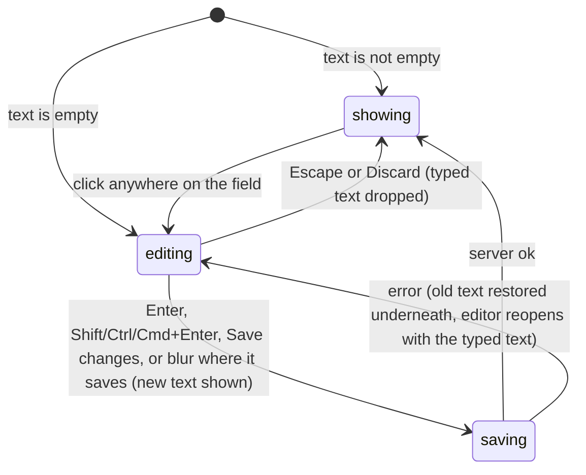

# Click-to-edit

## Summary

Click-to-edit is Probase's inline editor: a piece of text shown as it will be read, with math typeset, that turns into a text box when clicked and turns back when saved. It is used for the problem's title, statement and answer and a solution's text on the [problem page](../problem-page/problem-page.md), for users who [can edit](../glossary.md#people-and-access) them, and for the title, statement, short answer and solution fields of the [add-problem form](../collection/adding-a-problem.md). This document owns how the editor behaves; the feature documents say where each field is, who sees it, and what saving it does.

It comes in three variants, which differ only in how a save is triggered:

| Variant                | Used for                                                                   | Saves on                                | Buttons                   |
| ---------------------- | -------------------------------------------------------------------------- | --------------------------------------- | ------------------------- |
| Single-line            | Title and answer (problem page); title and short answer (add-problem form) | Enter, or [blur](../glossary.md#input)  | None                      |
| Multi-line             | Statement and solution (problem page)                                      | Shift/Ctrl/Cmd+Enter, or "Save changes" | "Save changes", "Discard" |
| Multi-line, autosaving | Statement and solution (add-problem form)                                  | Shift/Ctrl/Cmd+Enter, or blur           | None                      |

On the problem page a save is an [action](../glossary.md#interaction) sent to the server. On the add-problem form a save only closes the editor and keeps the text in the form; nothing is sent until the form's Submit.

## The simple case

An author opens their problem and clicks its title. The title becomes a text box holding the same text, with the cursor at the end. They change a word and press Enter. The box turns back into the title, showing the new text immediately. In the background the new title is sent to the server; when it is stored, the page refreshes and nothing more visibly happens.

A multi-line field works the same way, except that Enter starts a new line and the user saves with "Save changes" (or Shift/Ctrl/Cmd+Enter) or abandons with "Discard" (or Escape).

## The interaction, event by event

On the add-problem form there is no `saving` state: a save goes straight to `showing`.

### Arrive

A field with text starts **showing**: its label, if it has one ("ANSWER", "SOLUTION", "TITLE", "PROBLEM STATEMENT"), then the text rendered as it will be read, with [math](../glossary.md#interface) typeset and line breaks kept. Nothing marks it as editable: there is no pencil, underline, hover color or pointer cursor.

A field whose text is empty starts **editing** instead, with an empty box already open and focused. On the problem page this happens only to an [empty answer](../glossary.md#records); on the add-problem form it happens to every click-to-edit field. When several empty fields open at once, each takes focus in turn as it appears, and the last one on the page keeps it.

### Leave untouched

Leaving a showing field untouched records nothing. Leaving an empty field open and untouched records nothing either, since an empty box is never saved.

### Begin editing

Clicking anywhere on a showing field (its label, its text, a formula, the empty space beside it) opens the editor. The rendered text is replaced by a box holding the saved text as typed (the math source, not the rendering), focused, with the cursor at the end. A single-line box is one line the full width of the column. A multi-line box grows to fit its text, never shorter than about two lines (the Add Solution box elsewhere uses a taller minimum), and cannot be resized by hand; on the problem page, "Save changes" and "Discard" appear under it.

Because a click opens the editor, selecting text in a showing field with the mouse opens the editor too, so text cannot be copied from an editable field without entering it.

### While editing

Typing changes only the box. There is no preview of the rendered result, no character count, and no indication that the text differs from what was saved.

Keys in the box:

| Key                  | Single-line                     | Multi-line                      |
| -------------------- | ------------------------------- | ------------------------------- |
| Enter                | Saves, if the box is not empty  | New line                        |
| Shift/Ctrl/Cmd+Enter | Saves, if the box is not empty  | Saves, if the box is not empty  |
| Escape               | Abandons                        | Abandons                        |
| Tab                  | Moves focus on, which is a blur | Moves focus on, which is a blur |

**Blur** (Tab, a click elsewhere, the window losing focus) saves a single-line field and an autosaving multi-line field, if the box is not empty. It does nothing to a problem-page multi-line field, which stays open with its text until saved or discarded.

**Abandoning** (Escape, or "Discard") drops the typed text and shows the saved text again. If there is no saved text (the field started empty), abandoning does nothing: the box stays open with what was typed.

**An empty box is never saved.** Enter, Shift/Ctrl/Cmd+Enter, "Save changes" and blur all do nothing while the box is empty. As a result, once a field has text, it cannot be emptied through the editor; an answer, once given, can be changed but not removed.

### Submit

A save closes the editor at once and shows the new text, rendered, before anything else happens.

On the add-problem form that is the whole save: the text is kept in the form and submitted with it.

On the problem page the new text is then sent to the server ([saving and feedback](saving-and-feedback.md)). The field shows the new text while the request is pending, with no indicator. When the server answers:

- **Ok.** The page refreshes. The field keeps showing the text the user saved.
- **Error.** A toast shows the reason. Underneath, the field goes back to the text it had before, and the editor reopens holding the user's new text, focused, so nothing typed is lost. The user can fix it and save again, or press Escape to see the old text.

Every save sends a request, even when the text is unchanged: clicking a title and then clicking away saves the same title again and refreshes the page.

## Modifiers

| Modifier            | At arrival                                                                                                                                                                             | During editing                                                                                                                     |
| ------------------- | -------------------------------------------------------------------------------------------------------------------------------------------------------------------------------------- | ---------------------------------------------------------------------------------------------------------------------------------- |
| Role                | On the problem page, only users who can edit the problem get click-to-edit fields; everyone else sees plain text. On the add-problem form, every role that may add problems gets them. | Checked again by the server on save; a user who has lost the right sees a permission toast and the editor reopens with their text. |
| Authorship          | A TeamMember or SubmitOnly member gets click-to-edit fields only on problems (and solutions) they authored; an Admin gets them everywhere.                                             | As role.                                                                                                                           |
| Testsolver type     | No effect: users who can edit a problem never need to testsolve it, so their fields are never hidden.                                                                                  | No effect.                                                                                                                         |
| Record state        | An empty answer opens as an empty box; an absent answer has no field at all. An archived problem's fields are editable as usual.                                                       | No effect.                                                                                                                         |
| Collection settings | On the add-problem form, which fields are required; see [adding a problem](../collection/adding-a-problem.md). No effect on the problem page.                                          | No effect.                                                                                                                         |
| Keys                | No effect.                                                                                                                                                                             | As in the table under [While editing](#while-editing).                                                                             |

## Cancel and interrupt

For a problem-page field. On the add-problem form nothing is sent, so the network, session and access rows do not apply to the field itself; see [adding a problem](../collection/adding-a-problem.md).

| Event                               | Before editing                                                             | While editing                                                                                                                                                                                                    |
| ----------------------------------- | -------------------------------------------------------------------------- | ---------------------------------------------------------------------------------------------------------------------------------------------------------------------------------------------------------------- |
| Escape or Discard                   | No effect.                                                                 | Abandons: the saved text is shown again. With no saved text, nothing happens.                                                                                                                                    |
| Browser back or forward             | Leaves; nothing recorded.                                                  | Leaves. The typed text is lost, unless the field is single-line and saved on blur as the page lost focus.                                                                                                        |
| Reload                              | Page rebuilt.                                                              | The typed text is lost without warning.                                                                                                                                                                          |
| Tab or window closed                | Nothing recorded.                                                          | The typed text is lost without warning.                                                                                                                                                                          |
| A link inside the app followed      | Nothing recorded.                                                          | Clicking the link blurs the box first, so a single-line field (or an autosaving one) saves and its request completes after the navigation. A problem-page multi-line field is left unsaved and its text is lost. |
| Network lost mid-request            | No effect.                                                                 | Generic toast; the old text is restored underneath and the editor reopens with the typed text.                                                                                                                   |
| Request fails or returns an error   | No effect.                                                                 | Toast; the old text is restored underneath and the editor reopens with the typed text.                                                                                                                           |
| Session ends                        | No effect on the open page.                                                | "Not signed in"; the editor reopens with the typed text.                                                                                                                                                         |
| Access changes                      | No effect on the open page.                                                | A permission toast; the editor reopens with the typed text and every further save fails the same way.                                                                                                            |
| Same record changed in another tab  | The field keeps showing its own text, even after a refresh.                | A save overwrites whatever the other tab saved, without warning.                                                                                                                                                 |
| Same record changed by another user | As another tab.                                                            | As another tab: the last save wins.                                                                                                                                                                              |
| Autofill writes into the field      | No effect.                                                                 | A single-line box may offer entries the browser remembers for fields of the same name (for example earlier titles or answers); picking one is the same as typing it.                                             |
| The window loses focus              | No effect.                                                                 | A single-line or autosaving field saves (if not empty). A problem-page multi-line field stays open with its text.                                                                                                |
| The testsolve time limit passes     | No effect: a user with click-to-edit fields never testsolves that problem. | No effect.                                                                                                                                                                                                       |

After an interrupt that reopens the editor, the user is still in the editor with their text; after one that leaves the page, nothing unsaved survives.

## Interactions with other systems

**Permissions.** Whether a field is click-to-edit is decided on the server when the page is built; the server checks again on every save. See [accounts and roles](accounts-and-roles.md).

**Testsolving locks.** Not involved. Editors are shown only to users who can edit the problem, and they are never asked to testsolve it.

**Per-collection settings.** Only on the add-problem form, where they decide which fields must be filled.

**Validation and errors.** The editor refuses to save an empty box and gives no message about it. The server refuses an empty title or statement (which the editor never sends) and accepts anything else, including text that is only spaces. Errors arrive as toasts.

**Unsaved changes.** An open editor's text is never kept across a reload or navigation, and nothing warns about it.

**Optimistic updates.** Every problem-page save is optimistic and rolls back as described under [Submit](#submit).

**Freshness and other users.** A click-to-edit field keeps the text it had when the page (or the problem) was opened, or the text the user last saved in it. It does not pick up changes from other tabs or users even when the page refreshes; only a reload or navigating to the problem again shows them. See [freshness](../cross-cutting/freshness.md).

**URL state.** None.

**Math rendering.** The showing state renders math; the editing state shows the source. Malformed math shows in red after saving rather than being refused. See [math rendering](../cross-cutting/math-rendering.md).

**Offline.** A save fails with the generic toast and the editor reopens with the text.

**Keyboard and accessibility.** A showing field is not focusable and has no role, so a keyboard user cannot open it; it can only be opened by clicking. Once open, the box is an ordinary text box. See [keyboard and accessibility](../cross-cutting/keyboard-and-accessibility.md).

**Narrow screens.** Boxes take the width of the column; nothing else changes.

**Side effects.** None beyond the save itself.

## Edge cases

- Saving a single-line field with Enter also removes the box from the page. Whether the browser then reports a blur, sending a second, identical save, was not confirmed; if it does, the page refreshes twice.
- Escape on a single-line field removes the box from the page in the same way. If the browser reports a blur as the box disappears, the text the user meant to abandon would be saved. Not confirmed; see [open questions](#open-questions-and-verification).
- A title of only spaces is saved as typed.
- Clicking a field that is already open does nothing; clicking a second field while one is open saves (or leaves open) the first by blur and opens the second.
- Two single-line fields cannot be open at once, because opening the second blurs the first. Two problem-page multi-line fields (the statement and the solution) can be open at once.
- An answer that was given and then needs to be withdrawn cannot be emptied here; there is no way in the interface to go back to an empty answer.

## Open questions and verification

- Whether Enter and Escape in a single-line box cause an extra blur as the box is removed, and therefore an extra save (Enter) or an unwanted save (Escape), depends on the browser. This is the most important thing to check by hand; if Escape saves, it is a bug.
- That a click-to-edit field keeps its own text through a refresh, instead of showing the server's current text, was read from code. Confirm with two tabs.
- The lack of any visual cue that a field is editable, and the lack of keyboard access to open it, were read from code and styles.
- On the add-problem form, which of several empty fields ends up with focus, and whether the page scrolls to it, depends on the order they appear; confirm by hand.

Verified against Probase commit `c38ff56`
