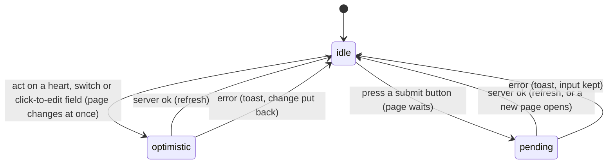

# Saving and feedback

## Summary

Every change a user makes in Probase is an [action](../glossary.md#interaction): a request from the page to the server that either succeeds or comes back with an error message. This document owns what happens around every action: what the page shows while the request is [pending](../glossary.md#interaction), how an error reaches the user as a [toast](../glossary.md#interface), which controls change the page [optimistically](../glossary.md#interaction) and roll back, how and when the page [refreshes](../glossary.md#interaction) afterwards, and what "[saved](../glossary.md#interaction)" means. Feature documents describe their own action's rules and messages and link here for the shared behavior.

Nothing in Probase is saved in the browser. There are no drafts, no autosave to local storage, no "unsaved changes" warning, and no success messages: a success is visible only as the page changing.

## The simple case

A member edits something (posts a comment, likes a problem, saves a title). Depending on the control, the page either changes at once and waits quietly for the server, or stays as it is and waits. When the server answers ok, the page refreshes itself from the server, showing the change along with anything else that changed since the page loaded. When the server answers with an error, a red toast appears in the bottom-right corner with the reason, and whatever the page had changed optimistically is put back.

## The actions

Every action Probase has, where it is triggered, and what the user sees on each outcome. "Refresh" means the page reloads its data from the server in place, without a full browser reload.

| Action                   | Triggered from                          | While pending                                                                                                                                                                     | On success                                                                                     | On error                                         |
| ------------------------ | --------------------------------------- | --------------------------------------------------------------------------------------------------------------------------------------------------------------------------------- | ---------------------------------------------------------------------------------------------- | ------------------------------------------------ |
| Like or unlike           | The heart on a card or the problem page | Heart and count already changed                                                                                                                                                   | Refresh                                                                                        | Toast; heart and count put back                  |
| Save the title or answer | Click-to-edit field on the problem page | New text already shown                                                                                                                                                            | Refresh                                                                                        | Toast; old text shown, editor reopens with draft |
| Save the statement       | Click-to-edit field on the problem page | New text already shown                                                                                                                                                            | Refresh                                                                                        | Toast; old text shown, editor reopens with draft |
| Archive or unarchive     | The Archive switch                      | Switch already moved                                                                                                                                                              | Refresh                                                                                        | Toast; switch put back                           |
| Post a comment           | "Post comment"                          | Button disabled, with a spinner                                                                                                                                                   | Refresh; comment box empties                                                                   | Toast; text kept                                 |
| Add a solution           | "Submit" under the Add Solution box     | Nothing changes                                                                                                                                                                   | Refresh; the box is replaced by the solution                                                   | Toast; text kept                                 |
| Edit a solution          | Click-to-edit field in the spoilers     | New text already shown                                                                                                                                                            | Refresh                                                                                        | Toast; old text shown, editor reopens with draft |
| Start testsolving        | "Start testsolving"                     | Button disabled, with a spinner                                                                                                                                                   | Refresh into the testsolving view                                                              | Toast; still locked                              |
| Submit an answer         | "Submit" in the timed attempt           | Submit and Give Up disabled, with spinners                                                                                                                                        | Correct: refresh into the unlocked view. Wrong: "{answer} is incorrect! ({n}/5)", box empties. | Toast; answer kept                               |
| Give up                  | "Give Up" in the timed attempt          | Nothing changes, unless an answer is typed: then Give Up also submits it and both buttons are disabled ([B-05](../bug-triage.md#b-05-give-up-also-submits-the-answer-in-the-box)) | Refresh into the unlocked view                                                                 | Toast; attempt continues                         |
| Add a problem            | "Submit" on the add-problem form        | Button disabled, with a spinner                                                                                                                                                   | The new problem's page opens                                                                   | Toast; form kept as filled                       |
| Accept an invite         | "Accept Invite"                         | Nothing changes                                                                                                                                                                   | The collection page opens                                                                      | Toast; invite page stays                         |
| Choose a testsolver type | "Confirm" on the chooser                | Nothing changes                                                                                                                                                                   | The collection page opens                                                                      | Toast; chooser stays                             |

The details of each belong to the feature documents: [likes](../problem-page/likes.md), [editing the problem](../problem-page/editing-the-problem.md), [archiving](../problem-page/archiving.md), [the discussion](../problem-page/discussion.md), [solutions](../problem-page/solutions.md), [the locked problem](../testsolving/locked-problem.md), [the timed attempt](../testsolving/timed-attempt.md), [adding a problem](../collection/adding-a-problem.md), [invites](../entry/invites.md), [choosing a testsolver type](../testsolving/choosing-a-testsolver-type.md).

## The interaction, event by event

### Arrive

A page arrives with everything it shows already decided on the server: what the user may see, what they may edit, and the data as it stood at that moment. No control starts disabled because something is loading, and nothing arrives later by itself. (The one exception is the countdown in a timed attempt, which ticks in the browser; see [the timed attempt](../testsolving/timed-attempt.md).)

### Leave untouched

Leaving a page without acting records nothing, with one exception described under [edge cases](#edge-cases): on a production build, merely viewing a collection page as a member who may add problems creates that member's [author](../glossary.md#people-and-access) in the collection.

### Begin editing

What the first change does depends on the kind of control:

- **Optimistic controls** (the heart, the Archive switch, every click-to-edit field on the problem page) change the page the moment the user acts, then send the action.
- **Waiting controls** (every button that submits a form or text: "Post comment", Add Solution's "Submit", "Start testsolving", the timed attempt's "Submit" and "Give Up", the add-problem "Submit", "Accept Invite", the chooser's "Confirm") leave the page as it is and send the action.
- **Local fields** (the add-problem form's fields, the answer box in a timed attempt, the collection page's search box and filters) change only what is on screen; nothing is sent until the form is submitted, or, for the search box and filters, the URL changes instead (see [navigation](navigation.md)).

### While editing

Only buttons that submit a form show that an action is pending. "Post comment", "Start testsolving", the timed attempt's "Submit" and "Give Up", and the add-problem "Submit" turn pale, show a small spinning ring to the left of their label, and ignore clicks until the server answers. Every submit button in the same form does this together, so while an answer is being judged both "Submit" and "Give Up" are disabled. The pending state ends when the action's answer arrives, which can be slightly before the page finishes refreshing.

The other waiting buttons ("Accept Invite", the chooser's "Confirm", Add Solution's "Submit", and "Give Up" when it is pressed with an empty answer box) are plain buttons with no pending state: they stay enabled, and a second click sends a second request. What that does depends on the action and is described in each feature document; none of them does lasting harm. Optimistic controls have no pending state either, since the page has already changed.

The rest of the page stays usable while an action is pending, but a page's actions are sent one at a time: an action started while another is pending waits until that one has been answered, so a slow save delays the like clicked after it. Each still settles on its own, with its own toast or refresh. Following a link while an action is pending does not stop it; its result still arrives, and an error still shows as a toast on the new page.

> Technical note: the framework queues a page's server actions, refreshes and navigations in one router queue. A navigation jumps the queue and discards the pending action's page update, but not its result, which is still handed to the code that called it.

> Technical note: the forms' action functions call the server action without returning its promise, but React ties the server action's own pending request to the form's transition, so `useFormStatus()` reports the form as pending until the server answers.

### Submit

When the server answers, one of three things happens:

1. **Ok, stay on the page.** The server has already marked the page stale as part of the action (or, for the testsolving actions, the page asks for a fresh copy itself), so the page refreshes in place: server-rendered parts are rebuilt with the latest data, scroll position is kept, and anything the user was typing in a component that stays on screen is kept.
2. **Ok, go somewhere.** Adding a problem, accepting an invite and choosing a testsolver type take the user to a new page. No toast appears.
3. **Error.** The message is shown as a toast. Optimistic changes are put back. Typed text is kept.

What a refresh does _not_ update is as important as what it does. A refresh rebuilds the page from the server, but controls that keep their own state in the browser keep showing what they showed, even when the server's data changed: the heart's count and color, the Archive switch's position, and the text of every click-to-edit field keep their values from when the page (or that problem) was first opened. Lists and read-only text (comments, the leaderboard, the solution as read, the problem list) do update. [Freshness](../cross-cutting/freshness.md) lists every part of every page.

## Toasts

An error toast is a red box in the bottom-right corner, 20 rem wide (narrower on a small window), with an exclamation icon, the message, and a close button (×, labeled "Dismiss" for screen readers). Toasts stack, newest at the bottom, and each disappears on its own 8 seconds after it appeared. Clicking × removes it at once. Toasts belong to the whole site rather than to one page, so a toast raised by an action that finishes after the user has navigated away appears on the page they are now on. Probase shows no success toasts, no warnings and no information toasts: every toast is an error.

The message is the action's own when the server refused the action deliberately, and "Something went wrong. Please try again." when anything unexpected happened: the server failed, the network dropped, the request could not be sent, or two requests collided on the database. The unexpected error's details go only to the server's log.

Deliberate messages the user can meet through the interface:

| Message                                                               | From                                                          |
| --------------------------------------------------------------------- | ------------------------------------------------------------- |
| "Not signed in"                                                       | Every action, when the session has ended                      |
| "You do not have permission to like this problem"                     | Like                                                          |
| "You do not have permission to edit this problem"                     | Saving the title, statement, answer; archiving                |
| "You do not have permission to comment on this problem"               | Posting a comment                                             |
| "You do not have permission to edit this collection"                  | Adding or editing a solution; starting, submitting, giving up |
| "You do not have permission to add a problem"                         | Adding a problem                                              |
| "You do not have access to this collection"                           | Choosing a testsolver type                                    |
| "Problem not found" / "No problem with id {n}"                        | Problem-page actions on a problem that no longer exists       |
| "Reached maximum number of submissions (5)"                           | Submitting an answer                                          |
| "Tried to submit after testsolve finished"                            | Submitting or giving up late, twice, or after giving up       |
| "Tried to submit before starting testsolve"                           | Submitting or giving up with no attempt                       |
| "Problem difficulty should not be null"                               | Submitting or giving up on a problem with no difficulty       |
| "Invite has expired" / "Invalid email domain" / "Invalid invite code" | Accepting an invite                                           |
| "Invalid input ({field}): {reason}"                                   | Any action given a value its rules reject                     |

Some of these are phrased for developers rather than people ("No problem with id 12", "Tried to submit before starting testsolve", "Problem difficulty should not be null"), and "edit this collection" is used for actions that do not edit the collection. See [open questions](#open-questions-and-verification).

## Optimistic updates and rollback

The heart, the Archive switch and the problem page's click-to-edit fields show the new state before the server answers. If the server answers with an error, or the request fails, the control goes back exactly to its state before the click:

- The heart restores its color and count.
- The Archive switch moves back.
- A click-to-edit field shows the text from before the edit again and reopens its editor holding the user's new text, so nothing typed is lost ([click-to-edit](click-to-edit.md)).

Quick clicks on an optimistic control send one request each, and each failure rolls the control back to its state before that click, whenever the failure arrives. Two clicks of which one fails end in step with the server; two clicks that both fail, or three or more with a failure among them, can leave the heart or the switch showing a state the server does not hold until the next load (see [archiving](../problem-page/archiving.md#edge-cases)). A click-to-edit field saved twice in quick succession, the first save failing and the second succeeding, reopens its editor holding the first text although the second was stored.

## Modifiers

| Modifier            | At arrival                                                                                                              | During editing                                                                                                                                                                  |
| ------------------- | ----------------------------------------------------------------------------------------------------------------------- | ------------------------------------------------------------------------------------------------------------------------------------------------------------------------------- |
| Role                | Decides which controls the page renders at all; a control the role cannot use is not shown, rather than shown disabled. | The server checks the role again on every action; a role lost while the page is open shows as a permission toast.                                                               |
| Authorship          | Decides whether the problem's fields are click-to-edit and whether the Archive switch is shown.                         | Checked again on every save.                                                                                                                                                    |
| Testsolver type     | Decides the problem page's view, and with it which actions are offered.                                                 | Not checked by the testsolving actions beyond "can view the collection"; a type changed elsewhere applies on the next load.                                                     |
| Record state        | Decides what is shown (locked, testsolving, unlocked; archived; answer present).                                        | Rules that must not be exceeded (five submissions, a one-time invite, giving up once) are re-checked as the change is written, so two requests at once cannot both get through. |
| Collection settings | No effect on saving or feedback.                                                                                        | No effect.                                                                                                                                                                      |
| Keys                | No effect.                                                                                                              | Keys that save or submit are owned by each control; see [click-to-edit](click-to-edit.md) and the feature documents.                                                            |

## Cancel and interrupt

| Event                               | Before editing                                                    | While editing                                                                                                                                                                             |
| ----------------------------------- | ----------------------------------------------------------------- | ----------------------------------------------------------------------------------------------------------------------------------------------------------------------------------------- |
| Escape or Discard                   | No effect.                                                        | Abandons a click-to-edit edit or the Add Solution box before it is sent. Nothing cancels a request that has been sent.                                                                    |
| Browser back or forward             | Leaves; nothing recorded.                                         | Unsent text is lost without warning. A sent request completes on the server; its error toast, if any, appears on whatever page is showing.                                                |
| Reload                              | Page rebuilt from the server.                                     | Unsent text is lost without warning. A sent request may or may not have been stored; the reloaded page shows which.                                                                       |
| Tab or window closed                | Nothing recorded.                                                 | Unsent text is lost without warning. A request that reached the server is stored.                                                                                                         |
| A link inside the app followed      | Nothing recorded.                                                 | As browser back.                                                                                                                                                                          |
| Network lost mid-request            | No effect until an action is sent.                                | "Something went wrong. Please try again." Optimistic changes are put back; typed text is kept. The change may still have been stored if the request arrived before the connection failed. |
| Request fails or returns an error   | No effect.                                                        | Toast with the message; optimistic changes put back; typed text kept.                                                                                                                     |
| Session ends                        | No effect on the open page.                                       | Every action answers "Not signed in". The page stays; the next page load goes to the login page.                                                                                          |
| Access changes                      | No effect on the open page.                                       | The next action is checked against the new access and may be refused with a permission toast.                                                                                             |
| Same record changed in another tab  | Not shown until a refresh.                                        | Not shown until a refresh, and even then not in the heart, the Archive switch or click-to-edit fields. A save overwrites the other tab's change without warning (last save wins).         |
| Same record changed by another user | Not shown until a refresh.                                        | As another tab. There is no conflict detection anywhere.                                                                                                                                  |
| Autofill writes into the field      | No effect.                                                        | Treated as typing.                                                                                                                                                                        |
| The window loses focus              | No effect.                                                        | A single-line click-to-edit field (and a multi-line one that autosaves) saves; nothing else reacts.                                                                                       |
| The testsolve time limit passes     | The testsolving view refreshes into the unlocked view on its own. | A submission sent in the last seconds is still accepted within the 10-second [grace buffer](../glossary.md#testsolving); after that it is refused.                                        |

## Interactions with other systems

**Permissions.** The page decides what to show, and the server decides again on every action. A control is never shown disabled for lack of permission; it is either there or not. See [accounts and roles](accounts-and-roles.md).

**Testsolving locks.** The locked and testsolving views leave out everything the user may not see yet, so there is nothing to act on there except starting, submitting and giving up.

**Per-collection settings.** No effect on how saving works.

**Validation and errors.** Two layers: the browser's own required-field checks on forms that have them (the comment box, the answer box, the add-problem form's fields), and the server's checks, whose failures arrive as toasts. There is no inline error text next to a field anywhere in Probase except the browser's own bubbles.

**Unsaved changes.** Never kept and never warned about. Any typed but unsent text is lost on reload, close or navigation.

**Optimistic updates.** Described [above](#optimistic-updates-and-rollback).

**Freshness and other users.** Each successful action refreshes the page the user is on and clears the browser's cache of other pages, so the next page visited is fetched fresh. See [freshness](../cross-cutting/freshness.md).

**URL state.** Actions never change the URL, except those that go to a new page.

**Math rendering.** Not involved.

**Offline.** Every action fails with the generic toast. Nothing is queued or retried.

**Keyboard and accessibility.** Toasts are announced to screen readers as alerts. Submit buttons are ordinary buttons reachable with Tab.

**Narrow screens.** Toasts shrink to fit a narrow window, keeping a 1.5 rem margin on each side.

**Side effects.** No action sends email or any other notification.

## Edge cases

- On a production build, links marked for eager prefetching load the linked page in the background as soon as they scroll into view. The collection page's "Add Problem" link is one of them, and loading the add-problem page creates the member's author in the collection if they have none. So on a production build, a member who may add problems gets an author just by opening the collection page, which in turn makes "Add Solution" appear on problems without a solution. The development server does not prefetch, so this does not happen there.
- An action that redirects (adding a problem, accepting an invite, choosing a type) shows no toast on success and cannot report a failure after the redirect has started.
- A toast raised while the user is on a page without the relevant content (after navigating away) still appears and still disappears after 8 seconds.
- If the same error happens several times in a row, one toast is shown per occurrence; they are not merged.

## Open questions and verification

- A first local pass confirmed that "Post comment" disables itself and shows its spinner while pending, and that a second click during that time sends nothing. The other form buttons use the same mechanism and were not all checked.
- That a refresh does not update the heart, the Archive switch or click-to-edit fields was read from code (each keeps the value it was first given). Confirm by changing a problem in a second tab and then triggering a refresh in the first.
- The eager prefetch of the add-problem page and the author it creates were read from code and Next.js's behavior; confirm on a production build.
- Several deliberate messages are worded for developers. Whether to rewrite them is a product call.
- Whether a request that is in flight when the tab closes reaches the server depends on the browser; not confirmed.

Verified against Probase commit `c38ff56`
