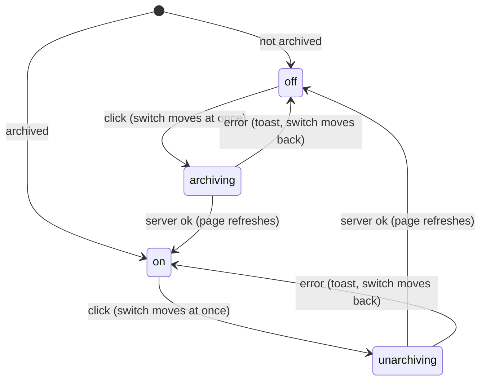

# The Archive switch

## Summary

The Archive switch is the toggle labeled "Archive" near the bottom of the [problem page](problem-page.md), shown only to users who [can edit](../glossary.md#people-and-access) the problem. Turning it on marks the problem [archived](../glossary.md#records): the problem drops out of the collection page's list, which shows archived problems only when its "Archived" filter is on, and then shows nothing but archived problems. It is the only way to take a problem out of the list, since nothing can be deleted through the interface. It hides nothing else: the problem page, its address, Previous and Next, test pages and everything attached to the problem stay as they were, for every user. The switch is [optimistic](../glossary.md#interaction): it moves the moment it is clicked and moves back if the server refuses. Its placement belongs to [the problem page](problem-page.md#arrive); this document owns what it does.

## The simple case

An author decides a problem will not be used. At the bottom of its page, under the discussion and just above Previous and Next, is a small gray switch with "Archive" beside it. They click it: the switch turns violet and its knob slides to the right at once. The change is sent in the background; when it is stored the page refreshes, and nothing else on the page changes.

Back on the collection page, the problem's card is gone. Turning on the collection page's "Archived" filter lists it, together with every other archived problem and nothing else. To bring it back, they open it from there and click the switch again.

## The interaction, event by event

### Arrive

The switch is part of the page only for users who can edit the problem. It sits below the body of the view (for these users always the unlocked view, so below the discussion) and above Previous and Next, at the left of the column.

It is a pill-shaped track with a round white knob, followed by "Archive" in small gray text. Off (not archived): gray track, knob at the left. On (archived): violet track, knob at the right. Its position is the only sign on the page that a problem is archived; no badge, heading or note says so, and users without the switch see no sign at all.

The position is the stored state at the moment the page was built. Nothing is focused.

### Leave untouched

Viewing the switch records nothing.

### Begin editing

Clicking the track or the word "Archive" (together they form one clickable label, with a pointer cursor), or pressing Space while the switch has keyboard focus, flips it at once: the knob slides across and the track changes color. There is no confirmation. The new position is sent to the server immediately.

### While editing

Nothing shows that the request is [pending](../glossary.md#interaction). The switch can be clicked again at once, which flips it back and sends a second request with the opposite position; the requests reach the server one after the other, in the order clicked. The rest of the page stays usable.

### Submit

The server receives the position the switch now shows, archived or not archived, rather than an instruction to toggle. It checks, in this order, that the problem still exists, that the user is signed in, and that they can edit the problem, then stores the position. Nothing else about the problem changes.

**Ok.** The page refreshes. The switch stays where it is, and nothing else on the problem page changes. The browser's cache of other pages is cleared, so the collection page shows the change the next time this user opens it; other users see it on their next load of the collection page.

**Error.** A [toast](../glossary.md#interface) shows the reason, and the switch moves back to where it was before this click ([saving and feedback](../foundations/saving-and-feedback.md#optimistic-updates-and-rollback)).

| Situation                               | Toast                                                                                    |
| --------------------------------------- | ---------------------------------------------------------------------------------------- |
| The session has ended                   | "Not signed in"                                                                          |
| The problem no longer exists            | "No problem with id {n}", where _n_ is the problem's internal number, not its problem ID |
| The user can no longer edit the problem | "You do not have permission to edit this problem"                                        |
| Anything unexpected, or the network     | "Something went wrong. Please try again."                                                |

What an archived problem looks like elsewhere:

- **The collection page** leaves it out of its list unless the "Archived" filter is on; with the filter on, it lists only archived problems. Search, the subject filters, "Unsolved only" and the page count apply within whichever set is shown ([search and filters](../collection/search-and-filters.md)). An archived problem's card looks like any other.
- **Everything else is unchanged**: the problem page, for every user; its address; Previous and Next from neighboring problems ([navigation](../foundations/navigation.md#previous-and-next)); the test pages it belongs to and its test chips ([tests](../collection/tests.md)); likes, comments, solutions and the leaderboard; timed attempts, so a Serious testsolver still finds it locked and can testsolve it; [editing](editing-the-problem.md); and the numbering of new problems in its subject, which carries on after archived ones.

## Modifiers

| Modifier            | At arrival                                                                                                                                                                                                                                                             | During editing                                                                                                                                                                                                                                        |
| ------------------- | ---------------------------------------------------------------------------------------------------------------------------------------------------------------------------------------------------------------------------------------------------------------------- | ----------------------------------------------------------------------------------------------------------------------------------------------------------------------------------------------------------------------------------------------------- |
| Role                | Only users who can edit the problem see the switch: an Admin on every problem, a TeamMember on problems they wrote. ViewOnly members never see it. SubmitOnly authors may archive but cannot open the problem page. No permission and signed out never reach the page. | Checked again on every click: a user who has lost the right gets "You do not have permission to edit this problem" and the switch moves back. The switch stays on the page until it next refreshes, then disappears (or appears) with the new access. |
| Authorship          | A TeamMember sees the switch only on problems whose authors include theirs; a problem whose authors belong to no user can be archived only by an Admin.                                                                                                                | As role: authorship removed in the database shows as the permission toast on the next click.                                                                                                                                                          |
| Testsolver type     | No effect: users who see the switch never need to testsolve the problem. For Serious testsolvers who cannot edit it, an archived problem locks like any other.                                                                                                         | No effect.                                                                                                                                                                                                                                            |
| Record state        | The switch's position shows whether the problem is archived. Nothing else about the problem (answer, solution, difficulty, attempts) affects it.                                                                                                                       | Another tab's or user's change to the archived state does not move the switch, even when the page refreshes.                                                                                                                                          |
| Collection settings | No effect.                                                                                                                                                                                                                                                             | No effect.                                                                                                                                                                                                                                            |
| Keys                | Tab reaches the switch between the discussion's "Post comment" and Previous; Space flips it. Enter does nothing.                                                                                                                                                       | Space flips it again, sending another request.                                                                                                                                                                                                        |

## Cancel and interrupt

| Event                               | Before editing                                                             | While editing                                                                                                                                                                                                    |
| ----------------------------------- | -------------------------------------------------------------------------- | ---------------------------------------------------------------------------------------------------------------------------------------------------------------------------------------------------------------- |
| Escape or Discard                   | No effect. There is no undo other than clicking the switch again.          | No effect: nothing cancels a request that has been sent.                                                                                                                                                         |
| Browser back or forward             | Leaves; nothing recorded.                                                  | Leaves; the request still completes on the server, and an error toast, if any, appears on the page the user went to.                                                                                             |
| Reload                              | The page is rebuilt, the switch showing the stored state.                  | A request already sent may or may not have been stored; the reloaded switch shows which.                                                                                                                         |
| Tab or window closed                | Nothing recorded.                                                          | A request that reached the server is stored.                                                                                                                                                                     |
| A link inside the app followed      | Nothing recorded.                                                          | As browser back. A collection page reached before the request is stored may still list the problem as it was; reloading it shows the change. Previous and Next open the neighboring problem with its own switch. |
| Network lost mid-request            | No effect until the switch is clicked.                                     | "Something went wrong. Please try again." and the switch moves back. If the request did arrive, the change is stored and the switch shows the opposite of the stored state until a reload.                       |
| Request fails or returns an error   | No effect.                                                                 | A toast from the table under [Submit](#submit); the switch moves back.                                                                                                                                           |
| Session ends                        | No effect on the open page.                                                | "Not signed in"; the switch moves back.                                                                                                                                                                          |
| Access changes                      | No effect until the page refreshes, when the switch disappears or appears. | "You do not have permission to edit this problem"; the switch moves back.                                                                                                                                        |
| Same record changed in another tab  | The switch keeps its position, even after a refresh.                       | A click sends the position the switch moves to. If the other tab already stored that position, nothing changes on the server; if the user wanted the opposite, a second click is needed. The last request wins.  |
| Same record changed by another user | As another tab.                                                            | As another tab. Nobody is told that someone else archived or unarchived the problem.                                                                                                                             |
| Autofill writes into the field      | Not applicable: the switch is not a text field.                            | Not applicable.                                                                                                                                                                                                  |
| The window loses focus              | No effect.                                                                 | No effect; the request completes.                                                                                                                                                                                |
| The testsolve time limit passes     | Not applicable: users who see the switch never testsolve this problem.     | Not applicable.                                                                                                                                                                                                  |

After any interrupt the stored state is whatever the last request that reached the server said; a reload shows it.

## Interactions with other systems

**Permissions.** Shown and accepted only for users who can edit the problem, the same permission that covers [editing the problem](editing-the-problem.md). Decided when the page is built or refreshed and checked again on every click. See [accounts and roles](../foundations/accounts-and-roles.md).

**Testsolving locks.** Archiving does not lock or unlock anything. A Serious testsolver sees an archived problem locked like any other, but no longer finds its card on the collection page unless they turn on "Archived"; they can still reach it from test pages, Previous and Next, and its address.

**Per-collection settings.** None apply.

**Validation and errors.** Nothing to validate: the switch sends only on or off. Errors arrive as toasts; see the table under [Submit](#submit).

**Unsaved changes.** None: every click is sent at once.

**Optimistic updates.** The switch moves before the server answers and, on an error, moves back to its position before that click ([saving and feedback](../foundations/saving-and-feedback.md#optimistic-updates-and-rollback)). After several quick clicks, a failure can move it back to a position the server does not hold; see [edge cases](#edge-cases).

**Freshness and other users.** The switch keeps the position it had when the page was opened, or the one the user last clicked it to, and does not follow a refresh; another tab's or user's change shows only after a reload or opening the problem again. The collection page reflects archiving the next time it is loaded; a collection page already open elsewhere keeps its list until it reloads or its search or filters change. See [freshness](../cross-cutting/freshness.md).

**URL state.** Clicking the switch does not change the URL. The collection page's `archived=true` parameter decides which set it lists ([navigation](../foundations/navigation.md#the-collection-pages-url)), and the problem page's back link carries it, so a problem opened from the Archived view returns to the Archived view.

**Math rendering.** Not involved.

**Offline.** The click fails with the generic toast and the switch moves back. Nothing is queued.

**Keyboard and accessibility.** The switch is a real checkbox, hidden from sight but not from the keyboard, inside a label reading "Archive". Tab reaches it, Space toggles it, and a screen reader announces it as a checkbox named "Archive", checked or not, rather than as a switch. While it has focus a pale violet ring surrounds the track. The ring follows any focus, not only keyboard focus, so in browsers that focus a checkbox when it is clicked it also appears after a mouse click and stays until focus moves elsewhere. See [keyboard and accessibility](../cross-cutting/keyboard-and-accessibility.md).

**Narrow screens.** No change; the switch and its label stay at the left of the column at the same size. See [narrow screens](../cross-cutting/narrow-screens.md).

**Side effects.** None beyond the stored state: nobody is notified and nothing else about the problem changes. The bearer-token export for integrators, which these documents do not cover, leaves archived problems out.

## Edge cases

- Quick clicks each send their own request, and each failure puts the switch back where it was before its own click, whenever that failure arrives. The switch can then end out of step with the server. Three quick clicks from off, the first failing and the other two succeeding, leave the problem archived and the switch off. Two quick clicks from off that both fail (after the session has ended, say) leave the switch on although nothing was stored. Two quick clicks of which only one fails end in step. Each failure shows its own toast.
- Two quick clicks that both succeed archive and then unarchive the problem; the stored state ends as the second click left it.
- Archiving a problem and then following the back link to the collection page's default view: the card is gone, and if that leaves the page the user came from past the last page, the collection page shows its last page instead ([pagination](../collection/pagination.md)).
- Unarchiving a problem opened from the Archived view and following the back link lands in the Archived view, where it is no longer listed.
- An archived problem opened by someone who cannot edit it looks exactly like any other; nothing tells them it is archived.
- The "Archived" filter shows only archived problems, so there is no view listing archived and unarchived problems together.
- Archiving never frees a problem ID: the next problem submitted in the same subject still gets the number after the most recently created one, archived or not.

## Open questions and verification

- That the switch keeps its position through a refresh was read from code; confirm with two tabs.
- The out-of-step results after quick clicks with failures were worked out from code (each failure restores the position from before its own click, whenever it arrives). Confirm on a throttled connection with a forced failure. It may be worth treating as a bug.
- That the requests reach the server one after the other in click order follows from how the framework runs a page's actions, not from Probase code; not confirmed.
- That the switch is keyboard-reachable, shows a violet focus ring, and is announced as a checkbox was read from its markup and classes. Confirm with a keyboard and a screen reader. Whether the ring also appears after a mouse click depends on the browser.
- Nobody who cannot edit a problem can tell it is archived, and archived problems stay reachable, testsolvable and on test pages. Whether that is intended is a product question.
- "No problem with id {n}" is phrased for developers and names an internal number; see [saving and feedback](../foundations/saving-and-feedback.md#open-questions-and-verification).

Verified against Probase commit `c38ff56`
