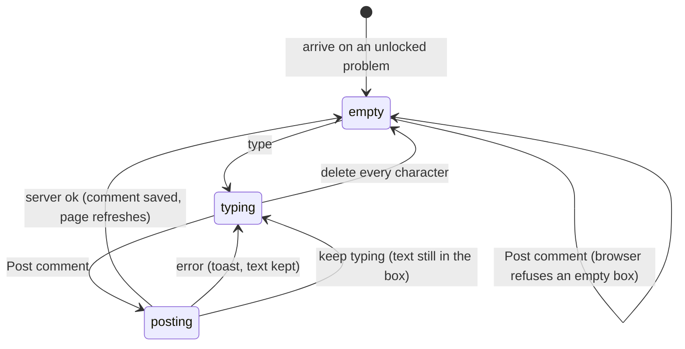

# The discussion

## Summary

The discussion is the comment thread at the bottom of an unlocked problem page, where any member who can read the problem can post a comment for everyone else in the collection to read. It lives under the "Discussion" heading, below the spoilers and (in a collection that requires testsolving) the leaderboard, and above the Archive switch and the Previous and Next links. It has one multi-line comment box with the placeholder "Write a comment...", a "Post comment" button, and the comments posted so far. It is part of the problem page's [unlocked view](../glossary.md#testsolving) only: a problem that is locked or being testsolved shows no discussion at all, and its comments never reach the browser. Every role that can open the problem page (Admin, TeamMember, ViewOnly) can post.

## The simple case

A member opens a problem they can read and scrolls to "Discussion". The comment box is empty; the comments already posted are listed underneath it, each with the poster's name, the date, and the text with any [math](../glossary.md#interface) typeset.

They click into the box, type a comment, and click "Post comment". Nothing on the page changes until the server answers. When it does, the box empties and the page [refreshes](../glossary.md#interaction): the new comment appears in the list, usually at the bottom, along with any comments other people posted since the page was loaded. The user stays on the problem page with the page scrolled where it was.

If the server refuses the comment, a red [toast](../glossary.md#interface) says why, and the text stays in the box so the user can try again.

## The interaction, event by event

### Arrive

The discussion is built on the server with the rest of the problem page, from the comments stored at that moment. The comment box starts empty and does not take focus; arriving on the page puts focus nowhere in particular. There is no draft to restore: Probase never keeps unsent comment text (see [saved](../glossary.md#interaction)).

Each comment shows the commenter's Google name in bold, then the date it was posted in the browser's short date format (for example 9/25/2026 in a US-English browser). Hovering the date shows the full date and time. Below that is the text, with line breaks kept and math rendered. Comments are separated by a thin rule. There is no avatar, no count of comments, no "no comments yet" message when the list is empty, and no edit or delete control on any comment.

The list is in the order the database returns it, which in practice is oldest first.

### Leave untouched

Leaving without typing records nothing. Scrolling past the discussion, following a link, or closing the tab has no effect on any comment and leaves no trace.

### Begin editing

The first keystroke in the box is the only change: the text appears and nothing else on the page reacts. There is no character counter, no live preview of math, and no validation message while typing. "Post comment" was enabled before the first keystroke and stays enabled.

### While editing

The box is an ordinary multi-line text box six lines tall; it can be resized vertically by its corner, and longer text scrolls inside it. Enter starts a new line. No key combination posts the comment: Shift+Enter also starts a new line, and Ctrl/Cmd+Enter does nothing. Tab moves focus to "Post comment", where Enter or Space posts.

The rest of the page stays usable while typing: the user can open spoilers, like the problem, or (if they can edit it) change the title, statement or answer. Those changes refresh the page on success, and the refresh leaves the typed comment in place.

### Submit

Clicking "Post comment", or pressing Enter or Space on it, first runs the browser's own check: an empty box is refused with the browser's "Please fill out this field" bubble and nothing is sent. A box holding only spaces or blank lines passes that check and is sent.

The comment text is then sent to the server. While the request is [pending](../glossary.md#interaction) the text stays in the box and "Post comment" turns pale, shows a spinner and ignores further clicks (see [saving and feedback](../foundations/saving-and-feedback.md)). The box itself stays editable.

The server checks, in this order, that the user is signed in, that the problem still exists, and that the user's role in the collection may comment. It then stores the comment with the user and the current time. On success the problem page refreshes with every comment now stored, and the box empties. The comment is not shown [optimistically](../glossary.md#interaction); it appears only with the refresh.

On failure the user sees one of these toasts, and the box keeps its text:

| Situation                           | Toast                                                   |
| ----------------------------------- | ------------------------------------------------------- |
| The session has ended               | "Not signed in"                                         |
| The problem no longer exists        | "Problem not found"                                     |
| The user's role no longer allows it | "You do not have permission to comment on this problem" |
| Anything unexpected, or the network | "Something went wrong. Please try again."               |

## Modifiers

| Modifier            | At arrival                                                                                                                                                                                                                                                                                                                           | During editing                                                                                                                                                                                                                                                                                                                                                                                                                        |
| ------------------- | ------------------------------------------------------------------------------------------------------------------------------------------------------------------------------------------------------------------------------------------------------------------------------------------------------------------------------------ | ------------------------------------------------------------------------------------------------------------------------------------------------------------------------------------------------------------------------------------------------------------------------------------------------------------------------------------------------------------------------------------------------------------------------------------- |
| Role                | Admin, TeamMember and ViewOnly see the discussion and can post. SubmitOnly members, users with no permission, and signed-out visitors never reach the problem page (see [navigation](../foundations/navigation.md)), so never see it.                                                                                                | A permission removed while the page is open is noticed only on posting: the post fails with "You do not have permission to comment on this problem" and the text is kept. A role changed to any other role, SubmitOnly included, still posts from the open page, because every role may comment; for a SubmitOnly member the refresh after the post then rebuilds the page with the new role and sends them to "You need permission". |
| Authorship          | No effect. Authors and non-authors see the same box and the same comments, and nothing marks a comment as coming from the problem's author.                                                                                                                                                                                          | No effect.                                                                                                                                                                                                                                                                                                                                                                                                                            |
| Testsolver type     | A Serious testsolver sees the discussion only once their attempt is finished; while the problem is locked or being testsolved there is no discussion. A Casual testsolver sees it at once. A member who has not chosen a type is sent to the chooser first. In a collection that does not require testsolving, type does not matter. | No effect on an open page. A type chosen in another tab applies from the next page load.                                                                                                                                                                                                                                                                                                                                              |
| Record state        | Shown only in the unlocked view. Archived problems have a working discussion. Whether the problem has an answer, a solution or a difficulty makes no difference.                                                                                                                                                                     | The problem being archived or edited by someone else has no effect on the box.                                                                                                                                                                                                                                                                                                                                                        |
| Collection settings | No effect. In particular, comments show the commenter's Google name even in a collection that hides authors.                                                                                                                                                                                                                         | No effect.                                                                                                                                                                                                                                                                                                                                                                                                                            |
| Keys                | No effect before typing.                                                                                                                                                                                                                                                                                                             | Enter, Shift+Enter: new line. Ctrl/Cmd+Enter: nothing. Escape: nothing. Tab: moves to "Post comment".                                                                                                                                                                                                                                                                                                                                 |

A change to the user's role or type made elsewhere never changes the page that is already open; it shows up as an error when posting, or as a different page on the next load.

## Cancel and interrupt

| Event                               | Before editing                                            | While editing                                                                                                                                                                                                     |
| ----------------------------------- | --------------------------------------------------------- | ----------------------------------------------------------------------------------------------------------------------------------------------------------------------------------------------------------------- |
| Escape or Discard                   | No effect. There is no Discard button.                    | No effect. Escape does not clear the box; the only way to abandon a comment is to delete the text or leave the page.                                                                                              |
| Browser back or forward             | Leaves the page; nothing recorded.                        | Leaves the page; the typed text is lost without warning. If a post was pending, it still completes on the server, and an error toast, if any, appears on the page the user went to.                               |
| Reload                              | The page is rebuilt with the latest comments.             | The typed text is lost without warning. A pending post may or may not have reached the server; after the reload the list shows whether it did.                                                                    |
| Tab or window closed                | Nothing recorded.                                         | The typed text is lost without warning. A pending post that reached the server is stored.                                                                                                                         |
| A link inside the app followed      | Nothing recorded.                                         | Same as browser back: the text is lost, a pending post completes, and its error toast, if any, follows the user to the next page. Previous and Next count as leaving: the next problem's discussion starts empty. |
| Network lost mid-request            | No effect until the user posts.                           | The post fails with "Something went wrong. Please try again." and the text is kept. Whether the comment was stored depends on whether the request reached the server before the connection failed.                |
| Request fails or returns an error   | No effect.                                                | A toast with the reason; the text is kept; nothing is added to the list.                                                                                                                                          |
| Session ends                        | No effect on the open page.                               | The post fails with "Not signed in" and the text is kept. Reloading to recover sends the user to the login page and loses the text.                                                                               |
| Access changes                      | No effect on the open page.                               | If the user's permission was removed, the post fails with the permission toast; any remaining role still posts. A new testsolver type has no effect until the next page load.                                     |
| Same record changed in another tab  | Not shown until this page refreshes.                      | Comments posted from another tab appear here only when this page refreshes, for example when this tab posts.                                                                                                      |
| Same record changed by another user | Not shown until this page refreshes.                      | Same as another tab. Two people posting at once both succeed; each sees the other's comment after their own post only if it was stored first.                                                                     |
| Autofill writes into the field      | No effect.                                                | No effect. The comment box is a multi-line box, which browsers do not fill from saved form entries.                                                                                                               |
| The window loses focus              | No effect.                                                | No effect. The comment box does not save or post on blur; the text waits in the box.                                                                                                                              |
| The testsolve time limit passes     | Not applicable: the discussion is only on unlocked pages. | Not applicable. A Serious testsolver whose own time runs out sees the page refresh into the unlocked view, and the discussion appears then (see [the timed attempt](../testsolving/timed-attempt.md)).            |

After any interrupt the user is wherever the interrupt took them; the discussion keeps no draft, and a comment that reached the server stays posted whether or not the user saw it succeed.

## Interactions with other systems

**Permissions.** Posting is allowed for every role Probase has, including SubmitOnly; in practice only Admin, TeamMember and ViewOnly can post, because only they can open the problem page. The server checks the role again on every post, so a permission removed while the page is open is enforced. See [accounts and roles](../foundations/accounts-and-roles.md).

**Testsolving locks.** A problem's comments are part of what a Serious testsolver may not see before testsolving. In the locked and testsolving views the discussion is left out of the page entirely, not hidden in the browser. See [the problem page](problem-page.md).

**Per-collection settings.** No setting changes the discussion. The collection's "show authors" setting hides who wrote the problem but not who commented, so an author who comments on their own problem reveals themselves.

**Validation and errors.** The only check before sending is the browser's refusal of an empty box. The server accepts any text, including text that is only whitespace, and has no length limit. Errors arrive as [toasts](../glossary.md#interface) that disappear after 8 seconds.

**Unsaved changes.** Typed text lives only in the page. Probase never warns before leaving and never restores a draft.

**Optimistic updates.** None. The box keeps its text and the list is unchanged until the server answers.

**Freshness and other users.** The list is as fresh as the last time the page loaded or refreshed. Nothing is pushed live; a comment posted by someone else appears after the next reload, navigation back to the page, or successful action on the page. See [freshness](../cross-cutting/freshness.md).

**URL state.** None. Posting does not change the URL, and the problem page's search and filter parameters (carried for the back link) are unaffected.

**Math rendering.** Comment text is rendered like a statement: math between the usual delimiters is typeset, and line breaks and spacing are kept. Malformed math shows in red rather than breaking the page. See [math rendering](../cross-cutting/math-rendering.md).

**Offline.** Posting while offline fails with the generic toast and keeps the text. Nothing is queued.

**Keyboard and accessibility.** The comment box has a label, "Your comment", that only screen readers announce. The discussion can be used entirely from the keyboard: Tab into the box, type, Tab to "Post comment", Enter. There is no keyboard shortcut for posting. Toasts are announced as alerts.

**Narrow screens.** The box and the list take the full width of the problem column; nothing is hidden on a narrow window.

**Side effects.** None. No one is notified of a new comment, by email or otherwise.

## Edge cases

- "Post comment" ignores clicks while a post is pending, so a double click posts once.
- Text typed after clicking "Post comment" and before the server answers is erased when the post succeeds, because success clears the whole box, including the added text, which was never sent.
- A comment of only spaces or blank lines is accepted and appears as a name and date with nothing under them.
- Very long comments are accepted in full; the list shows them in full, with no "show more".
- The date shown is the posting date in the viewer's own time zone, so a comment posted late in the evening can show a different date to viewers elsewhere.
- A comment containing a lone `$` or other unbalanced math delimiter shows the rest of the text as it was typed, delimiter included.
- The commenter's name is their Google name when the comment was loaded, not the author name they write under in the collection. A user with no Google name shows a blank name.
- Nothing in the discussion links to a user, and there is no way to reply to a particular comment.

## Open questions and verification

- A first local pass (with the server's answer delayed by 2.5 seconds) confirmed that "Post comment" is disabled with a spinner while pending and that a second click sends nothing.
- Clearing the box on success, including text typed while the post was pending, was read from code, not tried. It may be worth treating as a bug.
- The order of comments is whatever the database returns; nothing sorts them. In practice this is oldest first, but it is not guaranteed.
- The date is formatted once when the page is built on the server and again in the browser. Where the server's and the browser's time zone or language differ, the two can disagree; what the user ends up seeing (and whether the development build reports a hydration error) was not confirmed.
- Whether showing commenters' names in a collection that hides authors is intended is a product question.
- Whether a whitespace-only comment should be refused is a product question; the server has no rule against it.

Verified against Probase commit `c38ff56`
