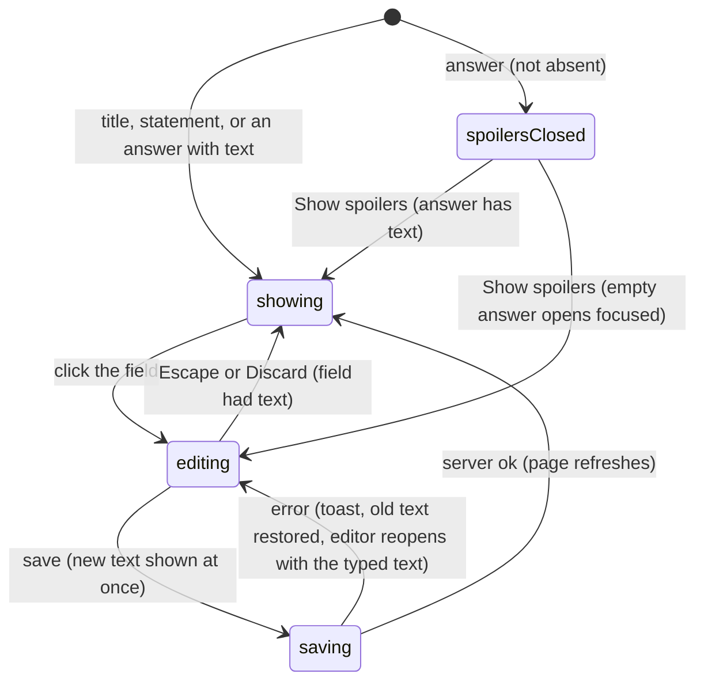

# Editing the problem

## Summary

A user who [can edit](../glossary.md#people-and-access) a problem (an Admin, or a TeamMember whose author is one of the problem's authors) can change its title, statement and answer in place on the [problem page](problem-page.md), without a separate form. Each of the three is a [click-to-edit](../foundations/click-to-edit.md) field: the title and the answer are single-line, the statement is multi-line with "Save changes" and "Discard". A save changes that one field and nothing else, shows the new text at once, and is sent to the server as an [action](../glossary.md#interaction) that rolls back if the server refuses it. Everyone else sees the same three things as read-only text. The subject, the difficulty and the [problem ID](../glossary.md#records) cannot be changed anywhere in the interface. This document owns who gets the three editors and what saving each one does; [click-to-edit](../foundations/click-to-edit.md) owns how the editor itself behaves, and the [Archive switch](archiving.md), which saves through the same action, has its own document.

## The simple case

An author opens their problem. Nothing marks the title as editable, but clicking it turns it into a text box holding the title as typed. They fix a typo and press Enter: the box turns back into the title with the change, and in the background the new title is stored and the page refreshes.

They click the statement. It becomes a larger box holding the statement's source, math delimiters and all, with "Save changes" and "Discard" under it. They rewrite a sentence and click "Save changes"; the statement is shown again, typeset, with the new text.

To change the answer they first click "Show spoilers". The answer, under its "ANSWER" label, works like the title: click, edit, Enter. If the problem was submitted without an answer, opening the spoilers shows an empty box already open and focused, ready for the answer to be typed.

If a save is refused, a red [toast](../glossary.md#interface) says why, the field shows its old text again, and the editor reopens holding what the user typed so they can try again.

## The interaction, event by event

### Arrive

Whether the user can edit the problem is decided on the server when the page is built ([accounts and roles](../foundations/accounts-and-roles.md#authorship)). For a user who can, the three fields arrive as click-to-edit fields holding the text stored at that moment:

- **Title**, after "{problem ID}." at the top of the page, shown with [math](../glossary.md#interface) typeset.
- **Statement**, at the top of the [unlocked view](../glossary.md#testsolving), shown with math typeset and line breaks kept. A user who can edit a problem never gets its locked or testsolving view, so the statement is always there for them.
- **Answer**, inside the [spoilers](spoilers.md), under "ANSWER". It is part of the page only when the answer is not absent ([the answer's three states](../foundations/data-model.md#the-answers-three-states)), and on screen only once "Show spoilers" has been clicked. An answer with text is shown with math typeset. An [empty answer](../glossary.md#records) has nothing to show, so it arrives as an open, empty box with no placeholder, which takes focus the moment the spoilers are opened.

Nothing marks any of them as editable: no pencil, underline or hover change. They look as they do to readers, with one difference. Readers see the title as typed, with any math source (`$x^2$`) visible, while users who can edit it see the same title with the math typeset.

For every other user the three are plain text: the title as typed, the statement typeset, and the answer, behind the spoilers, as read-only text ([spoilers](spoilers.md)).

Nothing is focused on arrival.

### Leave untouched

Viewing the fields records nothing. Opening the spoilers on a problem with an empty answer opens the empty box, but leaving it empty records nothing either: an empty box is never saved, and it stays open until something is typed.

### Begin editing

Clicking a field opens its editor ([click-to-edit](../foundations/click-to-edit.md#begin-editing)):

- **Title.** Clicking the title's text, or the empty space to its right as far as the heart, opens a one-line box holding the title as typed, in the title's large bold type, with the cursor at the end. The problem ID beside it is not part of the field.
- **Statement.** Clicking anywhere on the statement opens a box holding its source, grown to fit, with "Save changes" and "Discard" under it. Everything below moves down to make room.
- **Answer.** Once the spoilers are open, clicking the answer or its "ANSWER" label opens a one-line box holding the answer's source. An empty answer is already open.

The first keystroke changes only the box. Nothing is checked while typing.

### While editing

The keys are those of [click-to-edit](../foundations/click-to-edit.md#while-editing). In the title and answer boxes, Enter saves, Escape abandons, and leaving the box (Tab, a click elsewhere, switching windows) saves. In the statement box, Enter starts a new line, Shift/Ctrl/Cmd+Enter or "Save changes" saves, Escape or "Discard" abandons, and leaving the box leaves it open with its text. None of the three saves an empty box, so the title and statement can never be emptied, and an answer, once it has text, can be changed but never removed.

Clicking the title while the answer box is open, or the reverse, takes focus from the open box and saves it, so the two are open together only when one is empty (an empty answer's box stays open while the title is edited). The statement editor stays open while either of them is edited, and alongside the [solution](solutions.md) editor. The rest of the page stays usable. Any successful action on it (a like, a comment, another field's save) refreshes the page, and the refresh leaves open editors and their typed text in place.

### Submit

A save closes the editor and shows the new text at once, rendered, before the server answers. It then sends the problem and that one field: saving the title sends only the title, so a save never touches the other two fields, the archived state or anything else. Nothing shows that the request is [pending](../glossary.md#interaction), and saving again meanwhile sends another request. A save is sent even when the text has not changed.

The server checks, in this order, that the problem still exists, that the user is signed in, and that they can edit the problem: an Admin, or a TeamMember or SubmitOnly member whose author is one of the problem's authors. It then stores the text exactly as typed, spaces included, and the page refreshes. The field keeps showing the text the user saved.

On failure the old text is restored underneath, the editor reopens holding the user's text, focused, and one of these toasts appears ([saving and feedback](../foundations/saving-and-feedback.md#optimistic-updates-and-rollback)):

| Situation                               | Toast                                                                                    |
| --------------------------------------- | ---------------------------------------------------------------------------------------- |
| The session has ended                   | "Not signed in"                                                                          |
| The problem no longer exists            | "No problem with id {n}", where _n_ is the problem's internal number, not its problem ID |
| The user can no longer edit the problem | "You do not have permission to edit this problem"                                        |
| Anything unexpected, or the network     | "Something went wrong. Please try again."                                                |

What a saved change reaches, the next time each place is loaded or refreshed:

- **Title**: the problem page's heading, the problem's [card](../glossary.md#interface) on the collection page, the locked view, and what the collection page's search matches.
- **Statement**: the unlocked and testsolving views, the problem's cards on the collection page and the [test page](../collection/tests.md), and search.
- **Answer**: the spoilers, and what a [timed attempt](../testsolving/timed-attempt.md) is judged against. An attempt in progress is judged against the new answer from its next submission on; answers already judged are not judged again, and an attempt already solved stays solved.

## Modifiers

| Modifier            | At arrival                                                                                                                                                                                                                                                                                                           | During editing                                                                                                                                                                                                                                                                                                                                     |
| ------------------- | -------------------------------------------------------------------------------------------------------------------------------------------------------------------------------------------------------------------------------------------------------------------------------------------------------------------- | -------------------------------------------------------------------------------------------------------------------------------------------------------------------------------------------------------------------------------------------------------------------------------------------------------------------------------------------------- |
| Role                | Admin: all three editors on every problem. TeamMember: editors on problems they wrote, plain text elsewhere. ViewOnly: plain text always, even on a problem whose authors include theirs. SubmitOnly members may edit what they wrote but cannot open the problem page. No permission and signed out never reach it. | Checked again on every save: a user who has lost the right gets "You do not have permission to edit this problem" and the editor reopens with their text. The page changes only when it next refreshes; the fields are then rebuilt as editors or plain text for the new role, and an open editor that turns into plain text loses its typed text. |
| Authorship          | Decides a TeamMember's editors: their author must be one of the problem's authors. Having an author in the collection is not enough, and a problem whose authors belong to no user ("Default Author" in the demo data) can be edited only by Admins.                                                                 | As role: authorship removed in the database shows as the permission toast on the next save.                                                                                                                                                                                                                                                        |
| Testsolver type     | No effect: a user who can edit a problem always gets its unlocked view with the editors, whatever their type. (A member who has not chosen a type in a collection that requires testsolving is sent to the chooser first, as on every page.)                                                                         | No effect.                                                                                                                                                                                                                                                                                                                                         |
| Record state        | Answer absent: no answer editor and no answer. Answer empty: an open, empty box when the spoilers are opened. Answer with text: a click-to-edit answer. Archived problems are edited as usual. Whether there is a solution or a difficulty makes no difference.                                                      | Another tab's or user's change to the problem does not reach the open fields, even when the page refreshes.                                                                                                                                                                                                                                        |
| Collection settings | The answer format makes no difference: the answer editor is a plain text box that accepts any text, even in an Integer or AIME collection whose add-problem form accepts only numbers. Showing authors and requiring testsolving do not affect the editors. No code-level configuration applies.                     | No effect.                                                                                                                                                                                                                                                                                                                                         |
| Keys                | None: a field that is showing cannot be reached with Tab. The empty answer's box, once the spoilers are open, is the exception.                                                                                                                                                                                      | Title and answer: Enter saves, Escape abandons, Tab saves and moves on. Statement: Enter starts a new line, Shift/Ctrl/Cmd+Enter saves, Escape abandons, Tab moves to "Save changes" without saving.                                                                                                                                               |

## Cancel and interrupt

| Event                               | Before editing                                                                                           | While editing                                                                                                                                                                                                                                                                                                                                           |
| ----------------------------------- | -------------------------------------------------------------------------------------------------------- | ------------------------------------------------------------------------------------------------------------------------------------------------------------------------------------------------------------------------------------------------------------------------------------------------------------------------------------------------------- |
| Escape or Discard                   | No effect. The empty answer's box ignores Escape too: with nothing saved there is nothing to go back to. | Title and answer: Escape shows the saved text again. Statement: Escape or "Discard" does the same. An empty answer's box stays open with what was typed.                                                                                                                                                                                                |
| Browser back or forward             | Leaves; nothing recorded.                                                                                | Leaves; the typed text is lost, unless a title or answer box saved on blur as the page lost focus. A save already sent completes, and its error toast, if any, appears on the page the user went to.                                                                                                                                                    |
| Reload                              | The page is rebuilt with the stored text.                                                                | The typed text is lost without warning. A save already sent may or may not have been stored; the reloaded page shows which.                                                                                                                                                                                                                             |
| Tab or window closed                | Nothing recorded.                                                                                        | The typed text is lost without warning. A save that reached the server is stored.                                                                                                                                                                                                                                                                       |
| A link inside the app followed      | Nothing recorded.                                                                                        | Clicking the link takes focus from the box first, so an open title or answer is saved and its request completes after the page has changed; if it fails, the toast appears on the new page and the typed text is gone. An open statement is not saved and its text is lost. Previous and Next open the neighboring problem with its own fields, closed. |
| Network lost mid-request            | No effect until a save is sent.                                                                          | "Something went wrong. Please try again."; the old text is restored underneath and the editor reopens with the typed text. The change may still have been stored if the request arrived.                                                                                                                                                                |
| Request fails or returns an error   | No effect.                                                                                               | A toast from the table under [Submit](#submit); the old text is restored underneath and the editor reopens with the typed text.                                                                                                                                                                                                                         |
| Session ends                        | No effect on the open page; the fields stay editable.                                                    | "Not signed in"; the editor reopens with the typed text. Reloading to recover goes to the login page and loses it.                                                                                                                                                                                                                                      |
| Access changes                      | No effect until the page refreshes; the fields then become plain text, or editors, for the new access.   | "You do not have permission to edit this problem" on every save; the editor reopens with the typed text.                                                                                                                                                                                                                                                |
| Same record changed in another tab  | The fields keep showing their own text, even after a refresh.                                            | A save overwrites the other tab's change to the same field without warning. Changes to the other fields are untouched, because a save sends only its own field.                                                                                                                                                                                         |
| Same record changed by another user | As another tab.                                                                                          | As another tab: the last save wins, and neither user is told.                                                                                                                                                                                                                                                                                           |
| Autofill writes into the field      | No effect.                                                                                               | The title and answer boxes may offer text the browser remembers for fields named "title" and "answer", including entries typed on the add-problem form; picking one is the same as typing it. The statement box is not filled.                                                                                                                          |
| The window loses focus              | No effect.                                                                                               | An open title or answer saves, if not empty, so switching windows mid-word saves the half-typed text. An open statement stays open with its text.                                                                                                                                                                                                       |
| The testsolve time limit passes     | Not applicable: a user who can edit a problem never testsolves it.                                       | Not applicable. Another user's running attempt is unaffected, except that a changed answer is what their next submission is judged against.                                                                                                                                                                                                             |

After an interrupt that reopens the editor, the user is still in it with their text; after one that leaves the page, nothing unsaved survives.

## Interactions with other systems

**Permissions.** Who gets the editors is decided on the server each time the page is built or refreshed, from the role and authorship, and checked again on every save. There is no way in the interface to let another member edit a problem; that takes an Admin role or a change to the problem's authors in the database. See [accounts and roles](../foundations/accounts-and-roles.md).

**Testsolving locks.** Users who can edit a problem are never locked out of it, so the editors never meet a lock. Their saves reach users who are testsolving: the title shows on the locked view and on locked cards, the statement in the testsolving view on its next load or refresh, and the answer is what the next submission of a running attempt is judged against.

**Per-collection settings.** Only the answer format could matter, and the editor ignores it. An answer that the timed attempt's box cannot type (math, letters, spaces, decimals, leading zeros) can never be matched; see [the timed attempt](../testsolving/timed-attempt.md) and [per-collection settings](../cross-cutting/per-collection-settings.md).

**Validation and errors.** The editor never sends an empty box and says nothing about refusing it. The server checks its input before anything else: it refuses an empty title or statement ("Invalid input (data.title): Too small: expected string to have >=1 characters", which the page cannot trigger) and accepts an empty answer (which the page never sends). Everything else is accepted as typed: text of only spaces, leading and trailing spaces, malformed math, any length. Errors arrive as [toasts](../foundations/saving-and-feedback.md#toasts).

**Unsaved changes.** Typed text lives only in the open editor. The statement editor keeps it through clicks elsewhere, but nothing survives a reload, a link or closing the tab, and nothing warns before it is lost.

**Optimistic updates.** Every save is optimistic: the new text is shown at once and put back if the server refuses, with the editor reopened holding the typed text ([click-to-edit](../foundations/click-to-edit.md#submit)).

**Freshness and other users.** A field shows the text it was given when the page was opened, or the text last saved in it, and does not change when the page refreshes, so another tab's or another user's edit appears only after a reload or opening the problem again. The answer has one more way in: closing and reopening the spoilers rebuilds the answer field from the page's latest refresh. A save does not check whether the field changed since the page loaded; the last save wins. A successful save clears the browser's cache of other pages, so the collection page shows the new title when the user goes back. See [freshness](../cross-cutting/freshness.md).

**URL state.** None. The problem ID and the address never change, whatever is edited. The back link keeps the collection page's search, so a problem whose title or statement no longer matches that search is missing from the list the user returns to.

**Math rendering.** The statement and the answer are typeset for everyone when not being edited, and shown as source in the editor. The title is typeset only for users who can edit it; everyone else, and every collection-page card, shows its source. Malformed math is saved and then shows in red. See [math rendering](../cross-cutting/math-rendering.md).

**Offline.** A save fails with "Something went wrong. Please try again." and the editor reopens with the typed text. Nothing is queued.

**Keyboard and accessibility.** A field that is showing is not focusable and has no role, so a keyboard user cannot open any of the three editors; the empty answer's box, already open, is the only one Tab reaches. Once open, each is an ordinary text box with no label a screen reader would announce ("ANSWER" is plain text above the box, not its label). See [keyboard and accessibility](../cross-cutting/keyboard-and-accessibility.md).

**Narrow screens.** The boxes take the column's width. The title box shares its row with the problem ID on the left and the heart and lightbulbs on the right, so on a phone it is narrow. Text is smaller. See [narrow screens](../cross-cutting/narrow-screens.md).

**Side effects.** None beyond the stored text. No one is notified, and no history is kept: the previous title, statement or answer is overwritten and cannot be recovered through the interface.

## Edge cases

- Clicking the title or the answer and then clicking elsewhere saves the unchanged text and refreshes the page. Clicking the statement by accident leaves its editor open, showing the source, until "Discard" or Escape.
- Selecting text in a field to copy it opens the editor instead ([click-to-edit](../foundations/click-to-edit.md#begin-editing)). Readers who cannot edit can select text normally.
- Enter in the title or answer box sends one save and Escape sends none, in Chromium; other browsers are an open question in [click-to-edit](../foundations/click-to-edit.md#open-questions-and-verification).
- Clicking "Hide spoilers" while the answer box is open saves the typed answer, because pressing the button takes focus from the box ([spoilers](spoilers.md#submit)). If that save fails, the toast appears but the editor is gone, and the typed answer is lost.
- Closing and reopening the spoilers while an answer save is still pending shows the old answer, and it stays old after the save succeeds, until the spoilers are closed and opened once more ([spoilers](spoilers.md#edge-cases)).
- A title pasted with line breaks becomes one line; the single-line box drops them.
- A title of only spaces is accepted; the heading then shows the problem ID with nothing after it.
- An answer with a trailing space, math delimiters, letters or leading zeros saves normally but can never be matched in a timed attempt.
- An absent answer cannot be given from the page, and an answer with text cannot be removed. A wrong subject or difficulty cannot be corrected at all; the problem ID, which carries the subject's letter, stays as it is.
- Two saves of the same field in quick succession, the first failing and the second succeeding, reopen the editor holding the first text, with the text from before both underneath, although the second text was stored. A reload shows the stored text.
- Two users or tabs editing different fields of the same problem do not interfere, because each save sends only its own field. Editing the same field, the last save wins.

## Open questions and verification

- Readers see the title's math source while its editors see it typeset, and collection-page cards show the source to everyone. This was read from code (the read-only title and the card title are not passed through the math renderer). It looks like a bug, or at least an inconsistency worth deciding on.
- The answer editor ignores the collection's answer format, so an editor can store an answer that no timed attempt can match, even in an Integer or AIME collection. This may be worth treating as a bug.
- A first local pass in headless Chromium found that Enter in the title box sends one save and Escape none; other browsers are the open question in [click-to-edit](../foundations/click-to-edit.md#open-questions-and-verification).
- A first local pass confirmed that the title keeps its own text through a refresh (a title changed from another browser appeared only after a reload). That closing and reopening the spoilers resets the answer field to the latest refreshed answer was read from code; confirm with two tabs.
- That a failed save loses the typed text when the editor is no longer on screen (spoilers closed, page left) was read from code.
- That a refresh after a role change turns the editors into plain text, dropping an open editor's text, was read from code.
- "No problem with id {n}" is phrased for developers and names an internal number the user never sees elsewhere.
- The lack of any keyboard way to open the editors, and of labels on the boxes, was read from the markup; confirm with a keyboard and a screen reader.
- There is no edit history and no undo. Whether one is wanted is a product question.

Verified against Probase commit `c38ff56`
