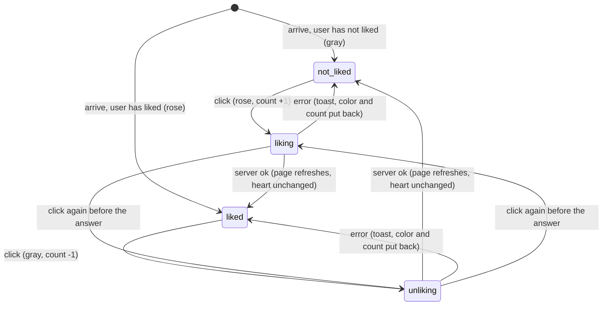

# The heart

## Summary

The heart is how a member likes a problem: a heart icon followed by the number of likes, the icon rose-colored when the user has liked the problem and gray when they have not. It appears on every problem [card](../glossary.md#interface) on the [collection page](../collection/problem-list.md) and at the top right of the [problem page](problem-page.md), in all three [views](../glossary.md#testsolving). One click likes or unlikes: the color and the count change at once, the change is sent to the server, and both are put back if the server refuses. Every member who [can view](../glossary.md#people-and-access) the collection can like any problem in it, including a problem that is locked for them. A user can like a problem at most once, and submitting a problem likes it on the submitter's behalf ([data model](../foundations/data-model.md#like)). The count is shown to everyone; who liked is never shown.

## The simple case

A member on the collection page sees a gray heart and "4" at the right of a card's title. They click the heart. It turns rose and the count becomes 5 immediately; the card does not open. Nothing says that anything was sent. A moment later the page quietly [refreshes](../glossary.md#interaction) from the server, and the heart stays as the click left it. Clicking again turns it gray, shows 4, and sends an unlike.

If the server refuses (for example because the user's access was removed), a red [toast](../glossary.md#interface) says why and the heart goes back to what it showed before the click.

## The interaction, event by event

### Arrive

The heart is built with its page or card from the likes stored at that moment. The count is the number of users who have liked the problem; the icon is rose if the signed-in user is one of them and gray otherwise. The icon is the same filled heart in both states; only its color changes. The count is bold and gray in both states. A problem nobody has liked shows a gray heart and "0". A problem submitted through the form starts at 1, liked by its submitter, so the submitter lands on their new problem with a rose heart.

Where it sits:

- **On a card**, on a window 640 px wide or wider: at the right end of the title line, to the right of the [lightbulbs](../glossary.md#interface). On a narrower window: in a row under the statement, at the left, with the lightbulbs at the right.
- **On the problem page**: at the right of the title and chips, above the lightbulbs, in the locked, testsolving and unlocked views alike.

The icon grows with the window (at 640 px and again at 768 px), and the count at 768 px. Hovering darkens the icon and the count by a shade. On a card the pointer is a hand, because the whole card is a link; on the problem page it stays an arrow. There is no tooltip and no list of who liked.

### Leave untouched

Viewing a page or a card likes nothing, and hovering over the heart records nothing.

### Begin editing

The click is the change. A click anywhere on the heart (the icon, the count, or the small gap between them) flips it at once: gray to rose with the count up by one, or rose to gray with the count down by one. The like or unlike is then sent. The heart does not wait for the server, and nothing else on the page changes.

On a card, the click stays with the heart: the card's link is not followed and the problem page does not open. A click anywhere else on the card, the lightbulbs included, opens the problem.

### While editing

While the request is [pending](../glossary.md#interaction) nothing marks the heart as busy: there is no spinner, no dimming, and it stays clickable. The rest of the page stays usable.

A second click before the answer arrives flips the heart back and queues a second request, the opposite of the first. The page sends its requests one at a time, each after the previous one has been answered, so a double click sends a like and then an unlike, and the server ends with the problem not liked, as the heart shows. Each request remembers what the heart showed just before its own click, which matters only if requests fail (see [edge cases](#edge-cases)).

### Submit

The server checks, in this order, that the problem still exists, that the user is signed in, and that the user can view the problem's collection. It then records or removes the user's like. Liking a problem the user already likes and unliking one they do not like both succeed and change nothing, so a heart that is out of date never produces an error.

On success the page the user is on refreshes and the browser's cache of other pages is cleared ([saving and feedback](../foundations/saving-and-feedback.md)). On the problem page that rebuilds the problem page; on the collection page it rebuilds the whole list, with the current search, filters and page. The heart itself is not updated by the refresh: it keeps the color and count it already shows, even if other users' likes arrived meanwhile.

On failure the heart goes back to the color and count it had before the click, and a toast says why:

| Situation                                  | Toast                                             |
| ------------------------------------------ | ------------------------------------------------- |
| The problem no longer exists               | "No problem with id {n}", with an internal number |
| The session has ended                      | "Not signed in"                                   |
| The user can no longer view the collection | "You do not have permission to like this problem" |
| Anything unexpected, or the network        | "Something went wrong. Please try again."         |

The {n} in the first message is the problem's internal database number, not its [problem ID](../glossary.md#records): a user liking `A3` can see "No problem with id 57".

> Technical note: the like action marks only the problem page's address as stale, but the framework rebuilds whichever page sent the action whenever any address is marked stale, so a like on a card refreshes the collection page.

## Modifiers

| Modifier            | At arrival                                                                                                                                                                                                                                                                                              | During editing                                                                                                                                                                                                                                          |
| ------------------- | ------------------------------------------------------------------------------------------------------------------------------------------------------------------------------------------------------------------------------------------------------------------------------------------------------- | ------------------------------------------------------------------------------------------------------------------------------------------------------------------------------------------------------------------------------------------------------- |
| Role                | Admin, TeamMember and ViewOnly see the heart and can use it. SubmitOnly members, users with no permission and signed-out visitors never reach a page with a heart (see [navigation](../foundations/navigation.md#what-each-page-checks-in-order)).                                                      | A permission removed, or changed to SubmitOnly, while the page is open is noticed on the next click: "You do not have permission to like this problem", and the heart is put back. A change between Admin, TeamMember and ViewOnly makes no difference. |
| Authorship          | No effect. Authors like and unlike their own problems like anyone else's; a submitter starts out liking their problem and can unlike it.                                                                                                                                                                | No effect.                                                                                                                                                                                                                                              |
| Testsolver type     | No effect. A Serious testsolver sees the heart and count on a locked card and in the locked and testsolving views, and can like a problem they have not read. A member who has not chosen a type is sent to the chooser before seeing any heart.                                                        | No effect. Liking starts no attempt and unlocks nothing.                                                                                                                                                                                                |
| Record state        | Archived, locked, testsolving and unlocked problems all have a working heart. The difficulty decides only whether lightbulbs sit beside it; without them, a card's heart is alone at the right of the title line.                                                                                       | A problem deleted in the database while the page is open fails with "No problem with id {n}". A problem archived or edited by someone else likes normally.                                                                                              |
| Collection settings | No effect. Likes are anonymous in every collection, whether or not it shows authors.                                                                                                                                                                                                                    | No effect.                                                                                                                                                                                                                                              |
| Keys                | The heart cannot be reached with Tab or pressed with Enter or Space. On a card, Tab stops on the whole card, where Enter opens the problem. Ctrl/Cmd+click or Shift+click on a card's heart likes rather than opening a tab or window; a middle click opens the problem in a new tab and likes nothing. | No effect.                                                                                                                                                                                                                                              |

## Cancel and interrupt

"Before editing" is the heart at rest; "while editing" is the time a like or unlike is pending.

| Event                               | Before editing                                                                                              | While editing                                                                                                                                                                                                               |
| ----------------------------------- | ----------------------------------------------------------------------------------------------------------- | --------------------------------------------------------------------------------------------------------------------------------------------------------------------------------------------------------------------------- |
| Escape or Discard                   | No effect. There is no Discard.                                                                             | No effect. A sent like cannot be cancelled; clicking the heart again sends the opposite.                                                                                                                                    |
| Browser back or forward             | Leaves; nothing recorded.                                                                                   | Leaves. The request still completes on the server, and an error toast, if any, appears on the page the user went to.                                                                                                        |
| Reload                              | The heart is rebuilt with the current count and the user's current like.                                    | The request may or may not have reached the server; the reloaded heart shows which.                                                                                                                                         |
| Tab or window closed                | Nothing recorded.                                                                                           | A request that reached the server is stored.                                                                                                                                                                                |
| A link inside the app followed      | Nothing recorded. A card clicked anywhere but its heart opens the problem page, whose heart is built anew.  | As browser back. A card clicked right after its heart, before the answer, may open a copy of the problem page prefetched before the like, whose heart does not show it.                                                     |
| Network lost mid-request            | No effect until the next click.                                                                             | "Something went wrong. Please try again." and the heart is put back. If the request reached the server before the connection failed, the change was stored anyway, and the heart shows the opposite until it is next built. |
| Request fails or returns an error   | No effect.                                                                                                  | A toast with the reason; the heart is put back.                                                                                                                                                                             |
| Session ends                        | No effect on the open page.                                                                                 | "Not signed in", and the heart is put back. Reloading to recover leads to the login page.                                                                                                                                   |
| Access changes                      | No effect on the open page.                                                                                 | A removed permission or a change to SubmitOnly: the permission toast, and the heart is put back. Any other role, or a new testsolver type: the like succeeds.                                                               |
| Same record changed in another tab  | Not shown: this heart keeps its color and count, even when this page refreshes.                             | The click sends the opposite of what this heart shows. If the other tab changed the like, the server already holds that, so nothing changes there and this heart ends agreeing with it.                                     |
| Same record changed by another user | Not shown: the count ignores other users' likes until the heart is next built.                              | The click moves the stale count by one; the server's count may differ from what the heart shows.                                                                                                                            |
| Autofill writes into the field      | Not applicable: the heart has no field.                                                                     | Not applicable: the heart has no field.                                                                                                                                                                                     |
| The window loses focus              | No effect.                                                                                                  | No effect; the request completes.                                                                                                                                                                                           |
| The testsolve time limit passes     | No effect. When the testsolving view refreshes into the unlocked view, the heart keeps its color and count. | No effect on the like. Its refresh may itself be what turns an expired attempt into the unlocked view (see [the problem page](problem-page.md#while-editing)).                                                              |

After any interrupt, a like that reached the server stays recorded whether or not the user saw it succeed, and the next heart built for that problem shows it.

## Interactions with other systems

**Permissions.** Every role that can view the collection (Admin, TeamMember, ViewOnly) may like, and the server checks the role again on every click. Authorship does not matter. See [accounts and roles](../foundations/accounts-and-roles.md).

**Testsolving locks.** The heart and its count are among the few things a locked problem shows ([the locked problem](../testsolving/locked-problem.md)). A Serious testsolver can see how many people liked a problem, and like it, before reading it. Liking neither starts nor affects an attempt.

**Per-collection settings.** None. No collection setting or code-level configuration changes the heart.

**Validation and errors.** Nothing the user does can fail validation. The possible toasts are listed under [Submit](#submit); "No problem with id {n}" is phrased for developers and names an internal number the user has never seen. Toasts disappear after 8 seconds.

**Unsaved changes.** None. A like is sent the moment the heart is clicked.

**Optimistic updates.** The heart is one of Probase's three optimistic controls. It changes before the server answers and is put back on any error, including a lost connection ([saving and feedback](../foundations/saving-and-feedback.md#optimistic-updates-and-rollback)).

**Freshness and other users.** The heart shows what it was built with, plus the user's own clicks. A refresh does not update it. It is built anew only when its page is loaded or reloaded, when the user navigates to the problem page, or, on the collection page, when a card enters the list (on arrival, or when the search, filters or page number bring it in). The card's heart and the problem page's heart are separate: liking on one changes the other only when the other is next built. A successful like clears the browser's cache of other pages, so the collection page reached by the problem page's back link is fetched fresh and its card shows the like. See [freshness](../cross-cutting/freshness.md).

**URL state.** None. Liking does not change the URL; on the collection page the refresh keeps the search, filters and page.

**Math rendering.** Not involved.

**Offline.** A click while offline flips the heart, then shows the generic toast and flips it back. Nothing is queued or retried.

**Keyboard and accessibility.** The heart is a clickable box, not a button: it cannot be reached with Tab, cannot be pressed with Enter or Space, has no label, and is not announced as a control. The icon is hidden from screen readers, so only the bare count is read; on a card it is read as part of the card's link text. Keyboard and screen-reader users cannot like a problem. See [keyboard and accessibility](../cross-cutting/keyboard-and-accessibility.md).

**Narrow screens.** Below 640 px, a card's heart moves from the title line to a row under the statement. The two positions are two separate hearts, each keeping its own state (see [edge cases](#edge-cases)). On the problem page the heart stays at the right of the title at every width. See [narrow screens](../cross-cutting/narrow-screens.md).

**Side effects.** Nobody is notified of a like. A successful like refreshes the page the user is on. On the problem page, that refresh re-decides the view. On the collection page, it rebuilds the list from every problem in the collection, so problems added by others since the page loaded appear at the top and can push the last cards onto the next page.

## Edge cases

- Every problem added through the form starts with its submitter's like, so its count is at least 1 until the submitter unlikes it.
- A double click likes and then unlikes, ending not liked; a triple click ends liked. Each click is a separate request.
- If both requests of a double click fail, the heart does not return to where it started. The first failure puts back the state from before the first click; the second then puts back the state from before the second click, so the heart ends flipped, with the count one off (a heart that started gray ends rose and one higher), although the server never changed. The next time the heart is built it is correct again.
- Each card holds two hearts, one for windows 640 px and wider and one for narrower windows, and shows one at a time. They keep separate state: after liking on a wide window, narrowing it below 640 px shows the other heart with the old color and count. Clicking that one sends whatever its own state implies, so it can send a second like (harmless) where the user meant to unlike.
- Ctrl/Cmd+click or Shift+click on a card's heart likes the problem instead of opening it in a new tab or window. A middle click on the heart opens the problem in a new tab without liking it. Right-clicking shows the card link's menu.
- The count counts users, not clicks: liking from two tabs still counts once.
- A heart that is stale by several likes stays stale by the same amount after a click; the click only moves the number it shows by one.
- Double-clicking the heart on the problem page can also select the count's digits, as double-clicking any text does.
- The [test page](../collection/tests.md)'s cards have no heart.

## Open questions and verification

- The heart's lack of keyboard access, role and label was read from code: it is a clickable box with no tab stop and no accessible name (`components/likes.tsx:42`). This looks like a bug.
- The two separate hearts on each card, one per layout, with separate state, were read from code (`app/c/[cid]/problem-card.tsx:63` and `:82`). This looks like a minor bug: one heart moved between positions would not disagree with itself.
- The double-failure rollback leaving the heart flipped was reasoned from code (each click's rollback restores the state from just before that click). It may be worth treating as a bug.
- That a refresh does not update the heart was read from code (the count and color are taken once, when the heart is created). Confirm by liking in a second tab and then liking another problem in the first.
- "No problem with id {n}" shows an internal number. It may be worth rewording.
- The page sends each heart the internal IDs of every user who liked the problem, although nothing shows them. They are opaque codes, not names; whether that is acceptable is a product call.
- That the page sends requests one at a time, so a double click's unlike follows its like, is the framework's behavior and was not confirmed by hand.
- Whether the browser's Back button, after a like on the problem page, shows the collection page with or without the like was not confirmed.
- That a card clicked before its like has been answered can open a prefetched problem page without the like was reasoned from the framework's prefetching; not confirmed.
- The pointer staying an arrow over the problem page's heart was read from the styles; confirm.

Verified against Probase commit `c38ff56`
