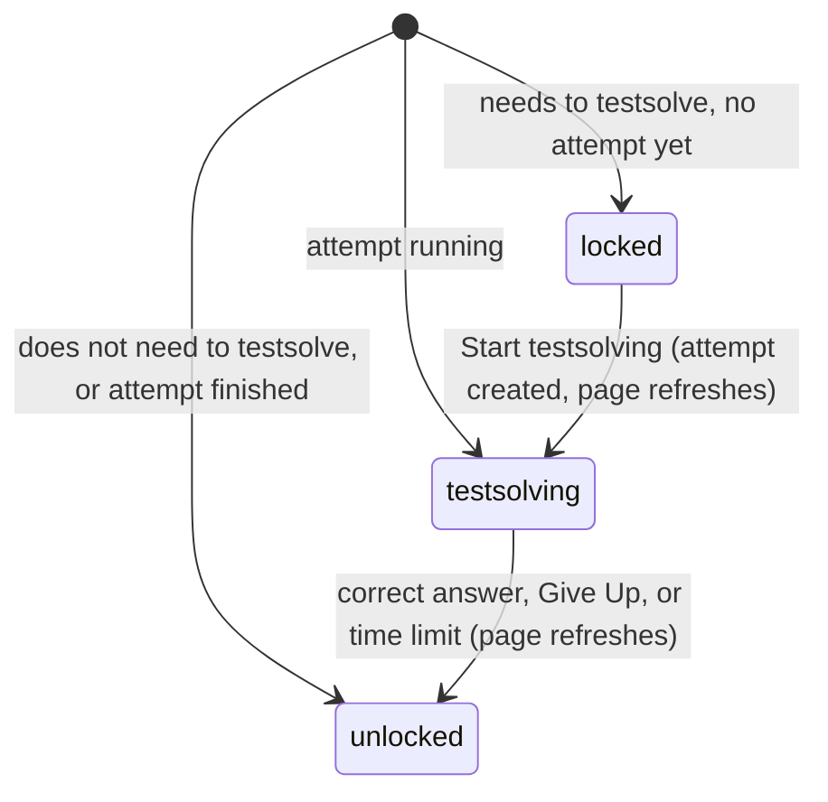

# The problem page

## Summary

The problem page shows one problem and everything attached to it: its title, subject and tests, its likes and difficulty, and then, depending on what the user is allowed to see right now, either a locked notice, a timed attempt, or the statement with its spoilers, leaderboard and discussion. It lives at `/c/{cid}/p/{pid}` and is reached from a [card](../glossary.md#interface) on the collection page or the test page, from Previous and Next on another problem page, or by address; a user who submits a problem lands on it. Only members who [can view](../glossary.md#people-and-access) the collection reach it. This document owns the page's layout and the choice between its three [views](../glossary.md#testsolving) (locked, testsolving, unlocked); each part of the page has its own document, linked below.

## The simple case

A TeamMember clicks a card on the collection page. The problem page opens with "‹ Back to {collection}" at the top left. Below it, in a centered column, the problem ID in its subject's color and the title; a colored subject chip and a gray chip for each test the problem is in; on the right, the heart with its like count and the difficulty as lightbulbs. Then the statement, with math typeset.

Under the statement is a "Show spoilers" button that reveals the answer and the solution, and at the bottom the "Discussion" with its comment box and the comments so far. The page ends with "← Previous" and "Next →", which step to the neighboring problem IDs.

If the user wrote the problem (or is an Admin), the title, statement and answer can be edited in place, and an "Archive" switch appears above Previous and Next.

## The interaction, event by event

A user who does not [need to testsolve](../glossary.md#testsolving) the problem is always in `unlocked`. The other two states exist only for Serious testsolvers in a collection that requires testsolving, on problems they cannot edit.

### Arrive

The page is built on the server after the checks in [navigation](../foundations/navigation.md#what-each-page-checks-in-order): the collection exists, the user is signed in and can view it, their testsolver type is chosen if required, and the problem exists (an unknown or wrongly capitalized problem ID shows "Page not found"). The view is decided at this moment from the user's role, authorship, testsolver type and [attempt](../glossary.md#testsolving), and stays fixed until the page refreshes, reloads, or the user navigates.

From top to bottom, in every view:

1. **Back link.** "‹ Back to {collection name}", returning to the collection page with the search, filters and page the user came from.
2. **Title.** "{problem ID}." in the subject's color (blue, amber, green, red), then the title. Long titles wrap. For a user who can edit the problem the title is a [click-to-edit](../foundations/click-to-edit.md) field; see [editing the problem](editing-the-problem.md).
3. **Chips.** The subject chip (gradient in the subject's colors, "Algebra", "Combinatorics", "Geometry" or "Number Theory") links to the collection page filtered to that subject alone. One gray chip per [test](../glossary.md#records) the problem belongs to, named after the test, links to the [test page](../collection/tests.md).
4. **Heart and lightbulbs**, stacked at the right of the title: the [heart](likes.md) with the like count, and, when the difficulty is 1 to 5, the [lightbulbs](../glossary.md#interface).
5. **The view's body**, below.
6. **Archive switch**, for users who can edit the problem; see [archiving](archiving.md).
7. **Previous and Next**; see [navigation](../foundations/navigation.md#previous-and-next).

The body of each view:

- **Unlocked.** The statement (click-to-edit for those who can edit it). Then, when the problem has at least one author and the collection shows authors or the viewer is an Admin, "Written by {first author}" in italics at the right. Then the [spoilers](spoilers.md): a "Show spoilers" button hiding the answer (when the answer is not absent) and the solution, or, when there is no solution, the "Add Solution" prompt for users with an author in the collection ([solutions](solutions.md)). When there is neither an answer nor a solution nor anything to add, a blank gap stands in for the button. Then, in a collection that requires testsolving, the [leaderboard](../testsolving/leaderboard.md). Then the [discussion](discussion.md).
- **Locked.** A padlock and "Testsolve to view", the time limit, and "Start testsolving". No statement, answer, solution, leaderboard, discussion or "Written by". See [the locked problem](../testsolving/locked-problem.md).
- **Testsolving.** The statement (never editable here), a rule, the answer box with "Submit" and "Give Up", and "Time remaining". No answer, solution, leaderboard, discussion or "Written by". See [the timed attempt](../testsolving/timed-attempt.md).

In the locked and testsolving views, what is left out is left out of the page itself, not hidden in the browser.

The page arrives scrolled to the top with nothing focused, except that a problem with an [empty answer](../foundations/data-model.md#the-answers-three-states) gives its answer editor focus as soon as the spoilers are opened by a user who can edit it.

### Leave untouched

Opening and leaving a problem page records nothing: viewing never starts an attempt, likes nothing, and leaves no trace of the visit. A locked problem stays locked however often it is opened.

### Begin editing

What can be changed depends on the view:

| View        | Controls                                                                                                                                                                                                                                            |
| ----------- | --------------------------------------------------------------------------------------------------------------------------------------------------------------------------------------------------------------------------------------------------- |
| Unlocked    | The heart; "Show spoilers"; the discussion; and, for users who can edit, the title, statement and answer editors, the solution editor or "Add Solution", and the Archive switch. "Add Solution" also for any user with an author in the collection. |
| Locked      | The heart; "Start testsolving".                                                                                                                                                                                                                     |
| Testsolving | The heart; the answer box, "Submit", "Give Up".                                                                                                                                                                                                     |

Every view also has its links: back, chips, Previous, Next.

### While editing

Several of the page's controls can be in use at once (a comment being typed while the heart's request is in flight while the statement editor is open). Each settles on its own. A successful action refreshes the page ([saving and feedback](../foundations/saving-and-feedback.md)): the statement as read, the answer and solution as read, "Written by", the leaderboard, and the comments are rebuilt from the server; the heart, the Archive switch and any click-to-edit field keep what they showed; text being typed in the comment box or an open editor stays; the spoilers stay open or closed.

A refresh also re-decides the view. That is how the page moves between views: starting an attempt refreshes locked into testsolving, and a correct answer, giving up, or the countdown reaching zero refreshes testsolving into unlocked. Any other refresh (a like, for example) re-decides the view too, so a running attempt that has run out of time becomes unlocked on the next refresh even if the countdown has not triggered it.

### Submit

The page has no submit of its own. Each control's action is described in its own document. The two view changes are:

- **Locked → testsolving**, when "Start testsolving" succeeds: the padlock is replaced by the statement, the answer box and the countdown.
- **Testsolving → unlocked**, when the attempt is solved, given up, or out of time: the answer box and countdown are replaced by the unlocked body, with spoilers, leaderboard and discussion.

There is no way back: an attempt is never undone, so a problem, once unlocked for a user, stays unlocked (unless their testsolver type or the collection's settings change).

## Modifiers

| Modifier            | At arrival                                                                                                                                                                                                                                                                                                    | During editing                                                                                                                                |
| ------------------- | ------------------------------------------------------------------------------------------------------------------------------------------------------------------------------------------------------------------------------------------------------------------------------------------------------------- | --------------------------------------------------------------------------------------------------------------------------------------------- |
| Role                | Admin, TeamMember and ViewOnly reach the page; SubmitOnly members, users with no permission and signed-out visitors are redirected. An Admin sees every problem unlocked and editable, sees "Written by" even when authors are hidden, and sees every leaderboard row. ViewOnly members see nothing editable. | A role changed elsewhere does not change the open page; the next action is checked against it and the next refresh rebuilds the page with it. |
| Authorship          | A TeamMember (or SubmitOnly) author sees their problem unlocked, editable, with the Archive switch and every leaderboard row.                                                                                                                                                                                 | No effect on the open page.                                                                                                                   |
| Testsolver type     | Serious: locked, testsolving or unlocked depending on the attempt. Casual: always unlocked. Not chosen: sent to the chooser before arriving. In a collection that does not require testsolving, always unlocked, and there is no leaderboard.                                                                 | A type changed elsewhere applies on the next refresh or load.                                                                                 |
| Record state        | Archived problems look exactly the same, apart from the Archive switch's position. An absent answer means no answer in the spoilers; no solution means "Add Solution" or nothing. No difficulty means no lightbulbs, and, for a user who needs to testsolve, the page fails ("Something went wrong").         | Changes by others appear on the next refresh, except in the heart, the Archive switch and click-to-edit fields.                               |
| Collection settings | Showing authors decides "Written by" for non-Admins. Requiring testsolving decides whether there is a leaderboard and whether anything can be locked. The answer format decides the answer box in a timed attempt.                                                                                            | No effect on the open page.                                                                                                                   |
| Keys                | No page-level shortcuts.                                                                                                                                                                                                                                                                                      | Keys belong to the controls: click-to-edit, Add Solution, the answer box.                                                                     |

## Cancel and interrupt

| Event                               | Before editing                                                                                         | While editing                                                                                                                                                                                        |
| ----------------------------------- | ------------------------------------------------------------------------------------------------------ | ---------------------------------------------------------------------------------------------------------------------------------------------------------------------------------------------------- |
| Escape or Discard                   | No effect.                                                                                             | Belongs to the control in use (an editor abandons; the comment box ignores it).                                                                                                                      |
| Browser back or forward             | Leaves; nothing recorded.                                                                              | Leaves; unsent text is lost; sent requests complete. A running attempt keeps running on the server.                                                                                                  |
| Reload                              | The page is rebuilt and the view re-decided.                                                           | Unsent text is lost. The view is re-decided: a running attempt shows its countdown from the true remaining time, not from the start.                                                                 |
| Tab or window closed                | Nothing recorded.                                                                                      | Unsent text is lost. A running attempt keeps running and its time keeps passing.                                                                                                                     |
| A link inside the app followed      | Leaves.                                                                                                | As browser back. Previous and Next open the neighboring problem fresh.                                                                                                                               |
| Network lost mid-request            | No effect until something is sent.                                                                     | The action in flight fails with the generic toast and rolls back as its control does.                                                                                                                |
| Request fails or returns an error   | No effect.                                                                                             | A toast; the page stays in its view.                                                                                                                                                                 |
| Session ends                        | No effect on the open page.                                                                            | Actions answer "Not signed in"; the next load goes to the login page.                                                                                                                                |
| Access changes                      | No effect on the open page.                                                                            | Actions are checked against the new access; the view changes only on the next refresh.                                                                                                               |
| Same record changed in another tab  | Not shown until a refresh.                                                                             | Shown on the next refresh, except in the heart, the Archive switch and click-to-edit fields. An attempt started, solved or given up in another tab changes this tab's view only on its next refresh. |
| Same record changed by another user | Not shown until a refresh.                                                                             | As another tab.                                                                                                                                                                                      |
| Autofill writes into the field      | No effect.                                                                                             | Belongs to the field (the answer box and single-line editors may be filled from browser history).                                                                                                    |
| The window loses focus              | No effect.                                                                                             | A single-line editor saves; nothing else reacts. The countdown keeps counting.                                                                                                                       |
| The testsolve time limit passes     | Only the testsolving view reacts: it refreshes into the unlocked view when the countdown reaches zero. | As before editing; an answer submitted within the last 10 seconds is still accepted.                                                                                                                 |

## Interactions with other systems

**Permissions.** Everything on the page is decided per viewer on the server: who reaches it, which fields are editable, whether "Written by" shows, how much of the leaderboard shows. See [accounts and roles](../foundations/accounts-and-roles.md).

**Testsolving locks.** The page is where locking happens. The lock is enforced by leaving content out of the page, and the page is the only place a problem can be unlocked (by starting an attempt). The collection page and the test page show the same lock on their cards.

**Per-collection settings.** "Shows authors", "requires testsolving" and the answer format change the page as described under [Modifiers](#modifiers). See [per-collection settings](../cross-cutting/per-collection-settings.md).

**Validation and errors.** A failure while building the page (for example the missing-difficulty case) shows "Something went wrong" in place of the whole page. Action errors appear as toasts.

**Unsaved changes.** Nothing typed on the page survives leaving it.

**Optimistic updates.** The heart, the Archive switch and the editors are optimistic; everything else waits.

**Freshness and other users.** The page is as fresh as its last load or refresh, and opening it from a prefetched link can show it as it was up to five minutes earlier. See [freshness](../cross-cutting/freshness.md).

**URL state.** The page carries the collection page's query string for its back link and for Previous and Next, and does nothing else with it.

**Math rendering.** Title, statement, answer, solution and comments render math; see [math rendering](../cross-cutting/math-rendering.md). The title is the exception: it is shown as typed, dollar signs included, to everyone except users who can edit it, whose click-to-edit title renders its math when not being edited.

**Offline.** The page stays as loaded; actions fail with the generic toast; links fail to load.

**Keyboard and accessibility.** The browser tab's title is "Probase" on every problem, not the problem's name. Several controls cannot be reached with the keyboard (the heart, click-to-edit fields in their showing state). See [keyboard and accessibility](../cross-cutting/keyboard-and-accessibility.md).

**Narrow screens.** The column narrows to the window, text gets smaller, and the heart and lightbulbs stay at the right of the title. See [narrow screens](../cross-cutting/narrow-screens.md).

**Side effects.** Opening the page has none.

## Edge cases

- A problem with no difficulty (or difficulty 0, as in the demo data) cannot be shown to a user who needs to testsolve it: the page fails with "Something went wrong" instead of showing the locked view. This happens in a collection that requires testsolving and does not require a difficulty on its form.
- "Written by" names only the first author, even when a problem has several.
- A problem that belongs to no test shows only its subject chip.
- A test chip's address is built from the test's name (lower case, spaces to hyphens, other punctuation removed) and its number; renaming a test in the database changes its chips' addresses, but old addresses keep working because only the number is used.
- The subject chip's link drops the search and other filters the user came with.
- Casual testsolvers see the leaderboard but cannot start an attempt as Casual; they appear on it only with attempts made while they were Serious.
- A Serious testsolver whose time ran out sees the unlocked view, with their own row on the leaderboard as unsolved.
- A title containing math shows the math source to readers and the rendered math to its editors.
- An author sees their own problem's leaderboard in full and never sees a locked view of it, even as a Serious testsolver.

## Open questions and verification

- The failure for a problem without a difficulty is covered by a unit test that expects the view to throw, and a first local pass confirmed it: a Serious testsolver opening such a problem got an HTTP 500 "Something went wrong" page, and "Try again" showed the same page. This looks like a bug rather than a design: the page should probably show the problem locked with no time limit, or refuse to lock it.
- That any refresh re-decides the view (so a like can end an expired attempt before the countdown does) was read from code.
- That opening a problem from a prefetched card can show it up to five minutes out of date follows from the framework's prefetch defaults; confirm on a production build.
- The browser tab title never naming the problem was read from the site's single, static page title.

Verified against Probase commit `c38ff56`
