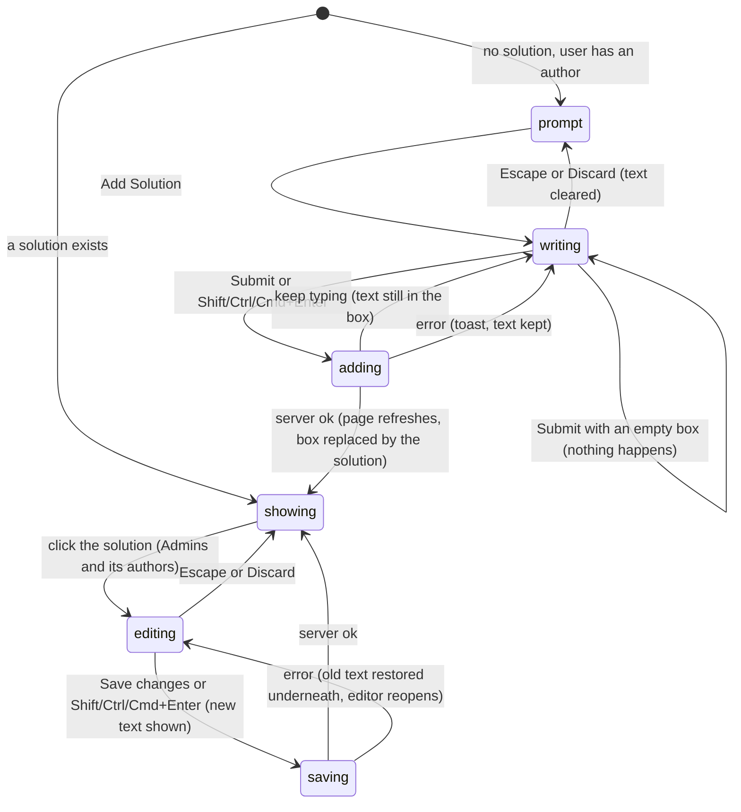

# Solutions

## Summary

A solution is a written solution to a problem, shown inside the [spoilers](spoilers.md) of an unlocked problem page under the label "SOLUTION". This document owns the two ways a solution is written on the problem page: "Add Solution", which adds the first solution to a problem that has none, and the solution editor, a multi-line [click-to-edit](../foundations/click-to-edit.md) field that lets Admins and the solution's own authors change its text. "Add Solution" is offered to any user who has an [author](../glossary.md#people-and-access) in the collection, on any problem without a solution; the server accepts it only from Admins and TeamMembers. A problem can hold several solutions, but only the first is ever shown, anywhere; any others are invisible. Solutions cannot be deleted, emptied, or attributed to anyone but the user who adds them, and nothing on the page says who wrote one.

## The simple case

A TeamMember who has submitted problems to the collection opens a teammate's problem that has no solution and clicks "Show spoilers". Under the answer is "No solutions yet. You could be the first!" and a violet "Add Solution" button. They click it. The prompt is replaced by an empty box reading "Write your solution here!", with the cursor in it, and under it a green "Submit" and a "Discard".

They type the solution, with math between dollar signs, and click "Submit". Nothing on the page changes until the server answers. When it does, the page [refreshes](../glossary.md#interaction): the box is replaced by "SOLUTION" and their text with the math typeset, and the spoilers stay open. Because they wrote it, the solution is theirs to edit: clicking it turns it back into a box holding the text, with "Save changes" and "Discard" under it.

If the server refuses the solution, a red [toast](../glossary.md#interface) says why, and the text stays in the box.

## The interaction, event by event

`prompt`, `writing` and `adding` exist only for users with an author; `editing` and `saving` only for users who can edit the solution. Everyone else sees `showing` as read-only text, or nothing.

### Arrive

Solutions are part of the problem page's [unlocked view](../glossary.md#testsolving) only, and are inside the spoilers, so a user sees any of this only after clicking "Show spoilers". In the locked and testsolving views no solution text and no prompt are sent to the browser.

What the spoilers hold under the answer is decided on the server when the page is built:

- **The problem has at least one solution.** "SOLUTION" in small gray capitals, then the first solution's text with [math](../glossary.md#interface) typeset and line breaks kept. For an Admin, and for a TeamMember whose author is one of the solution's authors, it is a multi-line click-to-edit field that looks exactly the same until clicked. Everyone else sees plain text. No author name is shown with the solution in any collection.
- **The problem has no solution and the user has an author in the collection.** The prompt, centered: "No solutions yet. You could be the first!" in gray, and under it a violet "Add Solution" button. This does not depend on the user's role or on who wrote the problem: any member with an author sees it on every problem without a solution.
- **The problem has no solution and the user has no author.** Nothing. If the answer is absent too, the spoilers are replaced by a blank gap (see [the spoilers](spoilers.md#arrive)).

A user gets an author the first time they open the collection's add-problem page (on a production build, simply by viewing the collection page; see [accounts and roles](../foundations/accounts-and-roles.md#authorship)). So an Admin or TeamMember who has never been near the add-problem page sees no way to add a solution.

The box never starts open, and no earlier text is restored: Probase keeps no drafts.

### Leave untouched

Leaving without adding or editing records nothing. Opening the box, or the solution editor, and leaving without submitting records nothing either.

### Begin editing

**Adding.** Clicking "Add Solution" (or Enter or Space on it) replaces the prompt with a text box the full width of the column and at least 150 pixels tall, with the placeholder "Write your solution here!". The box takes focus. Under it are "Submit", green, and "Discard", plain text. Nothing is sent to the server.

**Editing.** Clicking anywhere on a solution the user can edit, its "SOLUTION" label included, opens the click-to-edit editor: a box holding the solution's text as typed (the math source, not the rendering), focused with the cursor at the end, and "Save changes" and "Discard" under it. See [click-to-edit](../foundations/click-to-edit.md#begin-editing).

### While editing

**The "Add Solution" box** grows as text is added and cannot be resized by hand. There is no preview of the rendered math, no character count, and no message while typing. Keys:

| Key                  | In the "Add Solution" box                           |
| -------------------- | --------------------------------------------------- |
| Enter                | New line                                            |
| Shift/Ctrl/Cmd+Enter | Submits, if the box is not empty; otherwise nothing |
| Escape               | Discards                                            |
| Tab                  | Moves focus to "Submit", then "Discard"             |

Discarding, by Escape or "Discard", empties the box and closes it, bringing back the prompt; clicking "Add Solution" again opens an empty box. There is no confirmation. This differs from a click-to-edit field that started empty, which stays open on Escape.

The box does nothing on [blur](../glossary.md#input): clicking elsewhere, switching windows or tabbing away leaves the text waiting in the box.

**The solution editor** behaves as a problem-page multi-line click-to-edit field: Enter starts a new line, Shift/Ctrl/Cmd+Enter or "Save changes" saves, Escape or "Discard" shows the saved text again, blur does nothing, and an empty box is never saved. See [click-to-edit](../foundations/click-to-edit.md#while-editing).

The rest of the page stays usable meanwhile. A refresh caused by another action (a like, a comment) leaves the box and the editor open with their text, with one exception: if the refresh finds that the problem now has a solution, the "Add Solution" box is replaced by it, text and all. Closing the spoilers throws away the text in both; see [the spoilers](spoilers.md#submit).

### Submit

**Adding.** "Submit", or Shift/Ctrl/Cmd+Enter, does nothing at all while the box is empty: no message, no request. A box holding only spaces or blank lines is not empty and is sent.

The text is sent to the server with the problem and the user's author (their first, if they have several). The page does not change while the request is [pending](../glossary.md#interaction): the box stays open with the text and can still be typed in, "Submit" stays enabled, and no spinner is shown. Clicking "Submit" again sends the same text again and adds a second solution (see [edge cases](#edge-cases)).

The server checks, in this order, that the text has at least one character, that the user is signed in, that the problem still exists, that the user's role is Admin or TeamMember, and that the author sent is one of the user's own. It does not check whether the problem already has a solution. It then stores the solution with that author as its only author. On success the problem page refreshes: the spoilers stay open, and the box is replaced by "SOLUTION" and the new text, which the user can click to edit. The solution is not shown [optimistically](../glossary.md#interaction); it appears only with the refresh.

On failure the user sees one of these toasts, and the box keeps its text:

| Situation                                                      | Toast                                                |
| -------------------------------------------------------------- | ---------------------------------------------------- |
| The session has ended                                          | "Not signed in"                                      |
| The problem no longer exists                                   | "Problem not found"                                  |
| The user is not an Admin or TeamMember (for example, ViewOnly) | "You do not have permission to edit this collection" |
| The user's author was removed since the page loaded            | "Invalid input (authorId): not one of your authors"  |
| Anything unexpected, or the network                            | "Something went wrong. Please try again."            |

**Editing.** Saving closes the editor at once and shows the new text, rendered, while the request is pending; see [click-to-edit](../foundations/click-to-edit.md#submit). The server checks that the text has at least one character, that the user is signed in, that the solution still exists, and that the user may edit it: an Admin, or a TeamMember (or SubmitOnly member) whose author is one of the solution's authors. On success the page refreshes and the field keeps showing the saved text. On failure the old text is restored underneath, the editor reopens holding the new text, and a toast says why:

| Situation                           | Toast                                                |
| ----------------------------------- | ---------------------------------------------------- |
| The session has ended               | "Not signed in"                                      |
| The solution no longer exists       | "Problem not found"                                  |
| The user may no longer edit it      | "You do not have permission to edit this collection" |
| Anything unexpected, or the network | "Something went wrong. Please try again."            |

Every save sends a request, even when the text is unchanged.

## Modifiers

| Modifier            | At arrival                                                                                                                                                                                                                                                                                                                                          | During editing                                                                                                                                                                                                                                                                                        |
| ------------------- | --------------------------------------------------------------------------------------------------------------------------------------------------------------------------------------------------------------------------------------------------------------------------------------------------------------------------------------------------- | ----------------------------------------------------------------------------------------------------------------------------------------------------------------------------------------------------------------------------------------------------------------------------------------------------- |
| Role                | "Add Solution" is shown to Admin, TeamMember and ViewOnly members alike, whenever they have an author. The solution editor is shown to Admins on every solution and to TeamMembers on solutions they authored; ViewOnly members see read-only text. SubmitOnly members, users with no permission and signed-out visitors never reach the page.      | Adding is accepted only from Admins and TeamMembers, so a ViewOnly member with an author is refused with "You do not have permission to edit this collection", as is anyone whose role is lowered while the box is open. A lost right to edit a solution shows the same toast and reopens the editor. |
| Authorship          | "Add Solution" needs an author in the collection, not authorship of the problem: a member can add the first solution to anyone's problem. The solution editor follows authorship of the solution, not of the problem.                                                                                                                               | The added solution is attributed to the user's own author only. Saving an edit checks authorship of the solution again.                                                                                                                                                                               |
| Testsolver type     | Serious: the solution or the prompt appears only once the user's attempt has finished, so a Serious testsolver with an author can add the first solution to a problem they have just testsolved. Casual: at once. Not chosen: sent to the chooser before arriving. In a collection that does not require testsolving, type does not matter.         | No effect: neither action looks at the testsolver type.                                                                                                                                                                                                                                               |
| Record state        | No solution: the prompt, or nothing. One or more solutions: the first. The answer's state and the problem's difficulty make no difference. Archived problems work as usual. A solution with empty text (possible only in the database) shows "SOLUTION" alone to readers and opens as an empty, focused box for its editors when the spoilers open. | A solution added by someone else while the box is open does not stop "Submit": it succeeds and stores a second solution. A solution deleted in the database while its editor is open makes the save fail with "Problem not found".                                                                    |
| Collection settings | Whether the add-problem form requires a solution decides whether problems usually arrive with one, and so whether the prompt appears. Showing or hiding authors has no effect: a solution's authors are never shown. No code-level configuration applies.                                                                                           | No effect.                                                                                                                                                                                                                                                                                            |
| Keys                | Tab reaches "Add Solution"; Enter or Space opens the box. A solution as read cannot be opened from the keyboard.                                                                                                                                                                                                                                    | Box: Enter new line; Shift/Ctrl/Cmd+Enter submits if not empty; Escape discards; Tab moves to "Submit" and "Discard". Editor: as [click-to-edit](../foundations/click-to-edit.md#while-editing).                                                                                                      |

A change to the user's role or author made elsewhere never changes the open page; it shows up as a toast on submitting or saving, or as a different page on the next load.

## Cancel and interrupt

"While editing" covers the "Add Solution" box or the solution editor being open, and the time a submit or save is pending.

| Event                               | Before editing                                                                                                                                                                                                                                                    | While editing                                                                                                                                                                                                                                                                                                              |
| ----------------------------------- | ----------------------------------------------------------------------------------------------------------------------------------------------------------------------------------------------------------------------------------------------------------------- | -------------------------------------------------------------------------------------------------------------------------------------------------------------------------------------------------------------------------------------------------------------------------------------------------------------------------- |
| Escape or Discard                   | No effect.                                                                                                                                                                                                                                                        | The box empties and closes, back to the prompt; the editor shows the saved text again. Neither cancels a request already sent: a pending submit still adds the solution, which replaces the prompt when the page refreshes.                                                                                                |
| Browser back or forward             | Leaves; nothing recorded.                                                                                                                                                                                                                                         | Leaves; the typed text is lost without warning, since neither the box nor the editor saves on blur. A pending submit or save completes on the server, and its error toast, if any, appears on the page the user went to.                                                                                                   |
| Reload                              | The page is rebuilt, with the spoilers closed.                                                                                                                                                                                                                    | The typed text is lost without warning. A pending submit may or may not have reached the server; after the reload the spoilers show the solution if it did, the prompt if not.                                                                                                                                             |
| Tab or window closed                | Nothing recorded.                                                                                                                                                                                                                                                 | The typed text is lost without warning. A pending request that reached the server is stored.                                                                                                                                                                                                                               |
| A link inside the app followed      | Nothing recorded.                                                                                                                                                                                                                                                 | As browser back. Previous and Next count as leaving: the next problem opens with its spoilers closed and no box open.                                                                                                                                                                                                      |
| Network lost mid-request            | No effect until something is sent.                                                                                                                                                                                                                                | Adding: "Something went wrong. Please try again.", and the box keeps the text; the solution may still have been stored if the request arrived. Editing: the same toast, the old text restored underneath and the editor reopened with the new.                                                                             |
| Request fails or returns an error   | No effect.                                                                                                                                                                                                                                                        | A toast with the reason. Adding: the box keeps the text. Editing: the editor reopens with the text.                                                                                                                                                                                                                        |
| Session ends                        | No effect on the open page.                                                                                                                                                                                                                                       | "Not signed in"; the text is kept in the box or the reopened editor. Reloading to recover goes to the login page and loses it.                                                                                                                                                                                             |
| Access changes                      | No effect on the open page: the prompt or the editor stays.                                                                                                                                                                                                       | Adding fails with "You do not have permission to edit this collection" if the user is no longer an Admin or TeamMember, or "Invalid input (authorId): not one of your authors" if their author was taken away. Editing fails with the permission toast if they may no longer edit it. A new testsolver type has no effect. |
| Same record changed in another tab  | Not shown until this page refreshes. A solution added in another tab replaces the prompt on the next refresh; an edit made there reaches a read-only solution on the next refresh, but not a solution editor, which keeps its own text.                           | Submitting from a prompt whose problem has since been given a solution adds a second solution, which is never shown. Saving an edit overwrites the other tab's edit without warning: the last save wins.                                                                                                                   |
| Same record changed by another user | As another tab.                                                                                                                                                                                                                                                   | As another tab. Two people adding at once both succeed; afterwards both see whichever solution the database returns first, which for one of them is not their own.                                                                                                                                                         |
| Autofill writes into the field      | No effect.                                                                                                                                                                                                                                                        | No effect: the box and the editor are multi-line, which browsers do not fill from saved entries.                                                                                                                                                                                                                           |
| The window loses focus              | No effect.                                                                                                                                                                                                                                                        | No effect: neither the box nor the editor does anything on blur; the text waits.                                                                                                                                                                                                                                           |
| The testsolve time limit passes     | Not applicable: solutions appear only on unlocked pages. When a Serious testsolver's time runs out, the page refreshes into the unlocked view and the solution or prompt is there, inside closed spoilers ([the timed attempt](../testsolving/timed-attempt.md)). | Not applicable: an unlocked problem has no running time limit.                                                                                                                                                                                                                                                             |

After any interrupt the user is wherever it took them. Probase keeps no draft of a solution, and a solution or edit that reached the server stays stored whether or not the user saw it succeed.

## Interactions with other systems

**Permissions.** Three rules that do not quite line up. The page offers "Add Solution" to anyone with an author in the collection; the server accepts it only from Admins and TeamMembers, with their own author; the solution editor is for Admins and the solution's authors. So a ViewOnly member who has an author is offered a button that always fails. Both actions' refusals say "edit this collection", though neither edits the collection. See [accounts and roles](../foundations/accounts-and-roles.md).

**Testsolving locks.** A problem's solutions are part of what a Serious testsolver may not see before testsolving. In the locked and testsolving views neither the solution nor the prompt is sent to the browser. See [the problem page](problem-page.md).

**Per-collection settings.** Only indirectly: a collection that requires a solution on its add-problem form gets problems that already have one, so "Add Solution" rarely appears there. A solution's authors are hidden in every collection, whatever its "show authors" setting. See [per-collection settings](../cross-cutting/per-collection-settings.md).

**Validation and errors.** The box refuses to submit an empty box, silently. The server requires at least one character and accepts anything else, including text that is only whitespace, with no length limit. Errors arrive as toasts that disappear after 8 seconds ([saving and feedback](../foundations/saving-and-feedback.md)).

**Unsaved changes.** Text in the box or the editor lives only in the page. Reloading, leaving, or closing the spoilers loses it, and "Discard" or Escape empties the box, all without warning.

**Optimistic updates.** Adding is not optimistic: the box keeps its text and the prompt stays until the server answers. Editing is: the new text shows at once and rolls back on error.

**Freshness and other users.** What is shown is as fresh as the page's last load or refresh. A read-only solution, and whether the prompt or a solution is shown, update on every refresh; an open or closed solution editor keeps its own text until the spoilers are closed and reopened, or the page is reloaded. See [freshness](../cross-cutting/freshness.md).

**URL state.** None. Adding or editing a solution does not change the address, and the carried search and filters are unaffected.

**Math rendering.** A solution renders math like the statement, with line breaks and spacing kept. The box and the editor show the source, with no preview. Malformed math shows in red after saving rather than being refused. See [math rendering](../cross-cutting/math-rendering.md).

**Offline.** Adding fails with the generic toast and keeps the text; editing rolls back and reopens the editor with the text. Nothing is queued.

**Keyboard and accessibility.** "Add Solution", "Submit" and "Discard" are ordinary buttons reachable with Tab. The box has no label, only its placeholder, which disappears as soon as the user types. A solution in its showing state cannot be focused, so a keyboard user cannot open the editor. Toasts are announced as alerts. See [keyboard and accessibility](../cross-cutting/keyboard-and-accessibility.md).

**Narrow screens.** The box, the editor and the solution take the width of the problem column; the buttons keep their size. See [narrow screens](../cross-cutting/narrow-screens.md).

**Side effects.** None. No one is notified of a new or edited solution, and the author it is attributed to is not shown anywhere.

## Edge cases

- Clicking "Submit" twice, or pressing Shift+Enter twice, before the first request comes back adds the same solution twice. Only the first is shown; the second stays in the database, invisible, and cannot be seen, edited or removed through the interface.
- Two members who add a solution to the same problem at about the same time, or one who submits from a page opened before someone else added one, both succeed. Afterwards the page shows whichever solution the database returns first, so one member's own solution disappears from view the moment their submit succeeds, with no message.
- A refresh caused by any other action (a like, a comment) that finds the problem now has a solution replaces an open "Add Solution" box with that solution, discarding whatever the user had typed.
- Text typed into the box after clicking "Submit" and before the server answers is not sent, and is gone when the refresh replaces the box with the solution.
- "Discard" or Escape while a submit is pending empties and closes the box, but the solution is still added and appears on the refresh. If that submit fails, the toast appears and the text is gone.
- A solution of only spaces or blank lines is accepted. It shows "SOLUTION" with nothing under it; its editors can click the blank space under the label to open it.
- A solution, once added, can be changed but never emptied or deleted; click-to-edit never saves an empty box.
- A ViewOnly member keeps any author they had under an earlier role (for example a SubmitOnly member later given ViewOnly through an invite). They see "Add Solution" on every problem without a solution, and every submit fails with "You do not have permission to edit this collection", leaving the text in the box.
- The TeamMember who wrote a problem cannot edit a solution someone else added to it; the member who added it can edit the solution but not the problem.
- A problem submitted through the add-problem form with its solution field filled has that solution from the start, attributed to the submitter, so it never shows "Add Solution".
- Nothing on the page names a solution's author. "Written by", above the spoilers, names the problem's first author, so a solution added by someone else reads as the problem author's.

## Open questions and verification

- No pending state on "Submit", and no check on the server that the problem has no solution yet, were read from code. Confirm on a throttled connection that a double click adds two solutions. This looks like a bug: the second solution is invisible and cannot be removed through the interface.
- The page offers "Add Solution" to anyone with an author, while the server accepts it only from Admins and TeamMembers, so a ViewOnly member with an author is offered a button that always fails. This looks like a bug; the page should probably check the role as well.
- A missing solution is reported as "Problem not found", and both actions refuse with "You do not have permission to edit this collection". The wording may be worth revising.
- Which solution counts as "first" is whatever order the database returns; nothing sorts solutions, and solutions have no creation time. In practice it is the oldest, but it is not guaranteed, and could change after an edit.
- The replacement of an open "Add Solution" box by a solution that arrives with an unrelated refresh, and the loss of text typed after "Submit", were read from code, not tried.
- The solution editor is handed the whole stored solution, including the names of all its authors, so a co-author can find the other co-authors' names in the page's data even in a collection that hides authors. Read from code; minor.
- The "Add Solution" box having no accessible label was read from its markup.

Verified against Probase commit `c38ff56`
