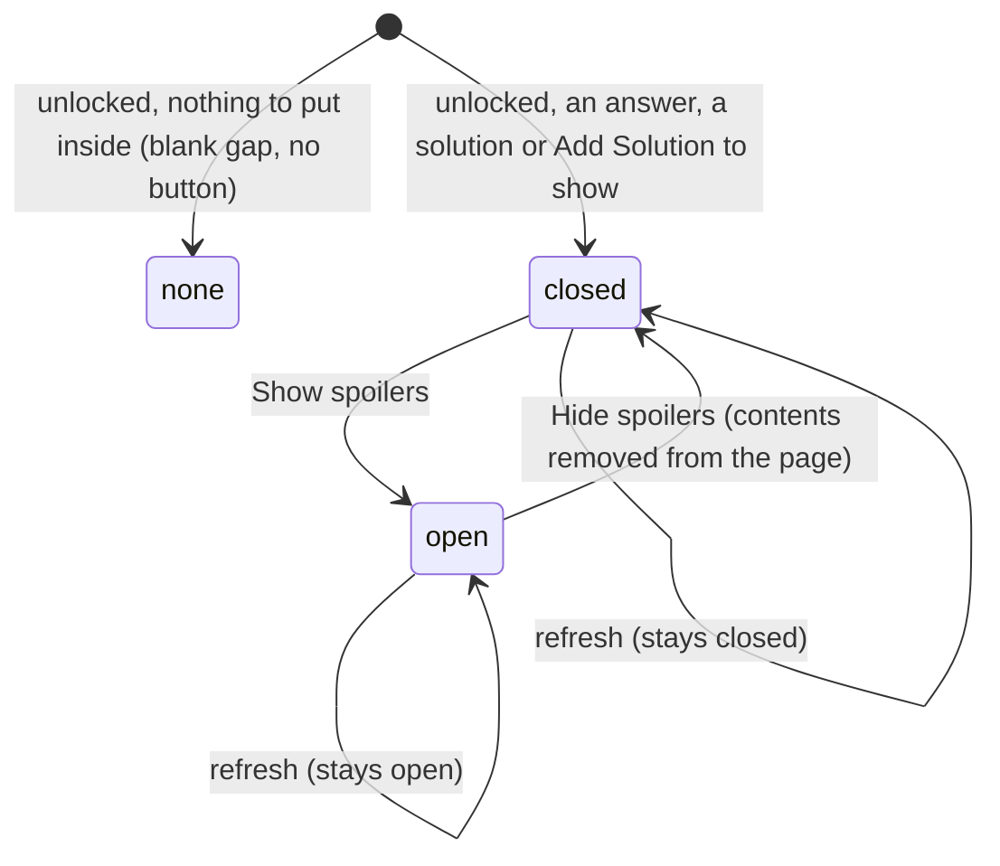

# The spoilers

## Summary

The spoilers are the part of an unlocked problem page that holds the problem's answer and its solution, hidden behind a violet "Show spoilers" button until the reader asks for them. They sit under the statement (and "Written by", when it is shown) and above the [leaderboard](../testsolving/leaderboard.md) and the [discussion](discussion.md). Inside are, in order: the answer, labeled "ANSWER", whenever the answer is not absent; then the problem's first solution, labeled "SOLUTION", or, when the problem has no solution and the user has an [author](../glossary.md#people-and-access) in the collection, the "Add Solution" prompt. This document owns the button, what it reveals, and the answer and solution as read. The editors that can appear inside belong elsewhere: the answer editor to [editing the problem](editing-the-problem.md), the solution editor and "Add Solution" to [solutions](solutions.md). Hiding the spoilers is a courtesy to readers who have not yet tried the problem, not access control: who may read the answer at all is decided by whether the page includes the spoilers, which it does only in the [unlocked view](../glossary.md#testsolving).

## The simple case

A member opens a problem and reads the statement. Under it is a "Show spoilers" button and nothing else until the leaderboard or the discussion. They think about the problem, then click the button. The answer appears under it, "ANSWER" in small gray capitals above the answer with any [math](../glossary.md#interface) typeset, and under that "SOLUTION" and the solution's text. The button now reads "Hide spoilers". Clicking it again removes the answer and solution from view. Nothing is sent to the server either way, and the next time the page is opened the spoilers are closed again.

## The interaction, event by event

Every page load, reload or navigation to the problem starts in `closed` (or `none`). Nothing about the open state is kept anywhere.

### Arrive

The spoilers exist only in the problem page's unlocked view. In the locked and testsolving views the whole section is left out of the page and neither the answer nor any solution is sent to the browser (see [the problem page](problem-page.md)).

What goes inside is decided on the server when the page is built, for this viewer:

1. **The answer**, unless the answer is [absent](../foundations/data-model.md#the-answers-three-states). Readers see "ANSWER" and the answer rendered, with math typeset and line breaks kept. An [empty answer](../glossary.md#records) shows "ANSWER" with nothing under it. A user who [can edit](../glossary.md#people-and-access) the problem gets a single-line [click-to-edit](../foundations/click-to-edit.md) field instead, labeled the same way; see [editing the problem](editing-the-problem.md).
2. **The solution**, when the problem has at least one: "SOLUTION" and the first solution's text, rendered the same way. Only the first is ever shown; see [data model](../foundations/data-model.md#solution). Admins and the solution's own authors get a multi-line click-to-edit field instead; see [solutions](solutions.md). Nothing says who wrote the solution.
3. **The "Add Solution" prompt**, in place of the solution, when the problem has no solution and the user has an author in the collection: "No solutions yet. You could be the first!" and an "Add Solution" button. See [solutions](solutions.md).

When there is none of the three (an absent answer, no solution, and a viewer without an author), there is no button: an empty gap about 4 rem tall stands where the spoilers would be, and the leaderboard or the discussion follows.

Otherwise the page shows the "Show spoilers" button, violet with white text and a fixed width of 11 rem, and nothing under it. The spoilers always arrive closed. Nothing is focused.

> Technical note: the answer and solution are rendered on the server and sent to the browser with the page whether the spoilers are open or closed; the button only decides whether they are drawn. Anyone who reads the page's source or data can find them while the spoilers are closed. They are sent only to users the page may show them to.

### Leave untouched

Leaving the page without opening the spoilers records nothing. Opening them records nothing either: no one, Admins included, can tell whether a user has looked at the answer.

### Begin editing

Clicking "Show spoilers", or pressing Enter or Space while it has focus, opens the spoilers. The contents appear directly under the button, which now reads "Hide spoilers". Nothing is sent to the server, so this cannot fail and works offline.

The contents are created at this moment from the data the page last received from the server, not fetched afresh. For a user who can edit the problem and whose problem has an empty answer, the answer box opens empty and takes focus as the spoilers open, so keyboard focus moves from the button into the box.

### While editing

The spoilers stay open while the user reads them, uses the editors or "Add Solution" inside them, or does anything else on the page. A [refresh](../glossary.md#interaction) after any successful action on the page (a like, a comment, a saved field, an added solution) leaves them open and rebuilds what they show from the server: the answer and solution as read show the server's current text, and a solution added by anyone replaces the "Add Solution" prompt. Click-to-edit fields inside keep their own text through the refresh, as they do everywhere ([saving and feedback](../foundations/saving-and-feedback.md)).

The open state belongs to this one view of the page. Another tab showing the same problem has its own, and closes on its own reloads.

### Submit

There is nothing to submit. Clicking "Hide spoilers" (or Enter or Space on it) closes the spoilers, and closing removes the contents from the page rather than covering them. That has consequences for anything open inside:

- **An open solution editor** loses its typed text, without warning; it does not save on [blur](../glossary.md#input).
- **An open "Add Solution" box** loses its typed text; showing the spoilers again brings back the "No solutions yet" prompt with the box closed.
- **An open answer editor** with text in it saves before the spoilers close, because pressing the button takes focus away from the box and a single-line field saves on blur. An empty answer box saves nothing.
- **A save or submit already sent** completes on the server. On success the page refreshes as usual. On failure the [toast](../glossary.md#interface) still appears, but the editor that would have reopened with the user's text is gone, so that text is lost.

Clicking "Show spoilers" again creates the contents afresh from the data the page last received from the server. Read-only text looks the same as before. Editors, however, start over from that data: an answer or solution editor shows the text the server sent at the last load or refresh, not the text it was showing before it was hidden. Because a refresh never updates a click-to-edit field that stays on screen, hiding and showing the spoilers after a refresh is the one way, short of reloading, to make the answer and solution editors show a change made in another tab or by another user.

## Modifiers

| Modifier            | At arrival                                                                                                                                                                                                                                                                                                                                                                                                              | During editing                                                                                                                                                                                                             |
| ------------------- | ----------------------------------------------------------------------------------------------------------------------------------------------------------------------------------------------------------------------------------------------------------------------------------------------------------------------------------------------------------------------------------------------------------------------- | -------------------------------------------------------------------------------------------------------------------------------------------------------------------------------------------------------------------------- |
| Role                | Admin, TeamMember and ViewOnly reach the page and get the button. An Admin gets the answer editor on every problem and the solution editor on every solution. A TeamMember gets the answer editor on problems they authored and the solution editor on solutions they authored. ViewOnly members see read-only text. SubmitOnly members, users with no permission and signed-out visitors never reach the problem page. | Opening and closing needs no permission and sends nothing. A role changed elsewhere changes the contents on the next refresh: an editor inside can turn into read-only text, or the other way round.                       |
| Authorship          | Authorship of the problem decides whether the answer is an editor. Authorship of the solution, separately, decides whether the solution is an editor. Having any author in the collection decides whether "Add Solution" is offered when there is no solution.                                                                                                                                                          | No effect on opening and closing.                                                                                                                                                                                          |
| Testsolver type     | Serious: the spoilers appear only once the user's attempt has finished; in the locked and testsolving views there are none. Casual: shown at once. Not chosen: the user is sent to the chooser before arriving. In a collection that does not require testsolving, type does not matter.                                                                                                                                | An attempt that finishes refreshes the page into the unlocked view, where the spoilers appear closed. A type changed elsewhere applies on the next refresh or load.                                                        |
| Record state        | Absent answer: no answer inside. Empty answer: "ANSWER" with nothing under it, or an open empty box for editors. No solution: "Add Solution" or nothing. Several solutions: only the first. Nothing inside at all: a blank gap, no button. Archived problems have spoilers like any other.                                                                                                                              | Changes made elsewhere appear inside on the next refresh, except in click-to-edit fields that stay on screen.                                                                                                              |
| Collection settings | No setting changes the spoilers directly. Requiring testsolving decides whether they can be withheld. The add-problem form's required fields decide whether problems tend to arrive with an empty answer or without a solution; in a collection whose answer format is Proof, every problem submitted through the form has an empty answer. Solution authors are not shown in any collection.                           | No effect.                                                                                                                                                                                                                 |
| Keys                | Tab reaches "Show spoilers"; Enter or Space opens the spoilers. Escape does nothing.                                                                                                                                                                                                                                                                                                                                    | Enter or Space on "Hide spoilers" closes them. Escape does not close the spoilers; inside an editor or the "Add Solution" box it belongs to that control ([click-to-edit](../foundations/click-to-edit.md#while-editing)). |

## Cancel and interrupt

"Before editing" means the spoilers are closed; "while editing" means they are open.

| Event                               | Before editing                                                                                                                                                                                                                             | While editing                                                                                                                                                                                                                                |
| ----------------------------------- | ------------------------------------------------------------------------------------------------------------------------------------------------------------------------------------------------------------------------------------------ | -------------------------------------------------------------------------------------------------------------------------------------------------------------------------------------------------------------------------------------------- |
| Escape or Discard                   | No effect.                                                                                                                                                                                                                                 | No effect on the spoilers, which only "Hide spoilers" closes. Inside, Escape and "Discard" abandon the editor or "Add Solution" box they belong to.                                                                                          |
| Browser back or forward             | Leaves; nothing recorded.                                                                                                                                                                                                                  | Leaves. Returning shows the spoilers closed. Text in editors inside is lost as [click-to-edit](../foundations/click-to-edit.md) describes; a single-line answer editor may save as the page loses focus.                                     |
| Reload                              | The page is rebuilt; the spoilers are closed.                                                                                                                                                                                              | The page is rebuilt with the spoilers closed. Unsaved text inside is lost.                                                                                                                                                                   |
| Tab or window closed                | Nothing recorded.                                                                                                                                                                                                                          | Nothing recorded about the spoilers. Unsaved text inside is lost.                                                                                                                                                                            |
| A link inside the app followed      | Nothing recorded.                                                                                                                                                                                                                          | The next page starts with its own spoilers closed; Previous and Next included. Editors inside react to the click as [click-to-edit](../foundations/click-to-edit.md) describes.                                                              |
| Network lost mid-request            | No effect: opening sends nothing.                                                                                                                                                                                                          | No effect on the spoilers. A request sent from inside fails with the generic toast as its control describes; if the spoilers were closed while it was pending, the editor that would have reopened with the text is gone and so is the text. |
| Request fails or returns an error   | No effect.                                                                                                                                                                                                                                 | The spoilers stay open and the failing control inside reacts as its document says, with the same exception when they were closed meanwhile.                                                                                                  |
| Session ends                        | No effect: opening needs no request, and shows what the page already holds.                                                                                                                                                                | No effect on opening and closing. Saves inside answer "Not signed in".                                                                                                                                                                       |
| Access changes                      | No effect on the open page. A member whose permission was removed can still open the spoilers of a page already loaded, since the contents came with it.                                                                                   | No effect until the next refresh, which rebuilds the contents with the new access.                                                                                                                                                           |
| Same record changed in another tab  | Not shown until this page refreshes. Opening the spoilers fetches nothing, so they show the answer and solution as of the last load or refresh.                                                                                            | Read-only text updates on this tab's next refresh. Editors inside keep their own text until the spoilers are closed and opened again after a refresh, or the page is reloaded.                                                               |
| Same record changed by another user | As another tab.                                                                                                                                                                                                                            | As another tab. A solution added by someone else replaces the "Add Solution" prompt on the next refresh.                                                                                                                                     |
| Autofill writes into the field      | No effect.                                                                                                                                                                                                                                 | No effect on the button. The answer editor inside may offer remembered entries; see [editing the problem](editing-the-problem.md).                                                                                                           |
| The window loses focus              | No effect.                                                                                                                                                                                                                                 | The spoilers stay open. An open answer editor saves, as a single-line field does on blur.                                                                                                                                                    |
| The testsolve time limit passes     | Not applicable: there are no spoilers in the testsolving view. When a Serious testsolver's time runs out the page refreshes into the unlocked view, and the spoilers appear closed ([the timed attempt](../testsolving/timed-attempt.md)). | Not applicable: once a problem is unlocked for a user it stays unlocked, so there is no time limit to pass.                                                                                                                                  |

After any interrupt that leaves or reloads the page, the spoilers are closed when the user comes back. Nothing about them is ever saved.

## Interactions with other systems

**Permissions.** The page decides, per viewer, what goes inside and whether any of it is editable; the toggle itself needs no permission. Hiding is not a permission boundary: everything inside was sent with the page. See [accounts and roles](../foundations/accounts-and-roles.md).

**Testsolving locks.** The answer and solution are what a Serious testsolver may not see before testsolving. In the locked and testsolving views the spoilers are left out of the page entirely, so nothing can be revealed by clicking or by reading the page's source. Once the attempt finishes, however it finishes, the spoilers are there, closed.

**Per-collection settings.** No setting changes the spoilers. "Requires testsolving" decides whether they can be withheld; the form's "answer required" and "solution required" and the answer format decide what problems usually have in them. Showing or hiding authors does not affect them. See [per-collection settings](../cross-cutting/per-collection-settings.md).

**Validation and errors.** Opening and closing cannot fail and show no errors. Errors from the editors and "Add Solution" inside are theirs.

**Unsaved changes.** Closing the spoilers throws away unsaved text in the solution editor and the "Add Solution" box without warning, and saves a single-line answer editor that has text. Nothing warns before either.

**Optimistic updates.** None: the toggle is local to the page and involves no request. The editors inside are optimistic ([click-to-edit](../foundations/click-to-edit.md)); "Add Solution" is not.

**Freshness and other users.** The contents are as fresh as the page's last load or refresh. Opening the spoilers does not ask the server for anything. Read-only text updates on every refresh; editors update only when created afresh by closing and reopening the spoilers, and then only to what the last refresh brought. See [freshness](../cross-cutting/freshness.md).

**URL state.** None. The open state is not in the URL, so no link can open a problem with its spoilers showing, and opening them does not change the address.

**Math rendering.** The answer and solution render math like the statement, with line breaks and spacing kept. Malformed math shows in red rather than breaking the page. See [math rendering](../cross-cutting/math-rendering.md).

**Offline.** Opening and closing work offline, since the contents are already on the page. Saves inside fail with the generic toast.

**Keyboard and accessibility.** "Show spoilers" is an ordinary button: Tab reaches it and Enter or Space toggles it. Only its label changes; it does not tell a screen reader that it controls a section or whether that section is open. Focus stays on the button when the spoilers open, except when an empty answer box takes it. The answer and solution as read are plain text. See [keyboard and accessibility](../cross-cutting/keyboard-and-accessibility.md).

**Narrow screens.** The button keeps its fixed width and the contents take the width of the problem column; nothing is hidden. See [narrow screens](../cross-cutting/narrow-screens.md).

**Side effects.** None. Opening the spoilers is not recorded, counted or reported to anyone.

## Edge cases

- Every problem submitted through the add-problem form has an answer field, empty or not, so it always shows "Show spoilers", even when all the spoilers hold is an empty "ANSWER" (no answer given, no solution, and a reader without an author).
- The blank gap in place of the button appears only for a problem whose answer is absent, which only a problem created in the database can have, when it has no solution and the viewer has no author.
- When the answer is absent and the problem has no solution, "Show spoilers" hides nothing but the "Add Solution" prompt: a user has to open the spoilers to discover that they can add a solution.
- Closing and reopening the spoilers while a save made inside is still pending recreates the editor from the text the page held before the save. When the refresh then arrives it does not update that editor, so it keeps showing the old text although the new text was saved, until the spoilers are closed and opened again or the page is reloaded. A double click on "Hide spoilers" with an answer editor open does exactly this: the first press saves the answer, the second reopens the spoilers before the save returns.
- An editor with an empty answer who opens the spoilers and closes them straight away saves nothing, since the box is empty.
- "Written by", above the spoilers, names the problem's first author. Nothing names the solution's author, so a solution added by someone else reads as if the problem's author wrote it.
- A problem with several solutions in the database shows only the first; the others never appear anywhere in the interface.
- Very long answers and solutions are shown in full; there is no "show more".

## Open questions and verification

- That closing the spoilers removes their contents, and so throws away unsaved text in the solution editor and the "Add Solution" box, was read from code (`spoilers.tsx` renders its children only while open). A user who closes the spoilers to reread the statement loses their draft. This may be worth treating as a bug rather than documenting.
- That pressing "Hide spoilers" saves an open answer editor depends on the browser moving focus off the box when the button is pressed. Browsers that do not focus buttons on click (Safari on macOS) may behave differently; confirm in each.
- The stale editor after closing and reopening the spoilers during a pending save was read from code (a click-to-edit field takes its text only when created). This looks like a bug.
- That reopening the spoilers brings the answer and solution editors up to date with the last refresh, while an editor left on screen does not, was read from code. Confirm with two tabs: change the solution in one, like the problem in the other, then close and reopen its spoilers.
- The answer and solution being present in the page's data while the spoilers are closed was read from how the page is built; confirm in the browser's view of the page source. Whether that matters is a product call, since they are sent only to users allowed to read them.
- Which solution counts as "first" is whatever order the database returns; nothing sorts solutions, and solutions have no creation time. In practice it is the oldest, but it is not guaranteed.
- The toggle's lack of an expanded or collapsed state for screen readers was read from its markup.

Verified against Probase commit `c38ff56`
