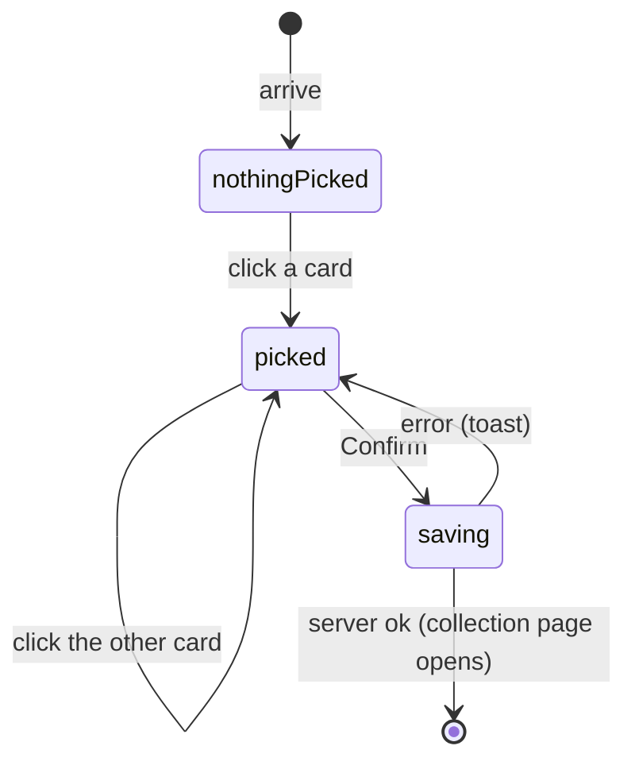

# The testsolver-type chooser

## Summary

The chooser is the page where a member of a collection that [requires testsolving](../glossary.md#testsolving) picks how they will testsolve it: **Serious** (problems stay hidden until the member starts a timed attempt on each) or **Casual** (everything visible at once, no timer). It lives at `/c/{cid}/choose-testsolver-type`, titled "Choose your testsolving style". Members who have not chosen are sent to it automatically the first time they open the collection or one of its problems; after that, nothing links to it, and it can be reopened only by typing its address. Every role that can view the collection passes through it, Admins included.

## The simple case

A new member clicks the link to a collection that requires testsolving. Instead of the problem list they see "Choose your testsolving style" and two cards side by side:

- **Serious**: "Practice with timed contest conditions", "Top 5 testsolvers featured on leaderboard", "Problems unlock when you start the timer".
- **Casual**: "No time limit", "Work on problems at your own pace", "All problems unlocked immediately".

Under them: "If you're not sure, pick Serious. It's more challenging, but provides accurate info on problem difficulty. You can always switch to Casual later." and a gray, disabled "Confirm" button.

They click the Serious card. Its border turns violet and "Confirm" turns violet. They click "Confirm" and land on the collection page, where every problem shows a padlock.

## The interaction, event by event

### Arrive

A member arrives here in one of two ways:

- **Sent here.** Any collection page or problem page of a collection that requires testsolving sends a member who can view it but has no testsolver type straight here (see [navigation](../foundations/navigation.md#what-each-page-checks-in-order)). Where they were going is not remembered.
- **By address.** Anyone who can view the collection can open the chooser's address directly at any time, whether or not they have chosen before.

Before showing itself the chooser checks that the collection exists ("Page not found" otherwise), that the user is signed in (the login page otherwise, which returns to the **collection page**, not to the chooser), and that the user can view the collection ("You need permission" otherwise). In a collection that does not require testsolving it sends the user on to the collection page.

The page has no back link and no sidebar. Neither card is selected, even for a member who has chosen before; the page does not show the current choice. "Confirm" is disabled.

### Leave untouched

Leaving without confirming records nothing. A member who has not chosen will be sent back here the next time they open the collection page or a problem page. The test page does not check, and nothing is locked for a member without a type, so a member who has not chosen can read every statement on a test page opened by its address.

### Begin editing

Clicking a card selects it: its border and shadow turn violet, and "Confirm" becomes enabled. Nothing is sent.

### While editing

Clicking the other card moves the selection to it. There is no way to deselect both. The cards respond only to clicks; they cannot be reached or chosen with the keyboard.

### Submit

"Confirm" sends the choice. The server checks that the user is signed in, that the collection exists, and that the user has a permission in it, then records the type. For either type it dates the member's [serious period](../glossary.md#testsolving) from the collection's creation, so choosing Serious hides every problem the member has not yet attempted. It then sends the member to the collection page.

While the request is pending nothing changes and "Confirm" stays enabled; a second click records the same choice again, harmlessly.

On failure a toast appears and the chooser stays:

| Situation                           | Toast                                       |
| ----------------------------------- | ------------------------------------------- |
| The session has ended               | "Not signed in"                             |
| The user's permission was removed   | "You do not have access to this collection" |
| The network, or anything unexpected | "Something went wrong. Please try again."   |

**Changing type later.** Opening the chooser's address and confirming the other type changes it for every page loaded afterwards:

- **Serious → Casual** unlocks every problem at once. Attempts already made stay on their leaderboards; a running attempt keeps running.
- **Casual → Serious** hides every problem the member has no attempt on, including problems they have already read as a Casual testsolver.

## Modifiers

| Modifier            | At arrival                                                                                                                                                                                                        | During editing                                                                                                                                                    |
| ------------------- | ----------------------------------------------------------------------------------------------------------------------------------------------------------------------------------------------------------------- | ----------------------------------------------------------------------------------------------------------------------------------------------------------------- |
| Role                | Admin, TeamMember and ViewOnly members can reach it. SubmitOnly members, users with no permission and signed-out visitors are redirected. Admins must choose even though nothing is ever hidden from them.        | A permission removed meanwhile makes Confirm fail with "You do not have access to this collection".                                                               |
| Authorship          | No effect. Authors see their own problems unlocked whatever they choose.                                                                                                                                          | No effect.                                                                                                                                                        |
| Testsolver type     | Not chosen: sent here automatically. Already chosen: only by address, with nothing preselected.                                                                                                                   | No effect until Confirm.                                                                                                                                          |
| Record state        | No effect.                                                                                                                                                                                                        | No effect.                                                                                                                                                        |
| Collection settings | Only collections that require testsolving show the chooser. `topsoj` and `mgci` make members Serious when they join, so their members are never sent here, but can still open it by address and switch to Casual. | A collection that stops requiring testsolving meanwhile: Confirm still records the type; it has no effect.                                                        |
| Keys                | No shortcuts.                                                                                                                                                                                                     | The cards cannot be chosen from the keyboard; Tab reaches nothing at all: "Confirm" is disabled until a card is clicked, and a disabled button cannot take focus. |

## Cancel and interrupt

| Event                               | Before editing                                                                                  | While editing                                                                     |
| ----------------------------------- | ----------------------------------------------------------------------------------------------- | --------------------------------------------------------------------------------- |
| Escape or Discard                   | No effect.                                                                                      | No effect; the selection stays.                                                   |
| Browser back or forward             | Leaves; nothing recorded. Going back to the page that sent the user here sends them here again. | Leaves; the selection is lost. A sent Confirm completes and the type is recorded. |
| Reload                              | The chooser again, nothing selected.                                                            | The selection is lost; a sent Confirm may have been recorded.                     |
| Tab or window closed                | Nothing recorded.                                                                               | As reload.                                                                        |
| A link inside the app followed      | There are no links on the page.                                                                 | There are no links on the page.                                                   |
| Network lost mid-request            | No effect.                                                                                      | Generic toast; the chooser stays with the card selected.                          |
| Request fails or returns an error   | No effect.                                                                                      | A toast; the chooser stays.                                                       |
| Session ends                        | No effect on the open page.                                                                     | "Not signed in".                                                                  |
| Access changes                      | No effect on the open page.                                                                     | See [Modifiers](#modifiers).                                                      |
| Same record changed in another tab  | A type chosen in another tab is not shown here.                                                 | Confirm overwrites it; the last confirmation wins.                                |
| Same record changed by another user | Not applicable: the type is the member's own.                                                   | Not applicable.                                                                   |
| Autofill writes into the field      | Not applicable: there are no fields.                                                            | Not applicable.                                                                   |
| The window loses focus              | No effect.                                                                                      | No effect.                                                                        |
| The testsolve time limit passes     | No effect on the chooser. A running attempt elsewhere keeps running.                            | No effect.                                                                        |

## Interactions with other systems

**Permissions.** Reaching the chooser needs view access; confirming only needs a permission of any role. See [accounts and roles](../foundations/accounts-and-roles.md#testsolver-types).

**Testsolving locks.** The choice decides whether anything is ever locked for the member. See [the locked problem](locked-problem.md).

**Per-collection settings.** Only collections that require testsolving use it; `topsoj` and `mgci` skip it for new members. See [per-collection settings](../cross-cutting/per-collection-settings.md).

**Validation and errors.** "Confirm" is disabled until a card is picked; server errors arrive as toasts.

**Unsaved changes.** An unconfirmed selection is lost on leaving.

**Optimistic updates.** None.

**Freshness and other users.** Other open pages of the collection keep their locks until they refresh.

**URL state.** None. After confirming, the collection page opens without any search or filters.

**Math rendering.** None.

**Offline.** Confirm fails with the generic toast.

**Keyboard and accessibility.** The cards are not buttons: they cannot be focused or chosen with the keyboard and are not announced as choices, so the chooser cannot be completed without a pointer. See [keyboard and accessibility](../cross-cutting/keyboard-and-accessibility.md).

**Narrow screens.** The two cards stack vertically on a narrow window.

**Side effects.** None beyond the recorded type.

## Edge cases

- The member is not returned to the problem they were trying to open; they always land on the collection page.
- The page does not show which type the member currently has.
- "You can always switch to Casual later" is true only for someone who knows the address; nothing in the interface links back here.
- Choosing Casual also records a serious period, which matters only if the member later switches to Serious.
- In collections that force Serious testsolving on joining, the chooser's address still lets a member switch to Casual.
- Until a member chooses, nothing is locked for them; only the redirect keeps them out, and the test page does not redirect.

## Open questions and verification

- The cards' lack of keyboard access was read from code (clickable boxes with no button role or tab stop). This looks like a bug.
- Whether members should be able to find the chooser again (the page promises they can switch) is a product call.
- Whether members of `topsoj` and `mgci` should be able to switch to Casual by address is a product call.
- Whether Admins should be asked to choose at all is a product call.

Verified against Probase commit `c38ff56`
