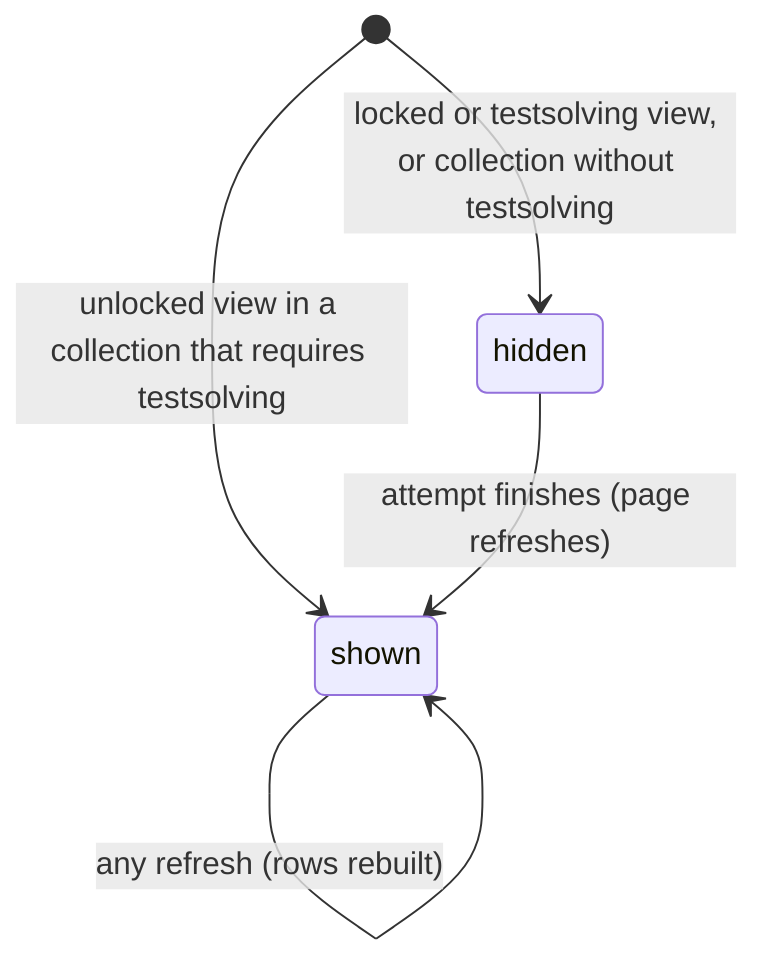

# The leaderboard

## Summary

The leaderboard is the ranked list of everyone who has made a [testsolve attempt](../glossary.md#testsolving) on a problem. It appears on the problem page's unlocked view, below the spoilers and above the discussion, in every collection that requires testsolving, and nowhere else. Solvers are ranked by fewest wrong answers, then fastest time; people who did not solve are listed after them without a rank. Users who can edit the problem (its authors and Admins) see every row; everyone else sees at most the top five solvers plus their own row. It is read-only: there is nothing to click.

## The simple case

A testsolver solves a problem on their second try in 6 minutes 12 seconds. The page refreshes into the unlocked view, and under "Show spoilers" is "Leaderboard", a table with no column headings:

```
1.  Ana Lopez              ✓ 4:03
2.  (the user)     ✕ 1     ✓ 6:12
```

with the user's own row highlighted in pale yellow, and under the table "2 out of 3 testsolvers solved this problem". The third testsolver, who did not solve it, is not shown to them; an author of the problem would see that row too.

## The interaction, event by event

The leaderboard has no interaction of its own. It is built on the server each time the problem page is built or refreshed.



### Arrive

Shown when the problem page is in its unlocked view and the collection requires testsolving: to Serious testsolvers whose attempt has finished, to Casual testsolvers, to authors and to Admins. Not shown in the locked or testsolving views, where no one's attempts are sent to the browser, and never in a collection that does not require testsolving.

**Rows.** One row per attempt on the problem, by anyone:

- **Solved attempts** first, ordered by number of wrong answers (fewest first), then by solve time (fastest first). Each gets a rank, "1.", "2.", and so on, by position; two solvers with the same wrong answers and the same time still get different ranks. The row shows the rank, the user's name, "✕ {n}" in red when they gave any wrong answers, and "✓ {m}:{ss}" in green, the time from the start of their attempt to the server receiving their correct answer. Minutes are not capped at 59.
- **Unsolved attempts** after them, alphabetically by name, with no rank. The row shows the name and "✕ {n}" in red, the number of answers submitted (including "✕ 0"). An unsolved row does not say whether the attempt was given up, ran out of time, used all five answers, or is still running.

Names are the users' Google names, shown in every collection, including those that hide authors.

**Who sees which rows.**

- A user who **can edit** the problem sees every row.
- Everyone else sees the first _k_ rows, where _k_ is the number of solvers or five, whichever is smaller, plus their own row wherever it falls. They never see other people's unsolved rows.

**The summary line** under the table reads "{solvers} out of {attempts} testsolvers solved this problem", counting every attempt, including rows the viewer cannot see. When some solvers are hidden, it adds " (showing top {k})".

The viewer's own row, if they have one, is highlighted in pale yellow.

### Leave untouched

Viewing the leaderboard records nothing.

### Begin editing

Not applicable: the leaderboard cannot be changed from the page. It changes when attempts change: when someone starts one (a new unsolved row), submits an answer (the wrong-answer count), solves one, or gives up.

### While editing

Not applicable. The leaderboard shown is as of the last load or refresh of the page; other people's progress appears on the next refresh.

### Submit

Not applicable.

## Modifiers

| Modifier            | At arrival                                                                                                                                              | During editing                                               |
| ------------------- | ------------------------------------------------------------------------------------------------------------------------------------------------------- | ------------------------------------------------------------ |
| Role                | Admins see every row. TeamMember and ViewOnly members see the top solvers and themselves, unless they author the problem.                               | A role changed elsewhere applies on the next refresh.        |
| Authorship          | Authors see every row of their problem's leaderboard.                                                                                                   | No effect.                                                   |
| Testsolver type     | Serious testsolvers see it once their attempt is finished; Casual testsolvers see it at once but never appear on it, having no way to start an attempt. | A type changed elsewhere applies on the next refresh.        |
| Record state        | No attempts: the heading, an empty table and "0 out of 0 testsolvers solved this problem". Archived problems have a leaderboard like any other.         | Other people's attempts change the rows on the next refresh. |
| Collection settings | Shown only in collections that require testsolving. Showing or hiding authors does not affect it.                                                       | No effect.                                                   |
| Keys                | No effect.                                                                                                                                              | No effect.                                                   |

## Cancel and interrupt

The leaderboard has no interaction to interrupt. The table records what each event does to what it shows.

| Event                               | Before editing                                                                                                                                                                | While editing   |
| ----------------------------------- | ----------------------------------------------------------------------------------------------------------------------------------------------------------------------------- | --------------- |
| Escape or Discard                   | No effect.                                                                                                                                                                    | Not applicable. |
| Browser back or forward             | Coming back may show the leaderboard as it was, from the browser's cache.                                                                                                     | Not applicable. |
| Reload                              | Rebuilt with every attempt as it now stands.                                                                                                                                  | Not applicable. |
| Tab or window closed                | No effect.                                                                                                                                                                    | Not applicable. |
| A link inside the app followed      | No effect; a prefetched problem page can show a leaderboard up to five minutes old.                                                                                           | Not applicable. |
| Network lost mid-request            | No effect.                                                                                                                                                                    | Not applicable. |
| Request fails or returns an error   | No effect.                                                                                                                                                                    | Not applicable. |
| Session ends                        | No effect on the open page.                                                                                                                                                   | Not applicable. |
| Access changes                      | No effect until the next refresh.                                                                                                                                             | Not applicable. |
| Same record changed in another tab  | Shown on the next refresh.                                                                                                                                                    | Not applicable. |
| Same record changed by another user | Shown on the next refresh.                                                                                                                                                    | Not applicable. |
| Autofill writes into the field      | Not applicable.                                                                                                                                                               | Not applicable. |
| The window loses focus              | No effect.                                                                                                                                                                    | Not applicable. |
| The testsolve time limit passes     | Another user's attempt running out changes nothing in its row (it was already unsolved). The viewer's own running out brings the leaderboard into view as the page refreshes. | Not applicable. |

## Interactions with other systems

**Permissions.** Who sees which rows follows from [can edit](../glossary.md#people-and-access). There is no way to see who attempted a problem other than through its leaderboard.

**Testsolving locks.** Other users' attempts are part of what a locked or testsolving view leaves out of the page.

**Per-collection settings.** Only collections that require testsolving have leaderboards.

**Validation and errors.** None.

**Unsaved changes.** None.

**Optimistic updates.** None.

**Freshness and other users.** As fresh as the page. See [freshness](../cross-cutting/freshness.md).

**URL state.** None.

**Math rendering.** None; names and times are plain text.

**Offline.** Shows what was loaded.

**Keyboard and accessibility.** A plain table with no header row, so a screen reader announces cells without column names. The ✕ and ✓ are icons announced as nothing; only the numbers are read.

**Narrow screens.** Rows do not wrap; a long name can make the table wider than a narrow column.

**Side effects.** None.

## Edge cases

- An attempt still running appears as an unsolved row with its current wrong-answer count, visible to authors and Admins while it runs.
- A user who submitted to a solved attempt from a second tab (see [the timed attempt](timed-attempt.md#edge-cases)) shows more wrong answers, and possibly a later time, than they gave before solving.
- A solve that took under a minute shows as "0:{ss}".
- A solve time of exactly zero would show as a bare "0" instead of "✓ 0:00"; it cannot happen in practice.
- Two users with the same Google name are indistinguishable.
- A user with no Google name appears with a blank name; if two such users have unsolved attempts, the page may fail to build.
- The summary line's count includes attempts that are still running, so "solved this problem" can read low while testsolvers are mid-attempt.

## Open questions and verification

- The ranking rule (wrong answers before time) was read from code; the locked view's wording ("A correct first submission can earn you a spot") suggests the designers intended wrong answers to weigh heavily, which matches.
- Whether showing testsolvers' names in collections that hide authors is intended is a product call.
- The page failing to build when two unsolved rows have no name was read from code (sorting compares names) and not reproduced; Google accounts normally have names.
- Ties being given different ranks was read from code; whether equal results should share a rank is a product call.

Verified against Probase commit `c38ff56`
