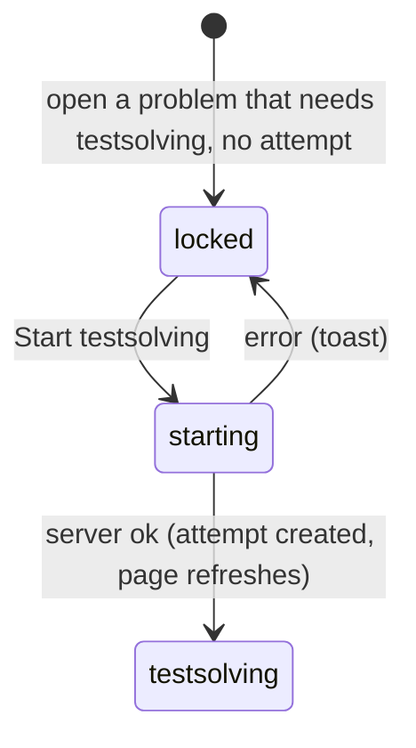

# The locked problem

## Summary

A locked problem is one a Serious testsolver has to testsolve before they can read it. On the problem page it shows its title, chips, heart and lightbulbs, and in place of everything else a padlock, "Testsolve to view", the time limit, and a "Start testsolving" button. Pressing the button starts the user's one and only [testsolve attempt](../glossary.md#testsolving) on the problem and opens the [timed attempt](timed-attempt.md). The same padlock replaces the statement on the problem's card on the collection page and the test page. A problem is locked for a user when they [need to testsolve](../glossary.md#testsolving) it and have no attempt yet, which can only happen in a collection that requires testsolving, to a Serious testsolver who cannot edit the problem.

## The simple case

A Serious testsolver opens a problem they have not tried. Under the title, where the statement would be, is a gray padlock and "Testsolve to view", then:

> Once you start testsolving, you'll have **15 minutes**. Keep an eye on the clock!
>
> Speed and accuracy matter! A **correct first submission** can earn you a spot on the leaderboard.
>
> No one has solved this problem yet—**You could be the first!**
>
> Best of luck!

and a full-width violet "Start testsolving" button. When they press it, the clock starts on the server; the page refreshes and shows the statement, an answer box and "Time remaining".

## The interaction, event by event

### Arrive

The page is built as described in [the problem page](../problem-page/problem-page.md), and the locked view is chosen when the user needs to testsolve the problem and has no attempt on it. The time limit shown is the problem's [time limit](../glossary.md#testsolving) in minutes (10, 15, 20, 25 or 30), from its difficulty. The line "No one has solved this problem yet—You could be the first!" appears only when no attempt on the problem, by anyone, has been solved.

What the locked view shows: the back link, "{problem ID}." and the title, the subject chip and test chips, the heart and like count, the lightbulbs, the padlock notice with the text above, "Start testsolving", and Previous and Next. What it leaves out of the page entirely: the statement, the answer, the solution, "Written by", the leaderboard, the discussion, and other users' names.

A problem without a difficulty never reaches the locked view: the page fails with "Something went wrong" instead (see [the problem page](../problem-page/problem-page.md#edge-cases)).

### Leave untouched

Opening a locked problem and leaving it records nothing. The clock does not start until the button is pressed, so a testsolver can look at the title, chips and difficulty of every problem without spending any of their attempts.

### Begin editing

Pressing "Start testsolving" (by click, or Enter or Space when it has focus) is the whole interaction; there is nothing to fill in. It sends the request at once. There is no confirmation.

### While editing

While the request is pending, the page does not change and the button does not disable or show its spinner ([saving and feedback](../foundations/saving-and-feedback.md)). A second press sends a second request, which fails because the attempt already exists: the user sees "Something went wrong. Please try again." even though the first request succeeded and the page is about to show the attempt.

The heart and the links remain usable meanwhile.

### Submit

The server checks that the user is signed in, that the problem exists, and that the user can view the collection, then records the attempt with the server's current time as its start. It does not check that the problem is actually locked for the user.

- **Ok.** The page refreshes and, since the user now has a running attempt, shows the [testsolving view](timed-attempt.md). The time limit counts from the moment the server recorded the start, so the time the refresh takes is already spent.
- **Error.** A toast, and the page stays locked:

| Situation                                               | Toast                                                |
| ------------------------------------------------------- | ---------------------------------------------------- |
| The session has ended                                   | "Not signed in"                                      |
| The problem no longer exists                            | "Problem not found"                                  |
| The user can no longer view the collection              | "You do not have permission to edit this collection" |
| An attempt already exists (a second press, another tab) | "Something went wrong. Please try again."            |
| The network, or anything unexpected                     | "Something went wrong. Please try again."            |

An attempt, once started, can never be undone or restarted.

## Locked cards

On the [collection page](../collection/problem-list.md) and the [test page](../collection/tests.md), a problem that is locked for the user shows its card with the title, heart and lightbulbs (collection page) or "PROBLEM {n}" (test page), and a padlock with "Testsolve to view" in place of the statement. Clicking the card opens the problem page in the locked view. A card is locked by exactly the same rule as the page, so a card and its page always agree when loaded at the same moment.

## Modifiers

| Modifier            | At arrival                                                                                                                                                                    | During editing                                                                                                                                                                                                               |
| ------------------- | ----------------------------------------------------------------------------------------------------------------------------------------------------------------------------- | ---------------------------------------------------------------------------------------------------------------------------------------------------------------------------------------------------------------------------- |
| Role                | TeamMember and ViewOnly Serious testsolvers can see a locked problem. An Admin never does. SubmitOnly members never reach the page.                                           | A permission removed while the page is open makes the start fail with "You do not have permission to edit this collection".                                                                                                  |
| Authorship          | An author never sees their own problem locked.                                                                                                                                | No effect.                                                                                                                                                                                                                   |
| Testsolver type     | Only Serious testsolvers see locked problems; in `topsoj` and `mgci` every new member is Serious. Casual testsolvers see everything unlocked.                                 | The start is not checked against the type: a user switched to Casual in another tab can still start from an open locked page, and the refreshed page then shows the problem unlocked, with their attempt on the leaderboard. |
| Record state        | Locked only for problems created after the user's serious period began, which in practice is every problem. Archived problems lock like any other. No difficulty: page fails. | No effect.                                                                                                                                                                                                                   |
| Collection settings | Nothing is locked unless the collection requires testsolving.                                                                                                                 | No effect on the open page.                                                                                                                                                                                                  |
| Keys                | No shortcuts.                                                                                                                                                                 | Enter or Space on the focused button starts.                                                                                                                                                                                 |

## Cancel and interrupt

| Event                               | Before editing                                                                    | While editing                                                                                                                |
| ----------------------------------- | --------------------------------------------------------------------------------- | ---------------------------------------------------------------------------------------------------------------------------- |
| Escape or Discard                   | No effect.                                                                        | No effect. A sent start cannot be cancelled.                                                                                 |
| Browser back or forward             | Leaves; nothing recorded.                                                         | Leaves. The start completes on the server and the attempt's clock runs while the user is elsewhere.                          |
| Reload                              | Still locked.                                                                     | Shows the testsolving view if the start reached the server, otherwise still locked.                                          |
| Tab or window closed                | Nothing recorded.                                                                 | The attempt may have started; its clock runs regardless.                                                                     |
| A link inside the app followed      | Leaves; nothing recorded.                                                         | As browser back.                                                                                                             |
| Network lost mid-request            | No effect.                                                                        | Generic toast; still locked on screen. The attempt may or may not exist; reloading shows which.                              |
| Request fails or returns an error   | No effect.                                                                        | A toast; still locked.                                                                                                       |
| Session ends                        | No effect on the open page.                                                       | "Not signed in"; still locked.                                                                                               |
| Access changes                      | No effect on the open page.                                                       | Losing view access: permission toast. Switching to Casual: the start still succeeds (see [Modifiers](#modifiers)).           |
| Same record changed in another tab  | An attempt started in another tab is not shown; the page still says locked.       | Pressing Start then fails with the generic toast and the page stays locked until reloaded, while the other tab's clock runs. |
| Same record changed by another user | Someone else solving it does not update "You could be the first!" until a reload. | No effect on the user's own start.                                                                                           |
| Autofill writes into the field      | Not applicable: there is no field.                                                | Not applicable.                                                                                                              |
| The window loses focus              | No effect.                                                                        | No effect.                                                                                                                   |
| The testsolve time limit passes     | Not applicable: no attempt is running.                                            | Not applicable until the attempt exists; from then on see [the timed attempt](timed-attempt.md).                             |

## Interactions with other systems

**Permissions.** Starting requires only that the user can view the collection. Admins and authors are never shown the locked view, since they can edit the problem.

**Testsolving locks.** This document is the lock's user-facing half. The rule that decides it is in the glossary under [needs to testsolve](../glossary.md#testsolving); what the lock hides is enforced by leaving it out of the page.

**Per-collection settings.** Requiring testsolving is what makes locking possible; collections that force Serious testsolving put every new member here. See [per-collection settings](../cross-cutting/per-collection-settings.md).

**Validation and errors.** None before sending. Errors arrive as toasts; see the table under [Submit](#submit).

**Unsaved changes.** Nothing to lose.

**Optimistic updates.** None: the page waits for the server before changing view.

**Freshness and other users.** The "You could be the first!" line and the lock itself are as fresh as the page. A card on a prefetched collection page can show a problem as locked after the user has started it elsewhere, until the cache is cleared.

**URL state.** Starting does not change the URL.

**Math rendering.** Nothing is rendered in the locked view apart from the title as typed.

**Offline.** Starting fails with the generic toast.

**Keyboard and accessibility.** "Start testsolving" is an ordinary button reachable with Tab. The padlock is decorative; the text "Testsolve to view" carries the meaning.

**Narrow screens.** The notice and button take the column's width; nothing is hidden.

**Side effects.** Starting creates the attempt that appears on the problem's leaderboard, visible to everyone who can see its unsolved rows, from that moment.

## Edge cases

- The heart works on a locked problem: a testsolver can like a problem they cannot read.
- The lightbulbs and test chips are visible while locked, so a testsolver knows the difficulty (and the time limit) before starting.
- "A correct first submission can earn you a spot on the leaderboard" understates the rule: a solve after wrong answers also ranks, below solves with fewer wrong answers.
- Two quick presses start the attempt and also show a generic error toast.
- The "unsolved" line counts solves by anyone, including users who solved it long ago.

## Open questions and verification

- That the start does not check the user's testsolver type, and that a second press produces a generic error toast alongside a successful start, were read from code and tests ("cannot be started twice"). Confirm the toast by hand.
- The locked view's promise about "a correct first submission" is worded more narrowly than the leaderboard's ranking; whether to reword it is a product call.
- The time spent between the server recording the start and the page showing the countdown was not measured.

Verified against Probase commit `c38ff56`
