# The timed attempt

## Summary

A timed attempt is a Serious testsolver's one chance to solve a problem against the clock before seeing its answer, solutions and discussion. It is the problem page's testsolving [view](../glossary.md#testsolving): the statement, an answer box with "Submit" and "Give Up", and "Time remaining" counting down. The user has the problem's [time limit](../glossary.md#testsolving) (10 to 30 minutes, from its difficulty) and up to five answers. The attempt ends when an answer matches the problem's answer exactly, when the user gives up, or when the time runs out; the page then refreshes into the unlocked view, and the result goes on the [leaderboard](leaderboard.md). It begins when "Start testsolving" succeeds on [the locked problem](locked-problem.md) and lasts until it ends, whether or not the page is open.

## The simple case

A testsolver presses "Start testsolving". The page refreshes: the statement appears, then a rule, then "ANSWER" with a box saying "Enter an integer" (or "Enter a number (0-999)" in an AIME-format collection), a violet "Submit" and a red "Give Up", and under them "Time remaining: 14m 59s", ticking down every second.

They work out an answer, type it, and press Enter. If it is wrong, the box empties and "**41** is incorrect! (4/5)" appears under the buttons. They try again. If it is right, the page refreshes into the unlocked view: the statement, "Show spoilers", the leaderboard with their row highlighted, and the discussion. There is no "correct!" message; the change of view is the confirmation.

If time runs out first, the countdown shows "Finished!" and the page refreshes into the unlocked view anyway.

## The interaction, event by event

```mermaid
stateDiagram-v2
    [*] --> answering : attempt started (page refreshes)
    answering --> answering : wrong answer ("... is incorrect! (n/5)", box empties)
    answering --> solved : correct answer (page refreshes)
    answering --> gaveUp : Give Up (page refreshes)
    answering --> outOfTime : countdown reaches zero (page refreshes)
    answering --> answering : fifth wrong answer (no more accepted; still answering)
    solved --> [*] : unlocked view
    gaveUp --> [*] : unlocked view
    outOfTime --> [*] : unlocked view
```

### Arrive

The testsolving view is shown whenever the user opens (or refreshes, or reloads) the problem page while they have an attempt that is not solved, not given up and not past its time limit. The first arrival is the refresh after "Start testsolving"; any later arrival (coming back after leaving, a reload, a second tab) shows the same view with the true remaining time.

The page shows the back link, the title and chips, the heart and lightbulbs, then:

- **The statement**, with math typeset. Never editable here.
- A horizontal rule.
- **"ANSWER"** and the answer box, empty. In an AIME-format collection the box accepts only up to three digits ("Enter a number (0-999)"); in every other collection (Integer, ShortAnswer or Proof format) it accepts only an optional leading minus sign and digits ("Enter an integer").
- **"Submit"** (violet) and **"Give Up"** (red), side by side.
- An empty line where wrong answers will be reported.
- **"Time remaining: {m}m {s}s"**, counted from the deadline the server computed (the recorded start plus the time limit) against the browser's clock, and updated every second. Minutes are not capped at 59 and there are no hours.

Nothing is focused; the user clicks into the box to start typing. Any wrong answers already given in an earlier visit are not mentioned: the count is kept on the server but shown only after the next wrong answer.

The answer, the solutions, "Written by", the leaderboard and the discussion are not part of the page.

### Leave untouched

There is no "untouched" attempt: the clock started when the attempt was created. Leaving the page (a link, back, closing the tab) records nothing new, but the attempt keeps running on the server and its time keeps passing. Coming back before the deadline shows the testsolving view with less time; coming back after shows the unlocked view with the attempt counted as not solved.

### Begin editing

Typing in the answer box is the first change. The box refuses anything that is not a valid partial answer as the user types: letters, spaces, decimal points, a second minus sign, a minus sign after the first character, and (AIME) a fourth digit are simply not entered. Leading zeros are removed as the user types, so typing `007` shows `7`, and `-0` becomes `0`. A lone `-` is kept in the integer box while the user is still typing. Pasting follows the same rule: a pasted value that is not valid as a whole is ignored.

### While editing

The countdown ticks every second whatever the user is doing. While an answer is being judged, "Submit" and "Give Up" both turn pale, show spinners and ignore presses ([saving and feedback](../foundations/saving-and-feedback.md)); the box stays editable.

**Keys.** Enter in the answer box submits the answer, exactly as "Submit" does. Tab moves from the box to "Submit" and then to "Give Up". Escape does nothing.

**The browser's own check.** The answer box is required, so submitting an empty box shows the browser's "Please fill out this field" bubble and sends nothing. A lone `-` is not empty and is sent.

### Submit

There are three ways to finish, and each is sent to the server, which uses its own clock.

**Submit an answer.** The server checks, in order: signed in; the problem exists; the user can view the collection; the problem has a difficulty; the user has an attempt; fewer than five answers have been submitted; the attempt has not been given up and the server's time is before the deadline plus the 10-second [grace buffer](../glossary.md#testsolving). It then compares the answer with the problem's answer character for character and records the submission (re-checking the limit and the give-up as it writes, so two submissions at once cannot both slip past the fifth).

- **Correct.** The attempt is marked solved at the server's time of receipt. The page refreshes into the unlocked view. The solve time on the leaderboard is from the recorded start to that moment.
- **Wrong.** The box empties and "**{answer}** is incorrect! ({n}/5)" appears, where _n_ is the number of answers the user has left. The attempt continues.
- **Refused.** A toast, and the box keeps what was typed:

| Situation                                             | Toast                                                |
| ----------------------------------------------------- | ---------------------------------------------------- |
| The session has ended                                 | "Not signed in"                                      |
| The user can no longer view the collection            | "You do not have permission to edit this collection" |
| Five answers already submitted                        | "Reached maximum number of submissions (5)"          |
| Given up already, or more than 10 s past the deadline | "Tried to submit after testsolve finished"           |
| No attempt (it was never started)                     | "Tried to submit before starting testsolve"          |
| The problem has no difficulty                         | "Problem difficulty should not be null"              |
| The network, or anything unexpected                   | "Something went wrong. Please try again."            |

After the fifth wrong answer ("... is incorrect! (0/5)") the attempt does **not** end. The view stays as it is, every further Submit is refused with "Reached maximum number of submissions (5)", and the user must either press Give Up or wait for the clock to run out before the problem unlocks.

**Give Up.** Pressing "Give Up" sends a give-up at once, with no confirmation. When the answer box is empty, the button has no pending state, so a second press sends a second give-up, which is refused with "Tried to submit after testsolve finished" if the first has already been recorded. The server checks the same things as for an answer, except the submission count, and allows no grace buffer: at or after the deadline it refuses with "Tried to submit after testsolve finished". On success the attempt is marked given up and the page refreshes into the unlocked view.

Give Up is also a submit button of the answer form, so pressing it submits the form too:

- With the answer box empty, the browser refuses the form and shows "Please fill out this field" on the box, while the give-up goes through and the page refreshes into the unlocked view a moment later.
- With something typed in the box, the typed answer is submitted as well as the give-up, and the two race. If the give-up arrives first, the answer is refused with "Tried to submit after testsolve finished". If the answer arrives first, it is counted: a correct answer marks the attempt solved (and then given up), and a wrong one adds a wrong answer to the attempt's record before it is given up.

**Time runs out.** When the countdown reaches zero on the browser's clock it shows "Time remaining: Finished!" and asks the server for a fresh page, once a second, until the server agrees the attempt is over and sends the unlocked view. The server considers the attempt over at the deadline itself; the grace buffer only helps an answer already on its way.

After any of the three, the attempt is finished for good. The problem is unlocked for this user permanently, and the attempt's result is on the leaderboard: solved (with a time and a count of wrong answers) or not solved (with a count of wrong answers).

## Modifiers

| Modifier            | At arrival                                                                                                                                                                                                                                                                    | During editing                                                                                                                                                                          |
| ------------------- | ----------------------------------------------------------------------------------------------------------------------------------------------------------------------------------------------------------------------------------------------------------------------------- | --------------------------------------------------------------------------------------------------------------------------------------------------------------------------------------- |
| Role                | TeamMember and ViewOnly Serious testsolvers who do not author the problem. Admins never testsolve.                                                                                                                                                                            | Losing view access makes every submission and give-up fail with "You do not have permission to edit this collection"; the clock keeps running.                                          |
| Authorship          | Authors never testsolve their own problem.                                                                                                                                                                                                                                    | No effect.                                                                                                                                                                              |
| Testsolver type     | Serious only.                                                                                                                                                                                                                                                                 | Switching to Casual in another tab does not stop the attempt; submissions still count. The next refresh shows the unlocked view, and the attempt stays on the leaderboard as it stands. |
| Record state        | The difficulty sets the time limit (10, 15, 20, 25, 30 minutes). An absent or empty answer can never be matched, and neither can an answer that the box cannot type (anything with math delimiters, letters, decimals, fractions or spaces). Archived problems work as usual. | An answer changed by the author mid-attempt is compared against the new answer from the next submission on.                                                                             |
| Collection settings | AIME format: three-digit box. Every other format, including ShortAnswer and Proof: the integer box.                                                                                                                                                                           | No effect.                                                                                                                                                                              |
| Keys                | No shortcuts before typing.                                                                                                                                                                                                                                                   | Enter submits the answer. Tab: box, Submit, Give Up. Escape: nothing.                                                                                                                   |

## Cancel and interrupt

| Event                               | Before editing (box empty)                                                                                                                     | While editing (answer typed or a request pending)                                                                                                                                                                                                                                                                                      |
| ----------------------------------- | ---------------------------------------------------------------------------------------------------------------------------------------------- | -------------------------------------------------------------------------------------------------------------------------------------------------------------------------------------------------------------------------------------------------------------------------------------------------------------------------------------- |
| Escape or Discard                   | No effect. Give Up is the only way to end early.                                                                                               | No effect; the typed answer stays.                                                                                                                                                                                                                                                                                                     |
| Browser back or forward             | Leaves; the attempt keeps running.                                                                                                             | Leaves; the typed answer is lost; a sent answer is still judged and counted, but its result (right or wrong) is not shown.                                                                                                                                                                                                             |
| Reload                              | The testsolving view comes back with the true remaining time; the wrong-answer line is gone.                                                   | The typed answer is lost; a sent answer is counted; the page shows the unlocked view if it was correct.                                                                                                                                                                                                                                |
| Tab or window closed                | The attempt keeps running and runs out if the user does not come back.                                                                         | As reload, without coming back.                                                                                                                                                                                                                                                                                                        |
| A link inside the app followed      | As browser back.                                                                                                                               | As browser back.                                                                                                                                                                                                                                                                                                                       |
| Network lost mid-request            | The countdown keeps ticking locally.                                                                                                           | "Something went wrong. Please try again."; the answer stays in the box. The answer may have been counted; nothing on the page says so. At zero, the refresh fails and "Finished!" stays until the connection returns.                                                                                                                  |
| Request fails or returns an error   | No effect.                                                                                                                                     | A toast (see the table under [Submit](#submit)); the answer stays in the box; the view does not change.                                                                                                                                                                                                                                |
| Session ends                        | The countdown keeps ticking.                                                                                                                   | "Not signed in"; the clock keeps running on the server. At zero, the refresh sends the user to the login page.                                                                                                                                                                                                                         |
| Access changes                      | No effect on the open page.                                                                                                                    | See [Modifiers](#modifiers).                                                                                                                                                                                                                                                                                                           |
| Same record changed in another tab  | The same attempt can be open in two tabs, each with its own countdown and its own wrong-answer line.                                           | Solving or giving up in one tab leaves the other in the testsolving view until its countdown ends or it refreshes. Submitting there still counts: a wrong answer adds to the solved attempt's wrong answers, and a correct one records another submission (shown on the leaderboard as a wrong answer) and moves its solve time later. |
| Same record changed by another user | Other users' attempts do not affect this one.                                                                                                  | An author editing the answer changes what later submissions are compared with.                                                                                                                                                                                                                                                         |
| Autofill writes into the field      | The browser may offer answers typed into earlier "answer" boxes, on this or other problems; picking one fills the box if it is a valid answer. | As before editing.                                                                                                                                                                                                                                                                                                                     |
| The window loses focus              | No effect; the countdown keeps running, and the server's clock is what counts.                                                                 | No effect.                                                                                                                                                                                                                                                                                                                             |
| The testsolve time limit passes     | "Finished!", then the page refreshes into the unlocked view.                                                                                   | An answer sent before zero and arriving within 10 seconds after the server's deadline is judged normally; one arriving later is refused. A give-up at or after the deadline is refused. The page then refreshes into the unlocked view.                                                                                                |

## Interactions with other systems

**Permissions.** The server checks only that the user can view the collection; it does not check that the user needed to testsolve the problem.

**Testsolving locks.** The attempt is what unlocks a problem. During it, only the statement is revealed; everything else stays out of the page until it ends.

**Per-collection settings.** The answer format decides the box; see [Modifiers](#modifiers). In a ShortAnswer collection (the default) that requires testsolving, any problem whose answer is not a plain integer cannot be solved in a timed attempt. See [per-collection settings](../cross-cutting/per-collection-settings.md).

**Validation and errors.** The box refuses invalid characters as they are typed and the browser refuses an empty box; everything else is judged by the server and reported as a wrong answer or a toast.

**Unsaved changes.** A typed answer is lost on leaving. Submitted answers are never lost.

**Optimistic updates.** None. The view changes only when the server confirms.

**Freshness and other users.** The countdown is live; everything else is as of the last refresh. See [freshness](../cross-cutting/freshness.md).

**URL state.** None; the address stays the problem page's.

**Math rendering.** The statement is rendered. Answers are compared as typed, never as rendered: `42` and `$42$` differ.

**Offline.** Submissions fail with the generic toast; the countdown keeps going; the refresh at zero waits for the connection.

**Keyboard and accessibility.** The attempt can be done entirely from the keyboard. The countdown is plain text updated every second, not announced to screen readers; the wrong-answer line is not announced either. See [keyboard and accessibility](../cross-cutting/keyboard-and-accessibility.md).

**Narrow screens.** The box and buttons fit the column; nothing is hidden.

**Side effects.** The result is visible to other users on the leaderboard as soon as their pages refresh.

## Edge cases

- The countdown is computed with the browser's clock. If it is ahead of the server's, the countdown reaches zero early and the page keeps showing "Finished!" (and asking for a fresh page every second) until the server's deadline passes. If it is behind, the countdown shows time left after the server has already refused further answers.
- The time a correct answer takes to reach the server counts against the solve time; the grace buffer protects only against the deadline, not against the leaderboard.
- A second press of Submit while an answer is being judged is ignored. After a correct answer, though, the answer stays in the box until the refreshed page replaces it, and pressing Enter in that moment submits it again: the attempt, already solved, records a second submission (shown on the leaderboard as a wrong answer) and a later solve time.
- "({n}/5)" shows answers remaining, not answers used: the first wrong answer shows "(4/5)".
- Clearing the box after a wrong answer means a typo cannot be corrected by editing; the answer must be retyped.
- A problem whose answer is empty or absent can be testsolved but never solved; every answer is wrong.
- In a ShortAnswer collection, whose add-problem form takes the answer as free text, an answer written with a leading zero, a plus sign or a space can never be matched either, because the box removes leading zeros and refuses anything but digits and a leading minus.
- Submitting a lone `-` is allowed by the browser's check and uses up one of the five answers.

## Open questions and verification

- Give Up submitting the answer form as well as giving up was read from code (it is a submit button inside the form with its own click handler). A first local pass confirmed that with an answer typed, one press of Give Up sends two requests; in that run the give-up was recorded first and the answer was not counted. The empty-box case (the browser's bubble) was not checked. This looks like a bug.
- The attempt not ending after the fifth wrong answer was read from code. Whether it should end (as a give-up) is a product call.
- Submissions after the attempt is solved still counting (from a second tab, or Enter pressed again as the page refreshes), including moving the solve time, was read from code: nothing refuses a submission to a solved attempt. This looks like a bug.
- The integer box being used for ShortAnswer and Proof collections was read from code. In a ShortAnswer collection that requires testsolving, many answers cannot be entered; this may be worth treating as a bug.
- The countdown's behavior with a skewed browser clock, and the once-a-second refresh after "Finished!", were read from code and not observed.
- Whether the browser offers earlier answers for the answer box depends on the browser's form history; the box does not opt out.

Verified against Probase commit `c38ff56`
